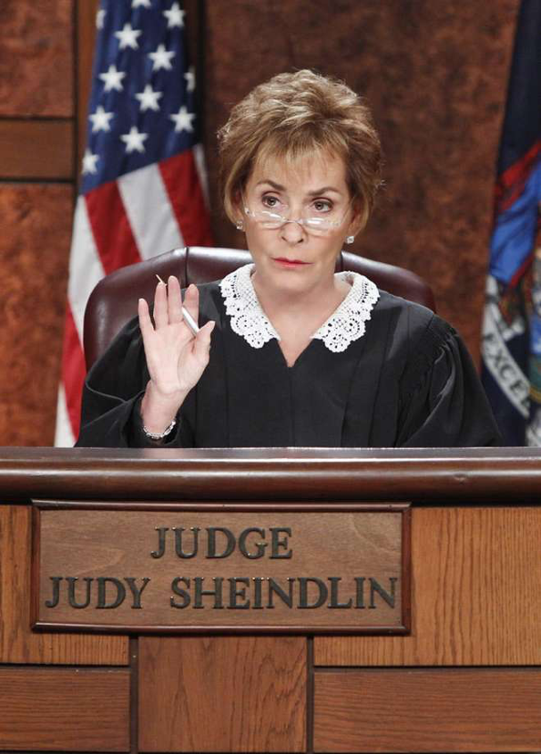
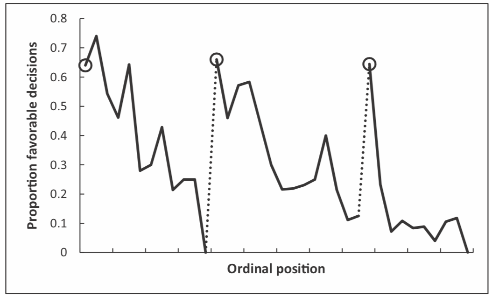
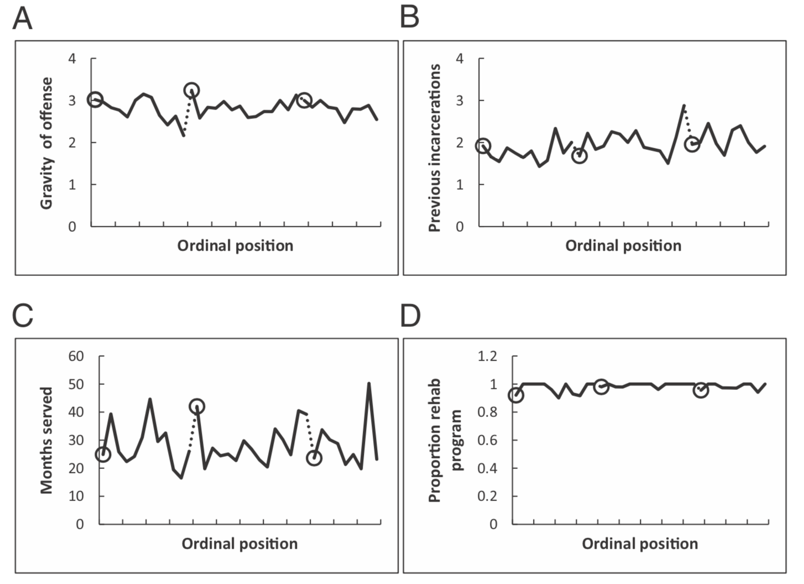

---
title: PSY 333 --- Week 1, Class 1
...

<iframe src="https://arizona.hosted.panopto.com/Panopto/Pages/Embed.aspx?id=31f84042-4bc8-45e6-8a9a-ac1e017b05b5&autoplay=false&offerviewer=true&showtitle=true&showbrand=false&start=0&interactivity=all" height="405" width="720" style="border: 1px solid #464646;" allowfullscreen allow="autoplay"></iframe>

## The judgment of judges

### Judges are paid to make good judgments

Judges are highly trained people who’s job it is to make judgements about other people.  They are paid well for this work, with the average judge in Arizona earning over $100,000 per year.

Judges are also highly trained, to be a judge you need (at least)

 1. A bachelors degree
 2. A law degree
 3. To pass the bar
 4. To work as an attorney for several years
 5. To get appointed or elected

If anyone is good at making judgements it should be judges.

### What does it mean to make good judgments?

For judges a minimum requirement is that the judgment should be based only relevant factors such as laws and facts of the case. The judgment should not be based on irrelevant or 'extraneous' factors such as what the judge ate for breakfast or whether they were tired.

Incredibly, however, in a 2011 study Shai Danziger and colleagues showed that extraneous factors can have a huge effect on the judgments made by judges. The paper is here ([Dangziger et al. 2011](Week_01a_reading_judges.pdf)) if you would like to read the original research for yourself.

### Methods

In this study the authors collected data on 1,112 judicial rulings made by eight judges on parole boards in Israel. For most of the cases (78%) the judges had to judge whether grant parole or not. For the remaining cases they had to decide whether to changes the terms of the parole.

They collected a bunch of information that might influence the judge's judgment, including the severity of the crime and the race/ethnicity of the prisoner.

_They also measured the time of day that the judgment was made._  This turns out to have a major effect on the judgments.

### Judges are less lenient when they are tired and/or hungry

To analyze their results they plotted the proportion of favorable judgments (i.e. the fraction of times they granted parole) as a function of (roughly speaking) time of day.  This is plotted below

What's going on here?  Looking at the left of the plot, first thing in the morning (first circle) judges are fairly lenient, paroling just over 60% of people. As the morning wears on, however, they grant fewer and fewer paroles until right before lunch (just before the first dashed line) they grant parole 0% of cases!

After lunch, which starts at the second circle, the proportion of paroles granted goes back up to around 60% before decreasing again before the final break (third circle).

Looking at this, it is very tempting to conclude the _judges are more likely to grant parole when they are well rested and full, and less likely to grant parole when they are tired and hungry!_

### Other factors can't account for the effect

Of course, before jumping to conclusions it's important to consider whether other factors changed over the day.  Perhaps, they start each session with the less serious crimes and end with the more serious crimes?  Or that prisoners differ across the day for other reasons.  By looking at how these other factors change over the course of the day, they were able to rule out these interpretations.

This figure shows that none of the other factors (gravity of offence, previous incarcerations, months served, or proportion in rehab program) had any systematic change over the course of the day.

### It's not just judges

Pretty much everyone has biases and imperfections in their judgment and decision making. But the judgments and decisions we make can **really matter**.

Sometimes it’s decisions about other people’s lives:

  * Paroling someone or not
  * Hiring someone or not

Sometimes it’s decisions about your own life

  * How much to save for retirement?
  * Whether to have another drink at a party?

Psychologists study judgment and decision making to understand _why_ people make the judgements and decisions they do and _how_ we can help them to make better decisions in the future.
