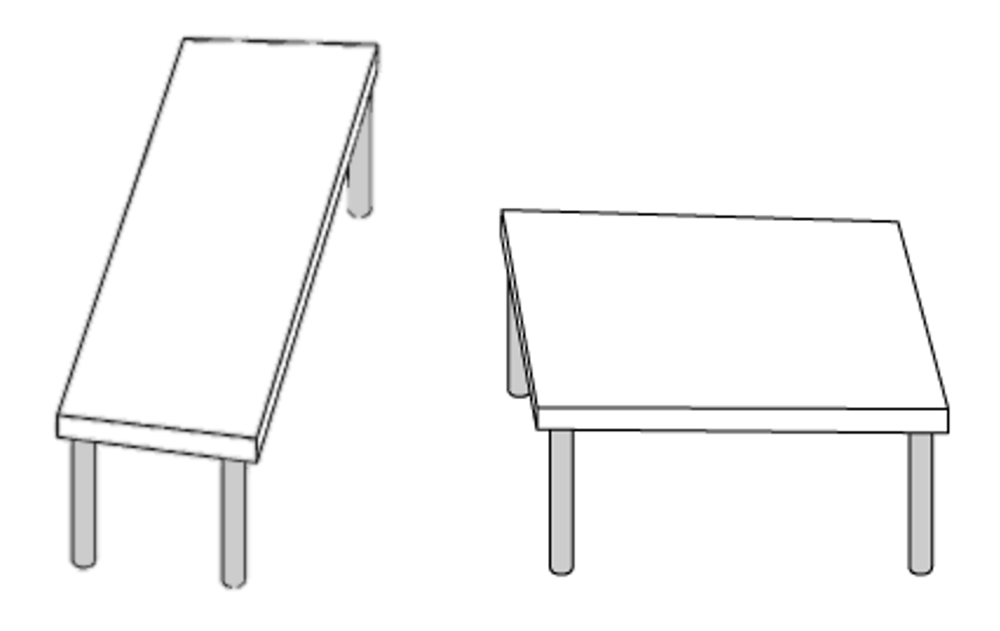
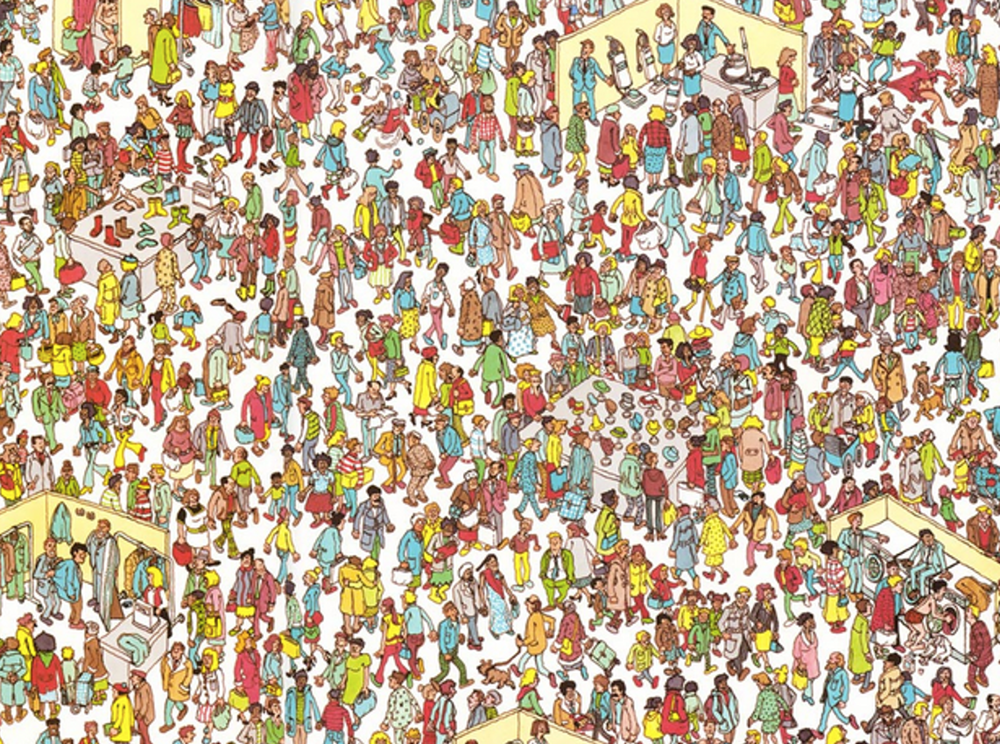
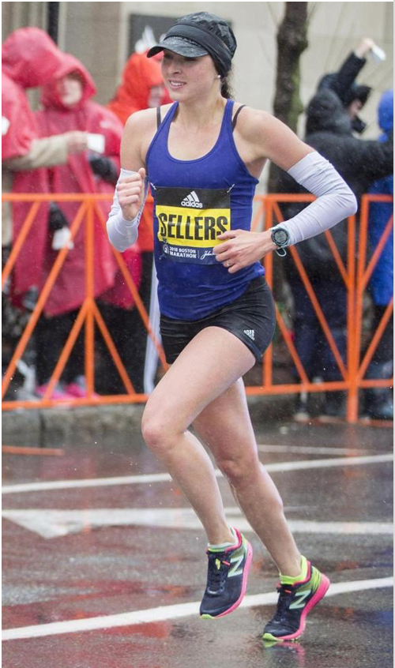
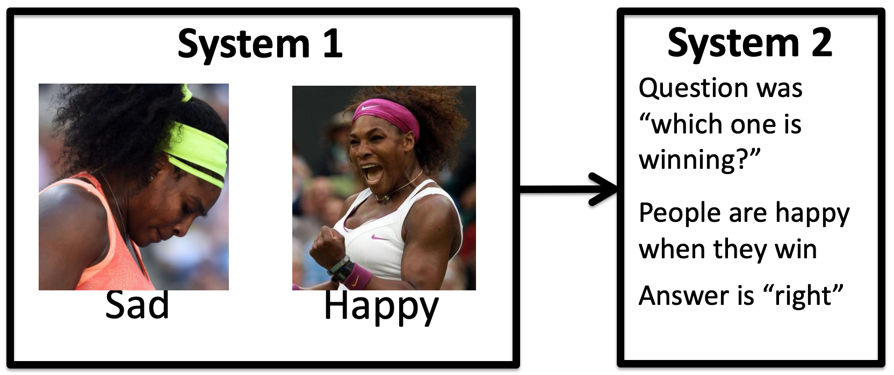
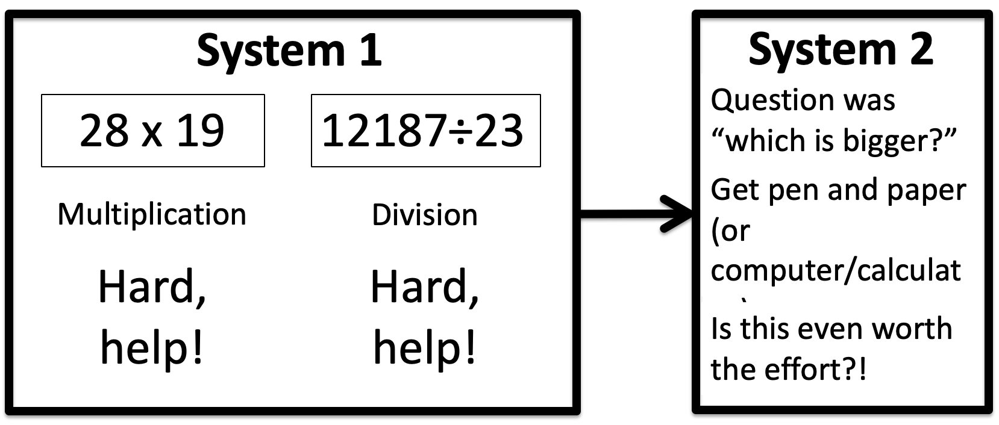

---
title: PSY 333 --- Week 1, Class 2
...

<iframe src="https://arizona.hosted.panopto.com/Panopto/Pages/Embed.aspx?id=b5ac842a-14e8-42a6-bf33-ac1e017b06e8&autoplay=false&offerviewer=true&showtitle=true&showbrand=false&start=0&interactivity=all" height="405" width="720" style="border: 1px solid #464646;" allowfullscreen allow="autoplay"></iframe>

## Some simple judgments

Let's start by making some simple and some not-so-simple judgments ...

### First some easy judgments ...

Which of these two cars is closer?

Which is bigger?

Which one is a picture of Serena Williams winning?

Which house is more expensive?

### Now some harder judgments ...

Which is bigger?

Which athlete won their event at the 2012 Olympics?  And which athlete lost?

Which house is more expensive?

Which number is bigger?

## Dual process models

Some judgments feel easy and some judgments feel hard.  What's the difference?

Daniel Kahneman proposed that the reason for this difference is that there are two different systems that are involved in the judgment and decision making process.

In his Dual Process Model of judgment, easy decisions feel easy because they use an automatic system (unimaginatively called **System 1**) that processes information quickly and unconsciously. Hard decisions lean on a conscious system (**System 2**) that is more flexible than System 1 but slower and involves mental effort.

Note that these systems are not (necessarily) implemented by differnet areas of the brain, although that’s been proposed with varying levels of seriousness (c.f. lizard brain). Instead the two systems are different _cognitive systems_ that may involve multiple, overlapping neural systems.

## System 1

System 1 is the unconscious system.  It is

  * Fast
  * Effortless
  * Uses "heuristics"
    - _We will discuss what we mean by "heuristics" more in the next section
  * Involves no sense of voluntary control
  * Is inflexible

When System 1 works it is amazing!

Consider the car example again ...

Just by looking at this image, within a fraction of a second you can tell me which car is closer.  You could also very quickly hazard a guess as to what time of year it is and where in the US this picture was taken (i.e. certainly not in Arizona!).

_None of these things is easy from a computational perspective._  It's only in the last few years that we've developed computers and algorithms powerful enough to get even close to the performance of humans on tasks like these.

### Other examples of System 1 judgments

Complete the phrase:

  * Bread and ...

Reading is a System 1 process - at least if you are reading in your native language, you're not in first grade

Coming up with a story for this photo

### System 1 is incredibly powerful, but ...

System 1 is really good at judging things we are experienced in such as

      * Understanding facial expressions
  * Reading

But it’s not good for new problems

  * Reading is hard in first grade and only becomes automatic after a lot of practice

And System 1 can be tricked ...

### Tricking System 1

Which of these tables is longer?

You may be familiar with [this table illusion](https://en.wikipedia.org/wiki/Shepard_tables) (which was created by Roger Shepard in 1990) and you may know for a fact that the tables are actually the same size.  Even so, it is very hard not to perceive them as being different.

This is the crazy thing about System 1 **_even when you know it is leading you astray, it is almost impossible to overcome the automatic perceptions of System 1_**

The paintings of [M. C. Esher](https://en.wikipedia.org/wiki/M._C._Escher) (which inspired the scene below from the 1986 movie Labyrinth) are based on this

Another example is judging which of these two houses is more expensive.  System 1 says it surely must be the one on the right, but in fact the house on the left is worth almost 10 times more, selling for [_three million dollars_](https://www.bbc.com/news/world-us-canada-45277711) in 2018!

## System 2

While System 1 is fast, effortless and flexible, System 2 is the exact opposite.  It is

  * Slow
  * Effortful
  * Highly flexible in that it can deal with many different types of Problems
  * It is also often associated with agency, choice, concentration and "concious" control (although this is not always the case)

### Examples of System 2

Some example of System 2 processes are the not-so-simple Math Problems

Finding Waldo

Doing your taxes

Trying to maintain a fast pace which running.
<figure>

<figcaption>Sarah Sellers (who lives in Tucson and works at Banner) is an amateur runner who stunned the world by placing 2nd in the Boston marathon in 2018.</figcaption>
</figure>
Even professional marathon runners --- who train their whole lives and are literally paid to maintain a fast running pace --- run faster when they have pacemakers! Indeed the effect of pacemakers is so big that there are separate world records for paced versus unpaced runs

For women the difference is about 90 seconds

  * Women's world record with pacemakers = 2:15:25
  * Women's world record without pacemakers = 2:17:01

For men the difference is close to a whopping 3 minutes (although the push to run a sub 2-hour marathon lead to some other [crazy things](https://www.theatlantic.com/health/archive/2019/10/kipchoges-sub-two-hour-marathon-how-legitimate-it/599974/) going on in that case such as the pacemakers forming a protective shield from the wind!)

  * Men's world record with pacemakers = 1:59:40
  * Men's world record without pacemakers = 2:02:57

### The strength of System 2

System 2 is incredibly flexible.  It can handle (or at least try to handle) almost any problem you throw at it.  But ...

### The weakness of System 2

This flexibility comes at the cost of speed and effort.  Utilizing System 2 feels effortful.

## Dual systems models

Kahneman's theory says that the two systems aren't completely separate and that in fact they _work together_ to make judgments and decisions.

System 1 generates impressions, intuitions, intentions and feelings

These are passed along to System 2 which accepts them and turns them into beliefs and voluntary actinos

When System 1 runs into difficulty it calls on systems 2 for more support

Most of the time this works well.  For example, when judging the pictures of Serena Williams, System 1 makes a guess at her emotions quickly and automatically.  This information is then passed to System 2 which can make the judgment about which one is a picture of her winning.

In this Math example, System 1 can't provide a rapid answer as to which quantity is bigger, but it very quickly tells you that these are hard mental arithmetic problems and it alerts System 2 that it will need to do work to solve this.  System 2 then sizes up whether it's even worth trying to perform this calculation at all (it's not).

**Most of the time the two systems work together well and we make good judgments and decisions** (Otherwise driving would be impossible).  However ...

## System 1 and System 2 can conflict

The [Stroop effect](https://en.wikipedia.org/wiki/Stroop_effect) gives a great illustration of how it feels when System 1 and System 2 conflict.  To illustrate it, first try naming the colors in which these words are written (i.e. the color of the fonts not the word itself)
<figure>
Red 
Green 
Blue
</figure>
Hopefully that was easy.  The words and the font colors match.

Now try naming the font color for these words
<figure>
Green 
Yellow 
Purple
</figure>
Hopefully this feels much harder and when people are asked to do this repeatedly in the lab they are slower to name the colors where there's mismatch

<figure>

<figcaption>Stroop's original figure showing that it takes people longer to make 100 responses in the difficult condition (2) than the easy condition (1).
</figcaption>
</figure>

In the Stroop task, System 1 is great at reading the words and has been trained that the font color doesn't matter (except to make things look nice). To do the task properly, which requires you to pay attention to the font color, System 2 has to override this desire to simple read the word and instead must put a name to the color.

## Summary

  * Today we discussed Dual Process models
  * These are models where we assume that people use two systems to make judgments and decisions
  * System 1 is
    - Fast, effortless, and unconscious
    - But it is inflexible and can be tricked
  * System 2 is
    - Flexible and able to make "better" decisions
    - But it is slower, effortful and conscious
  * In any judgment and decision, the two systems work together
