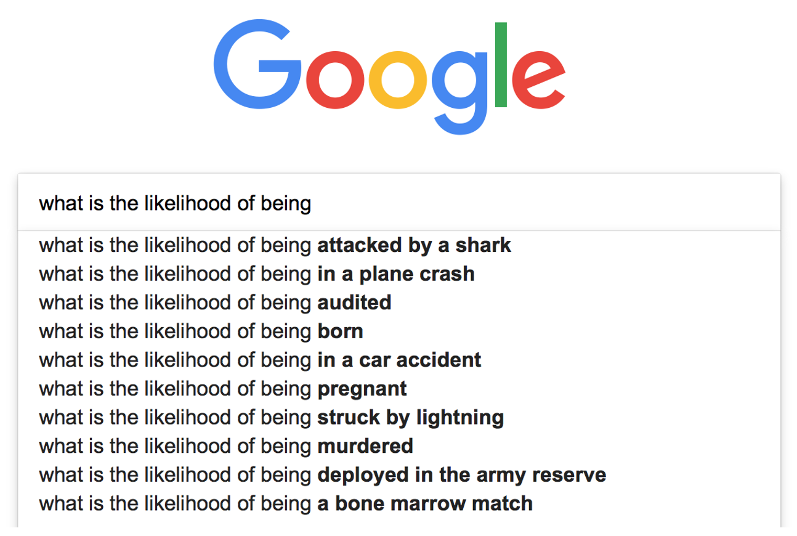
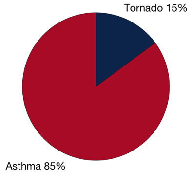

---
title: PSY 333 --- Week 2, Class 1
...

<iframe src="https://arizona.hosted.panopto.com/Panopto/Pages/Embed.aspx?id=21b7b0b7-ad19-4bdc-9aed-ac21011a3597&autoplay=false&offerviewer=true&showtitle=true&showbrand=false&start=0&interactivity=all" height="405" width="720" style="border: 1px solid #464646;" allowfullscreen allow="autoplay"></iframe>

# The Availability Heuristic for judging likelihoods

This week we will be discussing how we make judgments about the probabilities that certain events will happen or not.  We'll see how people aren't always great at making these judgments and that the _Availability Heurstic_ often biases their decisions.

More background on the Availability Heuristic can be found on ([wikipedia](https://en.wikipedia.org/wiki/Availability_heuristic)) and also in "Thinking Fast and Slow" Chapter 12.

## What do we mean by judging likelihoods

To get an intuition for what we mean by judging likelihoods try typing the following into a Google search

> `what is the likelihood of being `

and seeing how it wants to autocomplete it.  When I ran this in 2018 I got these results, which are a pretty good summary of the kind of things people worry about

In 2020 people are way less worried about shark attacks and now more worried about being "struck by lightning," although worrying about being "asymptomatic" for coronavirus is probably the thing you should _actually_ be worrying about especially if you are young and healthy (wear a mask!).

Finally, if you're wondering why people are asking about the likelihood of being born feel free to following this [link](https://www.huffpost.com/entry/probability-being-born_b_877853#:~:text=In%20a%20recent%20talk%20at,%2C%22%20I%20thought%20to%20myself.) turns out your chances of being born were about 1 in 400 trillion!

## Why does judging likelihoods matter?

Our ability to judge likelihoods is important because it informs our decision making.

For example, if I need to travel to San Diego I want to take the safest form of travel.  Should I fly or drive?  How likely I think I am to be in a plane crash vs a car crash is important information.

Once I get to San Diego, I might want to think about the likelihood of being eaten by a shark before I take a swim in the ocean.

## An experiment to investigate how we judge likelihoods?

In the survey at the start of the class I asked you this question (which is based on a similar question from Kahneman and Tversky)

> _In the English language, does the letter L appear more often as the first or third letter of a word?_

You can think of this as a question about judging likelihoods.

> _If I take a word at random from the dictionary, is it more likely to have the letter "L" at the first or third position?_

In reality there are more words with L in the third position (e.g. illness, baldrick) than there are with L in the first position (e.g. likelihood!)

<figure>

<figcaption>
The number of words in the English language with L as the first (red) or third (blue) letter
</figcaption>
</figure>

But this is not what people say when you ask them. Instead a majority say that there are more words with L as the first letter even though L appears 3rd in almost 3 times as many words.  These are responses from the survey you took ...
<figure>

<figcaption>
People's judgment about the number of words in the Enlish language with L as the first (red) or third (blue) letter
</figcaption>
</figure>

### How did you make that judgment?

One way in which you may have judged whether there are more words starting with L or with L as the third letter would be to try to think of examples of both kind of word.  So,

  * First, you think of words with L as the first letter
  * Second, you think of words with L as the third letter
  * Finally you compare the number of words you can come for both categories to judge which is more likely

_Can you see how this strategy might be subject to bias?_

Unless you are a Champion Scrabble player, it is much easier to think of words starting with L than to think of words with L as the third letter.  So any strategy that relies on coming up with _examples_ of the two types of words is bound to be biased.

<figure>

<figcaption>
Scabble Champion [Nigel Richards](https://en.wikipedia.org/wiki/Nigel_Richards_(Scrabble_player)) would surely answer the "L question" correctly!
</figcaption>
</figure>

The L question is an example of the [**Availability Heuristic**](https://en.wikipedia.org/wiki/Availability_heuristic).

## What is a heuristic?

A lot of Judgment and Decision Making research focusses on _heuristics_.  But what exactly is a heuristic?

A [heuristic](https://en.wikipedia.org/wiki/Heuristics_in_judgment_and_decision-making) is a simple process that humans (and other animals, and even machines) use to quickly form judgments and make decisions in complex situations.  Heuristics are not necessarily the _correct_ or _optimal_ thing to do, but they are easy and often work fairly well in practice.

When we use heuristics we are replacing a hard problem that we cannot solve for an easy problem that we can.  Our hope is that the easy problem shares enough features with the hard problem to provide some insight and lead us to a good solution, but this is not always the case.

An example of a heuristic is the strategy we described above for judging the prevalence of different kinds of L words.

The full problem is hard and to answer it you need a dictionary and to be able to count all words with L first or third.

The _heuristic_ of simply trying to come up with examples of L-first and L-third words is much easier.  If we could come up with both types of words equally well, this strategy would actually be pretty good.  But it fails us because it's much easier to come up with L-first words.

As we go through this class we will see a number of examples of heuristics.  The first, and the focus for this week, is the Availability Heuristic.

## The Availability Heurstic

The availability heuristic is at play when we judge likelihoods according to how easy it is to think of examples, that is how "available" examples are in our minds.

If I am using the availability heuristic then I think things are more likely when I can easily imagine examples of them and less likely when examples are hard to come up with.

### Fear of flying - the classic example of the Availability Heuristic

It is all too easy to imagine planes crashing. This is because every commercial plane crash is major international news and there are all sorts of movies where bad things happen to and/or on planes
<figure>

</figure>

On the other hand, safe landings are almost never reported [unless the plane nearly crashed](https://www.bbc.com/news/av/uk-england-london-51438230/storm-ciara-plane-struggles-to-land-in-strong-winds-at-heathrow-airport)

In reality plane accidents (on commercial airlines) killed 0 people in the entire world in 2017! That's despite their being over _100,000 flights per day_, a truly incredible feat of engineering and organization.

Fear of flying is definitely an irrational fear (especially compared to how most people feel about driving).  Google's autocomplete sums this up when we enter

> `plane`

It suggests plane crash as the third and fifth items (note the local tailoring re: plane crash on Mt Lemmon)

<figure>

</figure>

### Other examples of the Availability Heuristic

#### Stroke or Accident?
In the survey I asked you some classic questions to probe the Availability Heuristic.

> _Which of these is the more likely cause of death in the United States: Stroke or an accident?_

In reality strokes cause twice as many deaths, but accidents are much easier to imagine and so most people say accidents
<figure>

</figure>
Of course in the age group of typical college students, accidents or ([unintentional injuries](https://www.cdc.gov/injury/wisqars/pdf/leading_causes_of_death_by_age_group_2017-508.pdf)) _are_ more likely to kill you than a stroke!

#### Tornadoes vs Asthma

In the survey I also asked your

> _Which is a more likely cause of death in the United States – being killed by a tornado or being killed by asthma?_

In reality, asthma kills about 20 times more people, but in the original studies more people said tornadoes. This is explained by the Availability Heuristic because tornadoes are easier to imagine than death by asthma attack.

However, in Arizona (where tornadoes are rare) people don't make this mistake and most people list asthma as more deadly

<figure>

</figure>

#### Who does the dishes?

If you have ever lived in a group house you will have faced this one.  Who does most of the housework like the dishes?

<figure>

</figure>

[Ross and Sicoly](http://web.mit.edu/curhan/www/docs/Articles/biases/37_J_Personality_Social_Psychology_322_(Ross).pdf) asked married couples about how much they contributed to the household.  In particular, they asked about:

 * Positive things like: making breakfast, doing dishes, caring for children
 * Negative things like: causing fights, making a mess, irritating spouse

If people are unbiased, the total contribution from both partners should be 100% (assuming the kids aren't doing chores).

In practice the total contribution summed to _more_ than 100%.  People were overestimating their own contribution.  This was even true for negative things like causing fights (which suggests it's not just about wanting to look good).

What's behind this?

Why the Avaiability Heurstic, of course! It's much easier for me to recall what I have done around the house.  It's much harder for me to recall what my spouse has done because often I won't have seen them doing the chores.

#### Finally, an example of the Availability Heurstic about Availability Heuristics

This one is a bit meta, but which  phobia do you think is more prevalent: the fear of flying or the fear of driving?

Fear of flying is much better known and it's easy to imagine cases where people are afraid to fly (indeed such people are often depicted in movies).  So by the Availability Heurstic, most people think the fear of flying is more prevalent.

However, in reality _more_ people are afraid of driving (about 8% of the general population) than of flying (about 6.5% of the general population)!

This is in part driven by the much higher change of being in a car crash than a plane crash, because upto 25% of people involved in serious car accidents are afraid to drive (Why? Because of the Availability Heuristic; it's easy to imagine being in a car crash when you've actually been in one).

This meta-availability heuristic has real-world implications in that there's much more research on the fear of flying than there is into the fear of driving

In 2019, the number of papers with "Fear of flying"

  * 135 results on PubMed
  * 12,300 Results on Google Scholar

Number of papers with “Fear of driving”

  * 0 results on PubMed
  * 2540 results on Google Scholar
