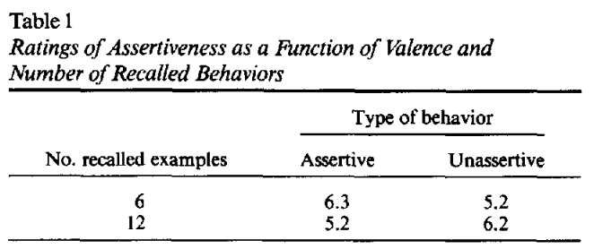

---
title: PSY 333 --- Week 2, Class 2
...

<iframe src="https://arizona.hosted.panopto.com/Panopto/Pages/Embed.aspx?id=deba2373-b2b5-4d5f-bc82-ac21011a3555&autoplay=false&offerviewer=true&showtitle=true&showbrand=false&start=0&interactivity=all" height="405" width="720" style="border: 1px solid #464646;" allowfullscreen allow="autoplay"></iframe>

# More on the Availability Heuristic

Last time we introduced the Availability Heuristic whereby events are judged as being more likely when examples of those events are easier to imagine. The classic example of this is plane crashes, which are easy to imagine but incredibly rare.

In this class we'll investigate what factors modulate how easy is to come up with examples; that is, _what determines availability_.

## An experiment to manipulate availability

Last time, I asked you to complete a short survey that I sent to you in an email.  This survey asked two questions.  The first asked about assertiveness:

> Question 1: _List six instances in which you behaved assertively_

The second question asked about UA

> Question 2: _List twelve things you love about the University of Arizona_

The reason I emailed these surveys to you (rather than simply posting a link online) is that there were actually _two different versions of the survey_ --- half the class did one version, the other half did the other.

  * In one version of the survey, I asked you to list SIX times you were assertive and TWELVE things you love about UA.
  * In the other version, the numbers were reversed and I asked for TWELVE times you were assertive and SIX things you love about UA.

After each question I had you make a judgment; first about your level of assertiveness and second about how much you like UA.

### How does the experiment manipulate availability?

Recalling SIX examples is relatively easy, while recalling TWELVE examples is relatively hard.  Thus, when you're asked to recall SIX examples those examples will feel available and you should rate your assertiveness or UA higher.

On the other hand, when you're asked to recall TWELVE items, then, because this feels hard, these examples will feel less available and you will rate your assertiveness or UA lower.

### So does this availability manipulation work?

In the [original 1991 study](https://www.researchgate.net/profile/Fritz_Strack/publication/38138513_Ease_of_Retrieval_as_Information_-_Another_Look_at_the_Availability_Heuristic/links/0046351b2031f1e9ee000000/Ease-of-Retrieval-as-Information-Another-Look-at-the-Availability-Heuristic.pdf) the answer is Yes! In this case they only looked had the assertiveness question, but found that people rated themeselves as more assertive in the SIX item condition (average assertiveness = 6.3 out of 10) than the TWELVE item condition (5.2).

<figure>

<figcaption>
The [original results](https://www.researchgate.net/profile/Fritz_Strack/publication/38138513_Ease_of_Retrieval_as_Information_-_Another_Look_at_the_Availability_Heuristic/links/0046351b2031f1e9ee000000/Ease-of-Retrieval-as-Information-Another-Look-at-the-Availability-Heuristic.pdf) from Schwartz and colleages.  Note that they also had a second question in which they asked people to rate how assertive they were after coming up with examples of cases in which they were _unassertive_.
</figcaption>
</figure>

In our study, the UA question gives similar results. n this case, people rate UA higher (8.3) after listing SIX items than TWELEVE (7.5).  This is similar to the patterns I've seen in previous years.

In the assertiveness question the results aren't quite so clean.  With people rating their assertiveness pretty much identically in both conditions (6.68 in the SIX-item condition, 6.61 in the TWELVE item condition).

### Why didn't the assertiveness question work?

Before we shout "failed replication" on the assertiveness question, it's important to check whether people were actually complying with the instructions.  In fact, this _was_ a problem with the assertiveness question: in both the SIX and TWELVE-item condition people stopped after just a few examples.  Because of this low compliance, it's not clear whether we actually manipulated the availability at all.

In the UA question compliance was much higher.

### Conclusions of the experiment

By manipulating how available examples feel we can change people's judgments.

## What determines availability?

The experiment above provides a nice demonstration that manipulating availability can change people's judgments.  But this is a pretty artificial situation.  What factors manipulate availability in the real world?

### Salience of the outcome

Salience describes how noticable or important something is and can refer to both negative things and positive things.

On the negative side, plane crashes are terrifying, while safe landings are not. This makes crashes much more salient than safe landings.  And this, in turn, makes plane crashes much more available than safe landings.

On the positive side, winning the lottery is highly salient and it's much easier (and more fun) to imaging winning the lottery than losing it!
<figure>

<figcaption>
Mavis Wanczyk won over $758,700,000 playing Powerball!
</figcaption>
</figure>

### Personal experience

If it happened to me it's more available.  We already saw this with driving.  People who have been in a serious car accident that requires hospitalization, are about 3-4 times more likely to have a fear of driving.  Why?  Because the idea of a car crash is more available to them.

_Can you think of other examples in which personal experience will change availability?_

### Movies

No one makes movies about uneventful plane journeys. In a movie, when an fire starts by accident it’s always bad news ...

<figure>

</figure>

But in real life, sometimes fires go out ...

<iframe width="560" height="315" src="https://www.youtube.com/embed/-R8-CpOcyp8" frameborder="0" allow="accelerometer; autoplay; encrypted-media; gyroscope; picture-in-picture" allowfullscreen></iframe>

### The news
No one writes news articles about people who don't win the lottery.

Media companies can also have an ideological agenda, promoting stories that align with their views and diminishing stories that conflict with their views.  If we only get our news from one source, this can change how available certain concepts are.

<figure>

</figure>

### Social Media

#### Blue Feed, Red Feed

Social media can amplify the biases of the mainstream media. This is because our friends and who we follow on social media tend to share our views (and if they don't we unfollow them).  This can create a "bubble" where we only see things we agree with.

After the last presidential election, the Wall Street Journal created a wonderfull tool call Blue Feed, Red Feed.  This showed two twitter feeds side by side, a Blue Feed that only followed Democrats and left-leaning media, and the Red Feed that only followed Republicans and right-leaning media.

Sadly the site stopped updating last year, but the archived results are striking and I really recommend you click the link and take a look. The two feeds look completely different and talk about the same topics in completely different ways.

> [Blue Feed, Red Feed](http://graphics.wsj.com/blue-feed-red-feed/ )

<figure>

</figure>

#### Judging ourselves

Social media and the availability heuristic can also affect our judgments about ourselves.

We often judge ourselves in comparison to other people, implicitly (or even explicitly) asking: _"Is my life as good as other peoples'?"_

On social media, the answer to this question is almost always "No" because people curate what they put online, whereas we can't so easily curate what happens in our daily lives.

So when I'm making cookies, my friends post things like this ...

<figure>

</figure>

While it takes me all day to make something like this ...

<figure>

</figure>

At Halloween, my friends are posting this ...

<figure>

</figure>

While my carving experience looks like this ...

<figure>

</figure>

Online you most often see the _highlights_ of people's lives. These highlights from your life are probably better than an average day in my life.  This may have consequences for mental health.

#### Social media use correlates with life satisfaction

In [one study](https://www.liebertpub.com/doi/abs/10.1089/cyber.2011.0324), the authors found that the more time people spent on Facebook (this study was conducted in 2011-2012 when Facebook was the most popular social media platform for young people) the more they were likely to agree with statements like:

  * Other people are happier than me
  * Life is unfair

This is consistent with the Availability Heuristic.  The more time you spend on Facebook, the easier it is to come up with examples of the great lives your friends are having, which can make your own life seem less good.

However, this _correlation_ between time on Facebook and life satisfaction could be driven by other factors.  For example, it could be that unhappy people spend more time online.  That is, that lower life satisfaction _causes_ increased Facebook use rather than increased Facebook use causing lower life satisfaction.

To get closer to a _causal_ test for the role of social media might play in driving self image, a [second study](https://journals.plos.org/plosone/article?id=10.1371/journal.pone.0069841&mbid=synd_msnhealth%20(https://journals.plos.org/plosone/article?id=10.1371/journal.pone.0069841&mbid=synd_msnhealth)) tracked people's Facebook use and life satisfaction over time.  So the design of the study looked like this:

<figure>

</figure>

In the baseline period they measured people's initial life satisfaction using surveys that asked people to rate how strongly they agreed or disagreed with statements such as these

  * I have nobody to talk to
  * My social relationships are superficial

They then measured the social media use for two weeks and then measured the extent to which they used social media changed their life satisfaction in the followup at the end of the two weeks.

The results suggest that life satisfaction at in the followup is predicted by three things

  1. Initial life satistfaction (that's the arrow with the .71*** above it)
     - This is not surprising because it's unlikely people's life satistfaction will change very much in two weeks
  2. Average affect (the arrow with -.26*** underneath it)
     - Again not surprising.  If you are generally unhappy during a two week period your life satistfaction at the end will likely be lower
  3. Average Facebook use (the like with -.12* over it)
     - This is the result that is consistent with the idea that Facebook use _causes_ lower life satisfaction

<figure>

</figure>

Of course, this _still_ isn't a proof that social media use causes lower life satisfaction because a worsening of life satistfaction during the experiment could be driving social media use, but it's moving in that direction.

## How can we change availability?

If the Availability Heuristic affects judgments and decisions, then perhaps we can use it to change people's behavior for the better.  One way to do this is through advertisments.  An example is a campaign that ran at UA to try to curb binge drinking ...

### Binge drinking on campus

Binge drinking is a problem associated with injury, crime, and low grades.

<figure>

</figure>

Anything that reduces binge drinking is "good" from a public heath perspective. Most people think that binge drinking is more prevalent than it actually is. This is in part due to large and loud parties at frat houses and also due to popular tropes in the media

<figure>

</figure>

This feeds into the Availability Heuristic, which encourages people to think that "everyone is doing it!"  But this is actually far from the truth, with the vast majority of college students _not_ engaging in binge drinking.  This has lead to the idea that perhaps we can change people's behavior by informing them about the actual prevalence, to make it easier to come up with examples of people not binge drinking on campus ... That is, can we make the idea of not drinking more available?

UA tried this posting ads like this one from 2005

<figure>

</figure>

and this

<figure>

</figure>

These aren't perfect, and would be better served by showing more pictures (and maybe even movies) of college students doing things other than drinking or turning down drinks (in a believable way).  However, the idea is on the right track.  So _did it work?_

Well, binge drinking went down (at least through 2015) - although whether this is due to the ad campaign is hard to say for sure

<figure>

</figure>
