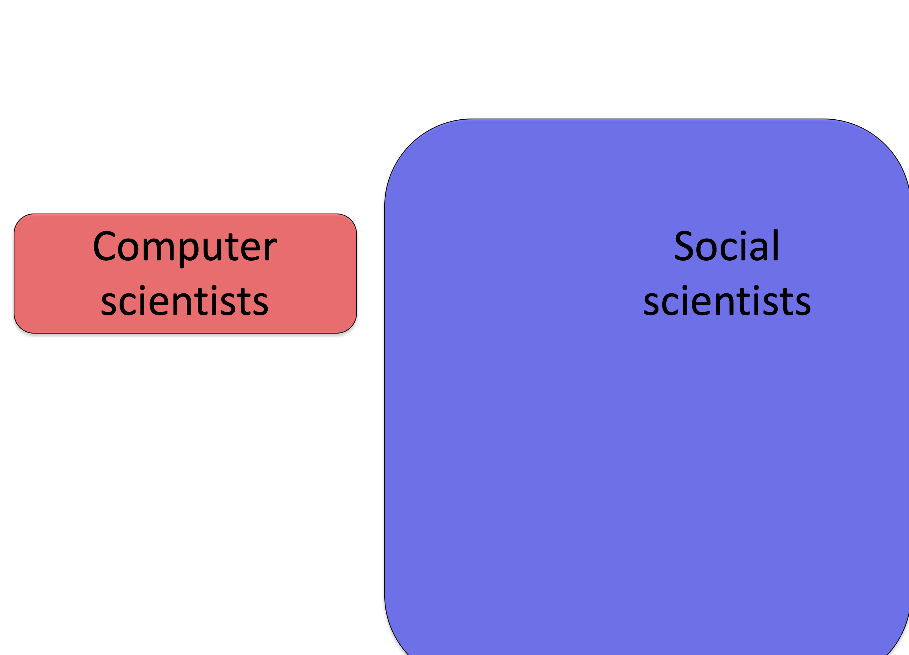

---
title: PSY 333 --- Week 3, Class 1
...

<iframe src="https://arizona.hosted.panopto.com/Panopto/Pages/Embed.aspx?id=dbbf6c83-53a8-4405-b21b-ac2201425afc&autoplay=false&offerviewer=true&showtitle=true&showbrand=false&start=0&interactivity=all" height="405" width="720" style="border: 1px solid #464646;" allowfullscreen allow="autoplay"></iframe>

# The Representativeness Heuristic

## Reading
[Wikipedia article on the conjuction fallacy, which talks about the Linda problem](https://en.wikipedia.org/wiki/Conjunction_fallacy)

## An example

What's the likelihood that something belongs to a particular category?  As an example let's consider the case where

> something = me

and let the category be

> category = nationality

In other words, _what's my nationality?_

To keep it simple let's limit ourselves to just two categories: Australian and English.

If you are trying to judge which of these two categories I'm more likely to belong to, and you are using the Representativeness Heuristic, then you will make your judgment by comparing me to your stereotypes for Australian vs English people.

For Australians, a Google image search for

> `Australian man`

throws up pictures like these

While a search for

> `English man`

throws up images like these

So which of these stereotypes am I closer to?  To vote, [click here](https://forms.gle/ZCs9TwufxyjNX84v7) and to find out the answer come to class on Tuesday!

As an aside, I probably don't fit the stereotype of a French man, which Google is more than happy to provide with an image search for

> `French man`

Hardly representative of _actual_ French people!  This has gotten a little better this year, but in 2018 this was the first page of results ...

So ... when you are judging my nationality, if you use the Representativeness Heuristic you are comparing (implicitly or explicitly) me to the stereotypes from different countries.  The one that I seem closest to is the category you put me in

## Representativeness vs Availability

At this point it's worth noting the similarities and differences between the Representativeness and Availability Heuristics.  In particular, both involve coming up with examples from memory

However, while the Availability Heuristic is all about how _easy_ it is to come up with examples, the Representativeness Heuristic is all about how _closely_ those examples match the thing you are trying to categorize.

## Two experiments to capture the Representativeness Heuristic

### The Linda Problem

From Kahneman and Tversky (1983).  In this study the experimenters had people make a judgment about a woman called Linda.  Before making the judgment they were presented with this description

> _Linda is 31 years old, single, outspoken, and very bright. She majored in philosophy. As a student, she was deeply concerned with issues of discrimination and social justice, and also participated in anti-nuclear demonstrations.
_

The judgment they had to make were about her job and her politics. Specifically they were asked

<i>
Which is more probable?

  1) Linda is a bank teller.
  2) Linda is a bank teller and is active in the feminist movement.

</i>

#### Most people say that Option 2 is more likely

Option 2 certainly _feels_ like the correct answer because Linda seems like a better match with a representative example of an active feminist than a representative example of a bank teller.  However, this answer is wrong and it is mathematically impossible for Option 2 to be more likely than Option 1 (although they can be equal in the unlikely case that all bank tellers are active feminists, see below).

That people choose the wrong answer here is known as the [Conjucation Fallacy](https://en.wikipedia.org/wiki/Conjunction_fallacy) and it is one of the key experiments that is used to provide evidence that people use the  Representativeness Heuristic.

#### Why is Option 2 the wrong answer?

However, the trick to this question is that mathematically, option 1 _has_ to be more likely.  To see why let's build a [Venn diagram](https://en.wikipedia.org/wiki/Venn_diagram) ...

First let's consider all of the people fitting Linda's description.  That's quite a lot of people and we will represent them as a rectangle, like we've rounded them all up and put them in a room.

Then of those people let's look at those who are bank tellers.  Let's represent that with a smaller blue rectangle.

Separately let's look at the people who are active feminists

And finally let's look at the overlap

Now, the likelihood that Option 1 is true (i.e. that Linda is a bank teller) corresponds to the area of the blue rectangle (including the area of overlap between the blue and red rectangles).

On the other hand, the likelihood that Option 2 is true (i.e. that Linda is a bank teller and an active feminist) corresponds to the area of overlap between the blue and red rectangles.  But this area _must_ be less than the size of the blue rectangle (unless all 31 year old bank tellers are feminists) so Option 1 _must_ be more likely to be true.

### The Tom W. Problem

Another experiment that illustrates the  Representativeness Heuristic is the Tom W. problem, also from [Kahneman and Tversky in 1973](https://pdfs.semanticscholar.org/8597/8718f87a0299b6b3fbbc3e8c40210d21942b.pdf).  This problem shares features with the Linda problem in that it starts with a description of someone who we later will have to judge.

In particular, we are asked to make judgements about Tom W. who is described like this

> _Tom W. is of high intelligence, although lacking in true creativity. He has a need for order and clarity, and for neat and tidy systems in which every detail finds its appropriate place. His writing is rather dull and mechanical, occasionally enlivened by somewhat corny puns and by flashes of imagination of the sci-fi type. He has a strong drive for competence. He seems to feel little sympathy for other people and does not enjoy interacting with others. Self-centered, he nonetheless has a deep moral sense._

Then, to three different groups of people we ask three different questions about Tom W.  The first question is much like the Linda question in that we ask about what he does - in this case, what his major is.  The second question asks us about typical students in each area. The third asks about the overall prevalence of each major on campus.  Together they provide a test of the Representativeness Heuristic idea.

#### Question 1 --- what is Tom's major?

Question 1 asks people to guess Tom W's major.

> _Question 1: Which of these subjects is Tom W most likely to be studying?_

<i>

  * Business administration
  * Computer science
  * Engineering
  * Humanities and education
  * Law
  * Library science
  * Medicine
  * Physical and life science
  * Social science and social work
</i>

Just like the Linda question, most people go with the Representativenss Heuristic and choose Computer Science for his major because Tom appears a better match for the stereotypes in this field.

Here are the results from the original paper, the number reported is the mean _rank_ after people ranked all of the options in order of how likely they were (e.g. I might rank Computer Science 1, Engineering 2, Physical and Life Sciences 3 etc ...).

A lower number means they think it's _more_ likely that Tom W is in that major.  Computer Science wins (average rank 2.5) closely followed by Engineering (2.6).  People ranked Social Science as the least likely option (average rank = 8.0).

However, similar to the Linda question, this "obvious" answer is less likely to be true.

Why?

Because in 1973 when there weren't many Computer Science majors, meaning that even if Tom W matches the stereotype, there would be _many_ more people matching his description in the more popular majors such as social science.

In Venn diagram form, let's consider all the Computer Science majors on Tom W's campus in 1973 --- it's not many

Now let's consider all the social science majors --- it's much more!

Now let's consider the people who match Tom W's description.  Even if the _fraction_ of computer scientists matching Tom W’s description is higher (note yellow overlaps most of red but only a small fraction of blue), the _total number_ of social scientists fitting his description (i.e. the total _area_ of the blue-yellow overlap) may be higher because there are more social scientists overall.

The next two question probe why people make this mistake.

#### Question 2 --- is Tom typical of the students in each major?

This question asks people to perform the comparison we _think_ (but do not yet know) they are performing to answer Question 1.  That is, it asks them to rate how typical Tom W is of students in each major.

> _Question 2: Consider the “typical” graduate student in each of the areas. Which area has students most similar to Tom W?_

If people are using the Representativeness Heurstic in Question 1, then the answers to Questions 1 and 2 should be the same.  This is because the Representativeness Heuristic assumes that people are comparing Tom W to the "typical" student in each of these programs.

As shown below, people's answers for Questions 1 and 2 are almost identical. This is not only  true for the most likely major (Computer Science in both cases, rank 2.1 for Question 2 and rank 2.5 for Question 1), but also for the least likely major (Social science rank 8.2 and 8.0)  and all the other majors in between.

This result provides good support for the Representativeness Heuristic, but still leaves open the possibility that they just don't know the prevalence of the different majors on campus.  This is addressed with Question 3.

#### Question 3 --- what is the prevalence of each major?

Question three asks whether people actually know the prevalence of each major.

> _Question 3: What percentage of people study each of the following in graduate school?_

In this one they didn't ask people to rank the majors in terms of popularity but to estimate the "base rate," i.e. the fraction of people in each major.  As you can see they do not think Computer Science (7%) is very prevalent, and they know it is much less prevalent than social science (17%).

However, despite knowing that Social Science is more prevalent _a priori_, they ignore this information when making their judgement about Tom W.  Instead using the Representativeness Heuristic to put him in Computer Science.

This error is known as "base rate neglect," because they are ignoring the base rate with which each major occurs.
