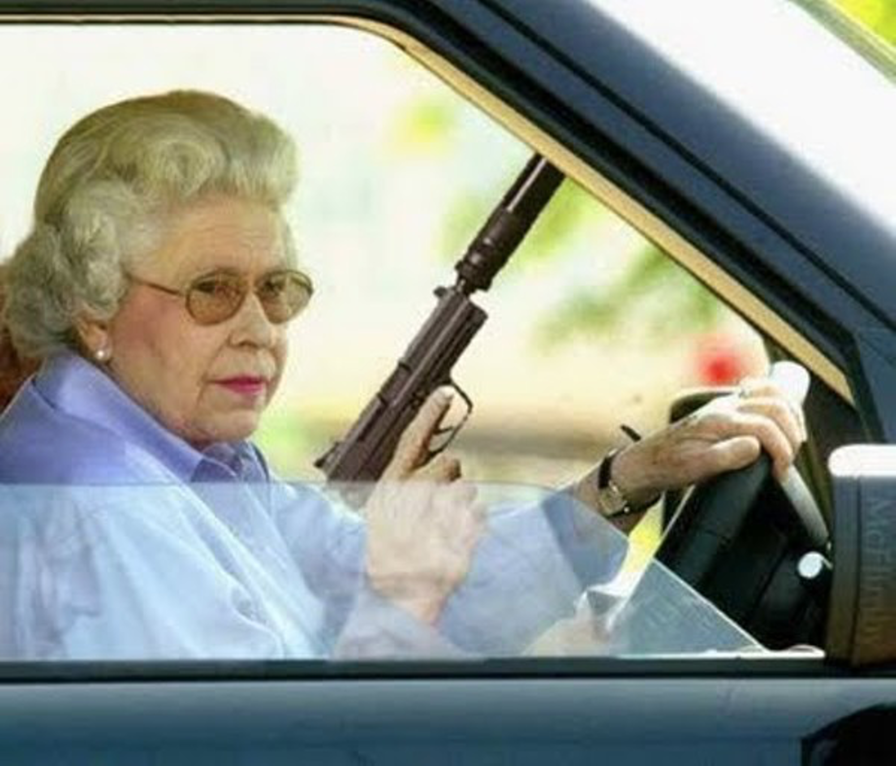
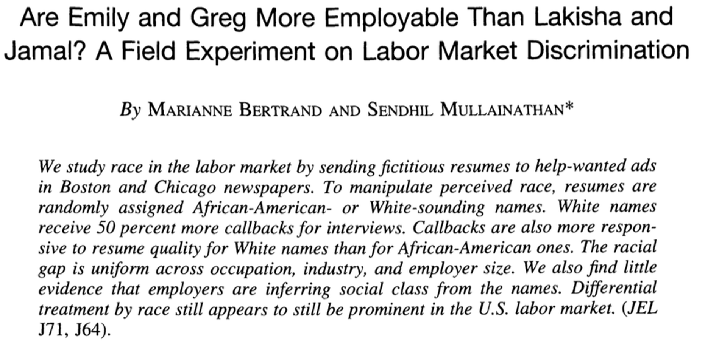
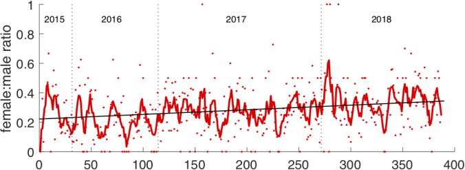
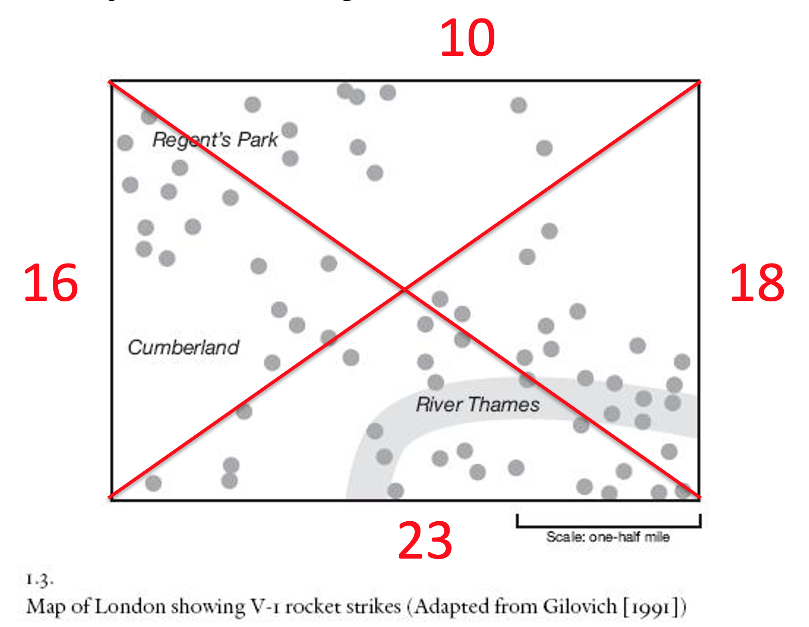

---
title: PSY 333 --- Week 3, Class 2
...

<iframe src="https://arizona.hosted.panopto.com/Panopto/Pages/Embed.aspx?id=82fcb7f7-0cd7-493c-aec8-ac2201425b2d&autoplay=false&offerviewer=true&showtitle=true&showbrand=false&start=0&interactivity=all" height="405" width="720" style="border: 1px solid #464646;" allowfullscreen allow="autoplay"></iframe>

# The Representativeness Heuristic 2

## Most of the time the Representativeness Heurstic works

### What are the chances a 7 foot tall man has / does / will play in the NBA?

You might think it's presumtuous to assume that a very tall man must be good at basketball, but if you ever meet a man over 7 feet tall there's a pretty good chance that he has, does, or will play in the NBA.  In fact, the chance is about 17% chance!

Why?  Because being this tall _does_ give you an advantage in basketball.  Moreover, there are only about 2800 people _in the entire world_ who are over 7 feet tall.  In the United States there are only about 70 US men between 20 and 40 are over 7 feet!  About 1 in 7 of these men play in the NBA

Of course, while a 7 foot tall man has a pretty good chance of being a professional basketball player, a merely very tall man (say 6'6 to 6'8) has a pretty miniscule chance --- only 0.007%!  So unless your are talking to someone over 7 feet, it's probably a bad idea to assume their a basketball player!

In case you'd like to know your own odds of playing in the NBA, the New York Times made this graffic (full story [here](https://archive.nytimes.com/www.nytimes.com/interactive/2013/11/03/sunday-review/so-you-want-to-play-pro-basketball.html)).  Sadly they didn't make a similar chart for women, but height helps here too with the average WNBA player being over 6 feet.

### Who's more likely to be the agressive driver?

Of these two people, who's more likely to be an agressive driver?

The Representativeness Heuristic says the guy on the left.  Indeed, a Google image search for

> `Aggressive driver`

gives a pretty good indication of what people think is a typical agressive driver --- a young man ...

Although watch out for the Queen (2nd from right in 2nd row) with the Walther PPK!  Also note that she is literally [above the law in the UK](https://www.royal.uk/queen-and-law), so she's allowed to shoot you if you cut her off ...

The data show that, in this case, the Representativeness Heuristic gives a pretty good answer --- young men are indeed more likely to be agressive drivers. For example, 71% of all car accident-related deaths in 2012 were males.  And young people pay way more for car insurance, in part because of the aggressive driving of young men.

## But the Representativeness Heuristic can also be very bad

While the Representativeness Heuristic can give good answers in many cases (and indeed if it wasn't fairly good most of the time we probably wouldn't use it) it can easily lead us astray.  We saw some experimental examples of this last time with the Linda and Tom W problems.  But the Representativeness Heuristic is likely behind many real world prejudices.

For example, let's imagine you are trying to hire someone.  The only relevant information here is their qualifications for the job, which in the first instance you learn about from their resume.  Nothing else --- their gender, age, race, ethnicity, nationality, disabilities --- should matter.

However, if you (perhaps subconsciously) have an idea of what a "representative" future employee will look like (e.g. your're imagining a white man because all of your current employees are white me), it is very easy for prejudice to creep in.

How big of an effect can this be?  In a [seminal paper](https://www.aeaweb.org/articles?id=10.1257/0002828042002561) Marianne Bertrand and Sendhil Mullainthan did an experiment to quantify real-world discrimination.

The idea was simple, they sent out applications for a bunch of jobs.  The applications all had the same information (same resume, cover letter etc ...) but differed in one feature, the name of the applicant.  These names were either white sounding names (Greg and Emily) or African American sounding names (Lakisha and Jamal).  So the resumes might look like this ...

Then they looked at who got called back for interviews.  White-sounding names got 50% more call backs than black-sounds names.

Sadly, this study is extremely robust and has been replicated many times and even in different countries (where minority groups can be different).  For example,

  * In Canada with English vs Immigrant names
  * In Germany with German vs Turkish names
  * In Sweden with Swedish vs Arabic/Muslim names
  * Also in Sweden with non-obese vs obese people (using resumes that included a photo)

Of course, these experiments can't say for sure whether this is the Representativeness Heuristic driving an unconscious bias in the recruiters or just explicit racism on the part of some people. Unpicking the causes is an active area of research.

## Hacking the Representativeness Heuristic for good

If people the Representativeness Heuristic is driving racial and other biases in hiring decisions, then one way to address this problem is to try to hack the heuristic by changing people's representation of what a good candidate for a job would be.

### Representation in stock photos

That's (at least part of) the idea behind projects such as the [Women's Center for Creative Work (WCCW) Stock Photo Project](https://stockphotoproject.womenscenterforcreativework.com/) and [TONL](https://tonl.co/) who are trying to inject some diversity into the world of stock images.

If you've ever been on a corporate website you will have encountered [stock images](https://en.wikipedia.org/wiki/Stock_photography) of business people.  Until recently the people in these stock images were not diverse ...

Images like this don't help and instead feed a the image of a "Representative" employee as being white, thin, and able-bodied.

Projects like the WCCW Stock Photo Project and TONL are trying to change this, by creating stock photos with a more diverse set of people.  For example, on the TONL website they have collections centered on specific areas like technology and travel (all the areas start with the letter T!).

### Representation at conferences

In many industries and in academia, a key component of the job is going to conferences.  Who speaks at these conferences, and hence who is elevated as a leader, can very much affect our stereotypes about what it takes to succeed in each field.

For this reason, more and more efforts are popping up devoted to increasing the diversity of speakers at conferences.  In my own field of neuroscience there's [Bias Watch Neuro](https://biaswatchneuro.com/), which tracks the gender of presenters in most neuroscience conferences, [Anne's list](https://anneslist.net/), which maintains a list of female neuroscientists and the topics they can speak on, [Black in Neuro](https://www.blackinneuro.com/binweek), which (among other things) highlights the work of Black neuroscientists, and [Comp Cog Sci](https://compcog.science/), which maintains a list of underrepresented researchers in Computational Cognitive Science.

There's some evidence that this work is paying off. In 2018 Bias Watch Neuro reported a significant increase in the representation of women at neuroscience conferences.  The average is still under 50%, but the trend is upwards ...

<!--

-->
