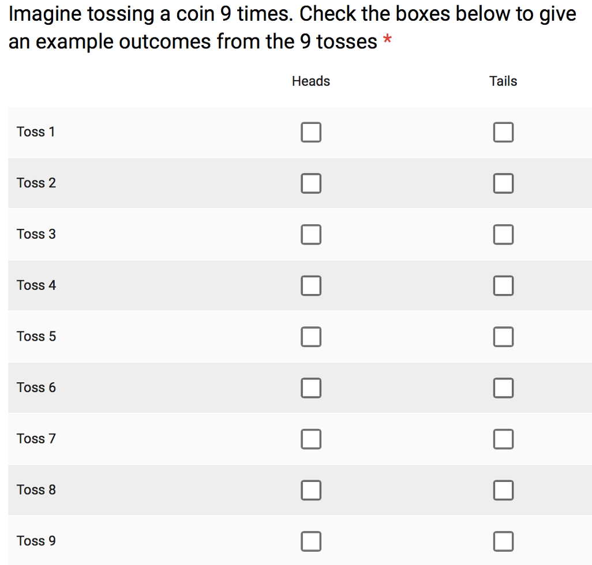
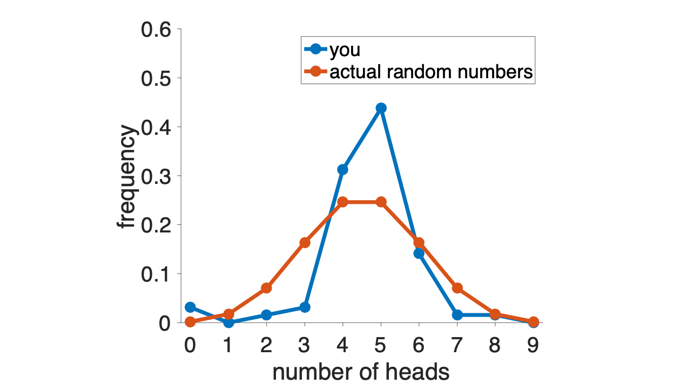
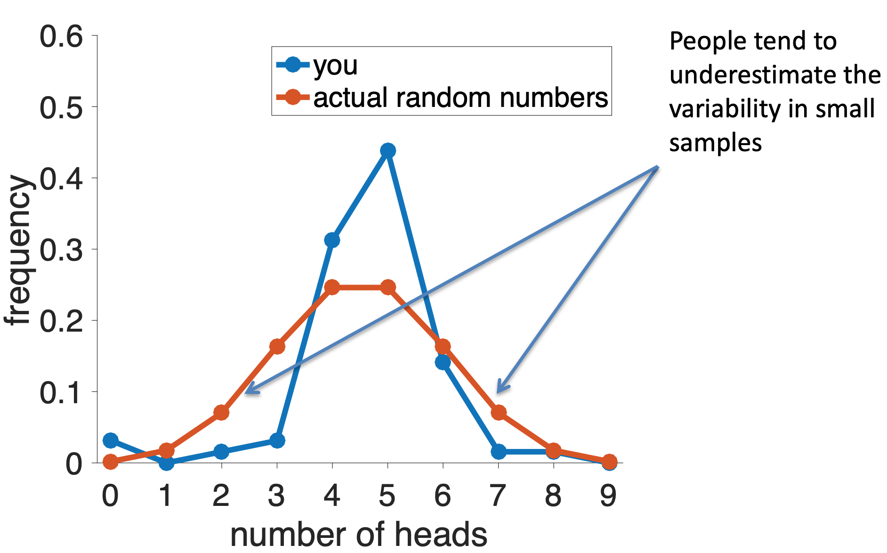

---
title: PSY 333 --- Week 4, Class 1
...

<iframe src="https://arizona.hosted.panopto.com/Panopto/Pages/Embed.aspx?id=1bbf86b5-cfa1-4e0c-acb2-ac2401306039&autoplay=false&offerviewer=true&showtitle=true&showbrand=false&start=0&interactivity=all" height="405" width="720" style="border: 1px solid #464646;" allowfullscreen allow="autoplay"></iframe>

# Weird properties of random numbers 1

Last week we studied the Representativeness Heuristic, which shows how people can be biased towards what the believe to be "representative" examples of a category.  We saw how this heuristic works well in some cases, but how it can lead us badly astray when our representative examples are wrong.

This week we will show how the Representativeness Heuristic can also mess with our understanding of random numbers.

## Survey results --- what do you think randomness looks like?

Last week I asked you to generate a series of 9 imaginary coin tosses on this survey ...

Here are the results.  In this plot, I'm plotting the people on the x-axis and toss number on the y-axis, heads are coded in yellow and tails in blue.  So the rectangle in the top left corner corresponds to the first imaginary coin toss of the first person to complete the survey.  In this case the rectangle is yellow so they said heads.

So are these coin tosses _actually_ random?  Well, you can already get a hint that they might not be by looking at the top row (toss number 1).  This row is mostly yellow which means that most people said heads for the first coin toss.  This is not at all how a real coin would behave!

We can get a much better idea by counting the total number of heads and tails that each person reported.  These results are plotted in the histogram below ... this shows that 5 heads (out of 9) was the most popular option, followed by 4 and the 7.  Only a few people reported any other numbers of heads.

Now we can compare this distribution of numbers of heads to what we'd expect from a fair coin.  To get this I turned to [some math](https://en.wikipedia.org/wiki/Binomial_distribution) that allows me to compute _exactly_ what this distribution should be for a fair coin.  As you can see there are some differences between your distribution and a truly random one ...

Note that the difference here isn't in the position of the peak of this distribution --- both the true distribution and your distribution put the maximum at 4 or 5 heads.  Instead it's in the _tails_ of the distribution.

Real random coin tosses, especially when there are only a small number of coin tosses, are more likely to have low and high numbers of heads than "random" coin tosses that are generated by people.

_People tend to underestimate the variability in small samples_

This psychological phenomenon is called the **_[Law of Small Numbers](http://psychology.iresearchnet.com/social-psychology/decision-making/law-of-small-numbers/#:~:text=The%20law%20of%20small%20numbers,at%20all%2C%20but%20a%20fallacy.)_**, in contrast to the mathematical phenomenon called the law of large numbers (see below).

Why do people underestimate the variability of small samples?  One answer is that they are using the Representativeness Heuristic.

In particular, when I ask you imagine 9 "random" coin tosses, instead of reporting something which could happen (e.g. 7 tails and 2 heads), you report something that is _representative_ of what you think randomness looks like.  For a fair coin, this is roughly equal amounts of heads and tails.

If you'd tossed more coins, your distribution over the _fraction_ of heads would have been closer to the truth.  This is because when you have a large number of tosses of a fair coin, then it's hard for the _fraction_ of heads to get far from 50%, this is because of a mathematical fact (the [law of large numbers](https://en.wikipedia.org/wiki/Law_of_large_numbers)).

<!--
To get an intuition for how increasing the number makes it harder to more away from 50%, first consider just one coin toss.  The outcome of this is either heads or tails, and so the fraction of heads is either 0 or 1.  With one coin you can't even get 50% heads!

Next think about 2 coin tosses.  If you get HT or TH that's 50% heads, but you only need to flip a T to H (50% probability) and you get 100% heads. Similarly you can easily get 0% heads by flipping the H to T.

Now imagine 10 coin tosses.  To get to 100% heads is now quite unlikely, you need 10 H in a row.
-->

## Real world cases of the Law of Small Numbers

Now, the above stuff about coin tossing might seem like a kind of mathematical party trick, fun to think about but kind of irrelevant for the real world.  But it turns out the same problem arises in many real world data sets.

### Height

Before we consider actual real world cases, let's consider an artificial one.  Let's imagine three groups of people (randomly selected from the population)

  * Group 1 has 10 people
  * Group 2 has 100 people
  * Group 3 has 1000 people

Which group is more likely to have an average height over six feet?  Which group is more likely to have an average height under five feet?

The answer to _both_ question is Group 1. Because it has the smallest number of people the variability in the average height will be higher.

Another way of saying that, is that you only need 2 or 3 tall people in Group 1 to push the average way up.  But you'd need 20 or 30 tall people in Group 2, and 200 or 300 in Group 3, to get a similar change in average height.

Conversely, if you had just 2 or 3 shorter than average people in Group 1 your average would be low.

This is _exactly_ the same reasoning as the coin example, although the intuition can be hard to get.  Random numbers are weird and our intuitions about them tend to be bad (in part because of the Representativeness Heuristic).

### Cancer clusters

Now let's look at a real-world case.  Take a look at this map of areas with the highest rates of kidney cancer in the US.  Looking at these you might notice that they are largely rural and in Republican areas of the country.

From those observations you could very easily come up with some story about how there are some health risks in these areas, perhaps due to local political decisions about the environment etc ...

But you would be wrong.  Why?  Because a glance at the areas with the _lowest_ incidence of kidney cancer shows that these too are in largely rural and Republican areas.

What's actually driving this effect is the Law of Small numbers.  The counties that show up as having especially high or especially low rates of kidney cancer are the ones with _low populations_.  And like the group of 10 people in the height example, there's more variability in these areas with small numbers of people.

Again it's the _exact_ same reasoning as the coin example and an example of the Law of Small Numbers.  Small groups have large variance and people do not account for this because their "representative" examples of randomness are not correct.

### Test scores and school size

Do big schools or small schools deliver a better education?  This is a huge question in education and something that many parents take into account when deciding where their kids should go to school.

One way (the wrong way) to address this question is to look at the sizes of the schools with the best average test scores and see if these are large schools or small schools.  These top scoring schools are shown in red below ...

These top scoring schools tend to be on the smaller than average, so from this we would conclude that smaller schools are better than larger schools.  Indeed, intuitions like this can become political very quickly and politicians can propose things like closing big schools in favor of more smaller schools.

However, what I've not shown you yet is the lowest scoring schools.  How big are those schools?   Well, ask you can see below the lowest scoring schools are _also_ small.  In fact the school with the lowest scores of all is one with about 50 students.

Why?  It's the Law of Small Numbers yet again.  Small schools, by definition, have smaller numbers of students and so we'd expect more variability in their average test scores simply by chance.

On this measure, at least, there's no effect of school size on the quality of education.
