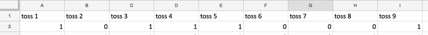
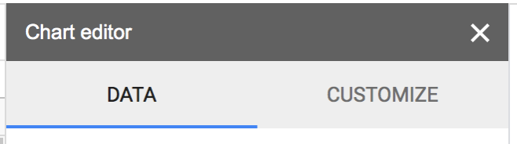

---
title: PSY 333 --- Assignment 4
...

_To answer the questions, please copy and paste them into Word (or some other text editor) and type out your answers.  Then please upload your document to the Assignment dropbox on D2L by the due date._

Due date: **Next Tuesday by midnight**.  If your assignment is late let us know and we can work something out.

## Representativeness and Randomness

### Part 1: Google Sheets (5 points)

In the first part of this Assignment you are going to play with real data from the coin tossing experiment you performed in class. The goal is to generate two histograms, one summarizing the responses of the class and the other summarizing actual random behavior.  In Part 2, you will talk about the differences between these histograms.

In this experiment I asked you to imagine tossing a coin 9 times and report the outcomes (e.g. Heads on first toss, Tails on second etc …). The results of this experiment are available in this Google Sheet (**note this sheet is read only so you will have to copy and paste into your own Google or Excel spreadsheet**).

> [LINK TO GOOGLE SHEET](https://docs.google.com/spreadsheets/d/1JBbVN4u1Kc2A29uMNO7uMzwKB1wfYHAGptIiN93f7nk/edit?usp=sharing)

Your data is on the page called “YourData”.  In this spreadsheet, each person’s response is on a separate row and the tosses of each coin are in each column.  So the responses of the first person look like this, where 1 means Heads and 0 means Tails.

So person one said there would be 5 heads and 4 tails.

1. Copy and paste all the values from the “YourData” page into your own spreadsheet.

2. Compute the total number of Heads each person reported by using the SUM function in Google Sheets.  Specifically in Cell J2 write

> = SUM(A2:I2)

3. Copy this formula down the column by selecting cell J2 and double clicking the little blue square at the bottom right of cell J2

4. Now we’re going to make a histogram of the Number of Heads the class reported.  To do this:

   - select all of column J (you can do this by clicking on the letter J at the top of the column)
   - Go to the “Insert” Menu at the top and click “Chart”.  A simple histogram should appear in the spreadsheet.
   - To clean up the appearance of this histogram, click “CUSTOMIZE” on the Chart editor window that should have popped up.

   

   
   

   - Then click on the “Histogram” tab and set the “Bucket size” to 1

   

   
   

   - Then click on the “Horizontal axis” tab and set the minimum value to 0 and the maximum value to 9
   - You should now have a nice histogram.  Save it by clicking on the three dots on the Figure and “Save Image”

   

   
   

   - Make a word document and paste in your histogram.

5. Repeat steps 1 to 4 for the “RandomNumbers” page.  This page looks similar to the “YourData” page.  The only difference is that the Heads and Tails are actually random.  Once you’ve made your histogram, paste it into your word document and compare with the histogram from YourData.

### Part 2: Writing (5 points)

1. What is the Law of Small Numbers?

2. What is the difference between the two histograms you made in Part 1? Why is this an example of the Law of Small Numbers?

3. Describe a real-world example where the Law of Small Numbers might lead us to wrong conclusions.  You can talk about the examples we covered in class or come up with an example of your own.
