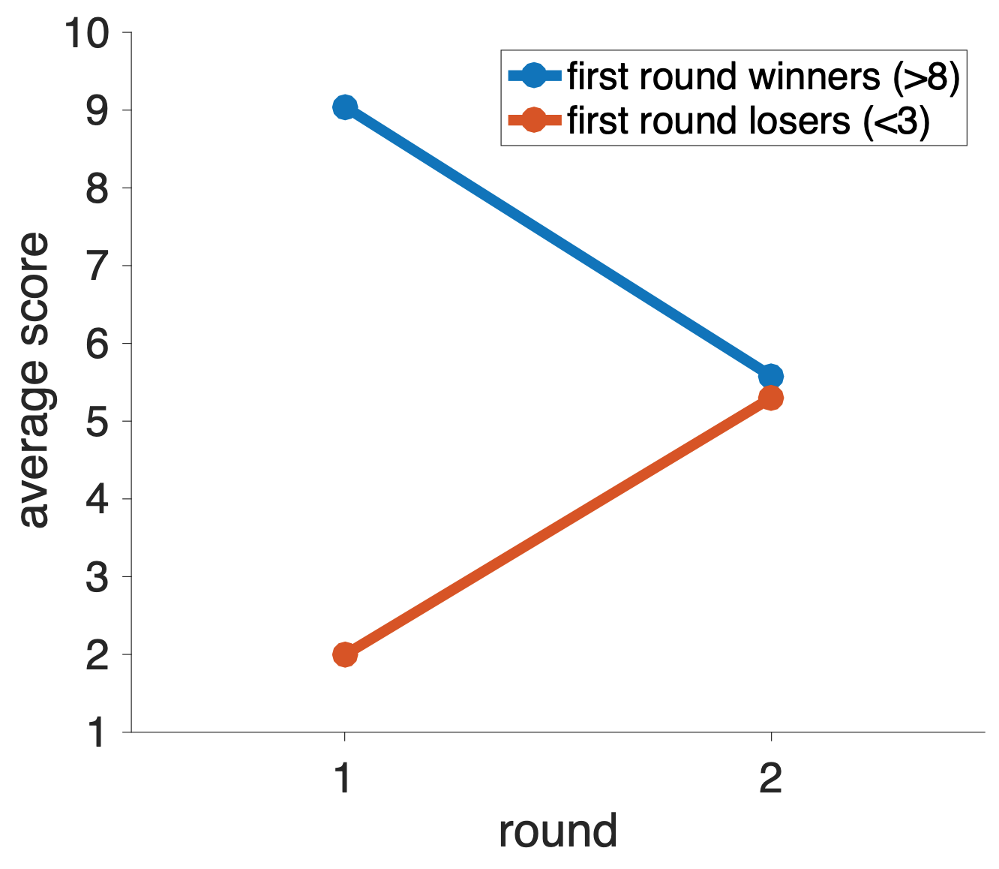
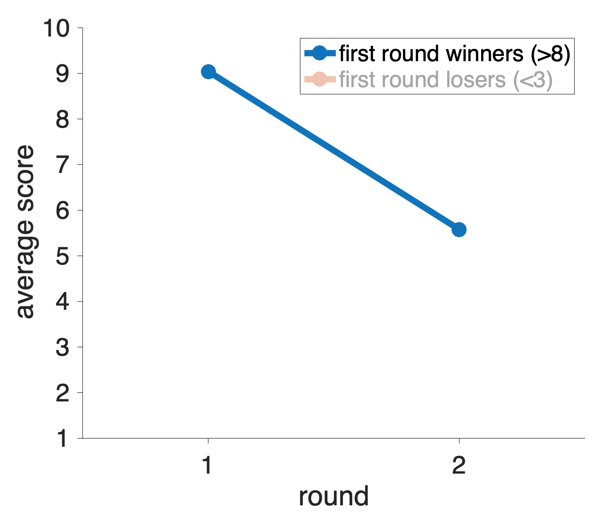
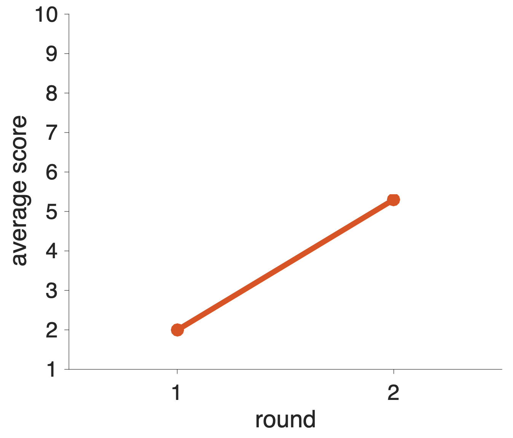
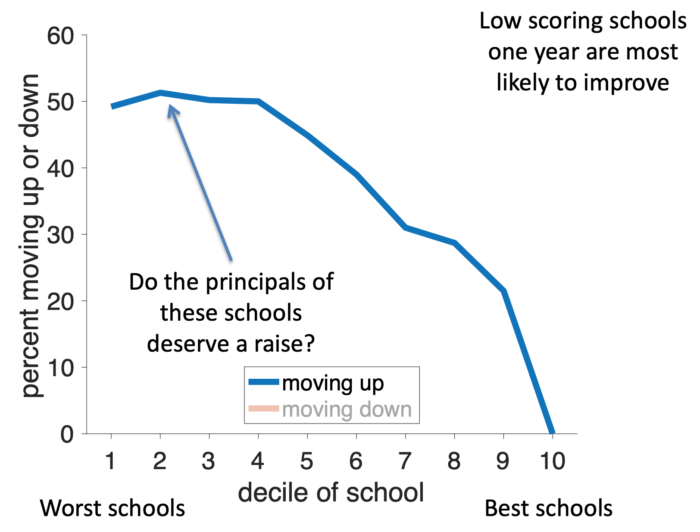
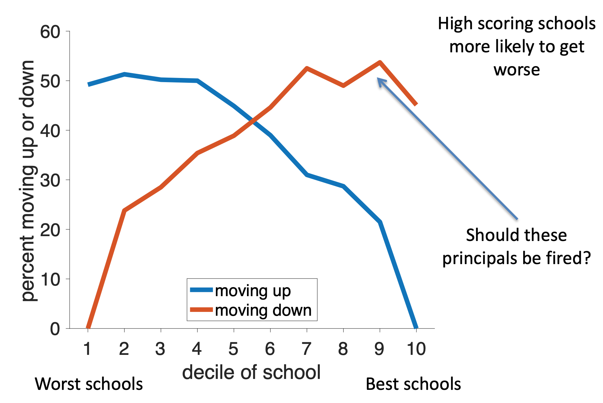

---
title: PSY 333 --- Week 4, Class 2
...

<iframe src="https://arizona.hosted.panopto.com/Panopto/Pages/Embed.aspx?id=f13360e3-eca1-4916-9d62-ac2401303be5&autoplay=false&offerviewer=true&showtitle=true&showbrand=false&start=0&interactivity=all" height="405" width="720" style="border: 1px solid #464646;" allowfullscreen allow="autoplay"></iframe>

# Weird properties of random numbers 2

Last time we saw how people can make bad judgments about random numbers.  This is because their "representation" of what random numbers should look like is wrong.  In particular, we showed how people underestimate the variability in small samples of random numbers.  We also showed that this can have real-world implications for the judgments we make about things like cancer clusters and school size.

Today we will investigate another way in which people's intuitions about random numbers go awry because their representations of random numbers are flawed.

## A game with random numbers

This example works better in a group demonstration and I will try it again in the Zoom for this class.  However, I want to have it in the notes so you can refer back to it later.  If it doesn't make total sense on your first read through, hopefully it will make more sense after class.

This game is all about generating random numbers.  To start, please do a Google search for

> `random number`

This should give you a tool like this, which allows you to generate a random number between 1 and 10.

Please generate a random number.

<!--
If you got a high score, do you think you could do it again?  If you got a low score, do you think you could improve?

Do you think, if you played a second time, what you got on the second play would depend at all on what you got on the first play?

Hopefully your answer to the last question is "of course not," they are just random numbers and the next play shouldn't depend on the outcome of the last play.  That's correct, and hopefully it's obvious,
-->

> _If you scored 8 or higher, you are a WINNER!  Congratulations!  You must be really great at generating random numbers.  Now generate another one.  What did you get?  Hopefully you didn't let me down ... if you did you are just proving that positive reinforcement doesn't work._

> _If you scored 3 or lower, you are a LOSER!  I can't believe you could do so badly at generating a random number!  Now generate another one and do a better job this time.  What did you get now?  Hopefully you improved ... if you did, you are proving that negative reinforcement does work._

Of course, the above two statements are crazy!  Please don't take them literally!  I promise none of you are losers!

The point of this game is to illustrate a phenomenon known as "Regression to the Mean."  This is where abnormally high or abnormally low numbers tend to average out in the long run.

In this example, it's clear that the number you get on the second play should be totally unrelated to the number you get on the first play.  So the average on the second play will be 5.5 (average of numbers from 1 to 10).

This is illustrated in a simulated example below (with thousands of random numbers).

For the first round winners, their average on the first round is 9.  This is not surprising since we defined these winners as having a score of 8 or more.  Their average appears to "get worse" on the second round, but that's only because they are "regressing to the mean" on the second round.

For the first round losers, their average on the first round is 2.  Again this is not surprising.  Their average appears to "get better" on the second round, but that's also only because they are "regressing to the mean" on the second round.

Hopefully this example seems trivial.  But as we shall see, when regression to the mean crops up in the real world it can fool even the smartest of us ...

<!--
What you've just done is an example that I like to do live in an in-person class.  When we do this in a crowded lecture theatre, we're virtually guaranteed to get several "winners" and "losers" every time.

But when the winners play again, they do worse on average than they did the first time.  This is not surprising because it's a random number and the second time their average will be around 5 (here's a simulation)

And when the losers play again, they do better, again because their average is around 5

iv>

At this point you're probably wondering what I'm going on about.  Aren't all the numbers random?  There surely can't be any actual skill involved.

## Regression to the mean
According to [Lee and Smith](https://onlinelibrary.wiley.com/doi/abs/10.1002/bdm.418?casa_token=_UYFGcAJdiYAAAAA:yZ3AHI66_gL0s68YSm35O0FnprMfeQ4UU4SVDGmu7Ms96yATl4evLakGjii3wctg3OBFZNGyskq6j3A)

> _There are few statistical facts more interesting than regression to the mean for two reasons:_

> _First, people encounter it almost every day of their lives._

> _Second, almost nobody understands it._

> _The coupling of these two reasons makes regression to the mean one of the most fundamental sources of error in human judgment, producing fallacious reasoning in medicine, education, government, and, yes, even sports._

So what is Regression to the Mean?  First let's consider an example from Kahneman ...
-->

## Flight school

Once upon a time, Kahneman was asked to present at a flight school for the Isreali air force.  Because he was a psychologist they talked to him about their training techniques.

The instructors claimed that

  * praise after a good maneuver results in a decrease in performance on next try, perhaps because people get lazy when they are praised
  * Conversely, punishment after a bad maneuver results in better performance

Kahneman realized that this pattern of responses could just as easily be caused by random chance.  Specifically he suggested that whether a maneuver was good or bad was purely down to luck.

In that case, if good maneuvers were largely just (good) luck, then the most likely outcome on second try was worse, just by chance.

Likewise if bad maneuvers were also largely (bad) luck, then the most likely outcome on second try was better.

In both cases, the feedback from the instructor was irrelevant.  The outcome of the maneuver was luck both times.  It's just that if, by chance you have good or bad luck the first time, the next time you will be more likely to be average, which either looks like a worsening or improvement relative to the first, random outcome.

That's not to say that instruction and feedback can't be valuable, but that just chance could also explain the results.

## Test scores

Another example comes from school test scores.  A key component in evaluating schools (and the principals of those schools) is whether their test scores are increasing or decreasing over time.

But there's a problem with evaluating this change because test scores are at least partially random.  This means that a school could perform poorly one year just by chance, meaning that the next year it will likely get higher scores just by regressing to the mean.

Likewise a school could, by chance, do great one year and then look like it failed the next year, just by regressing to the mean.

Thus regression to the mean predicts that low ranked schools should be more likely to move up next year and high ranked schools should be more likely to move down. Critically, this prediction is just a property of random numbers and is completely independent of the principal or whatever else is going on in the school!

If we plot the fraction of schools moving up in the ranking as a function of their initial ranking, we find support for this regression to the mean hypothesis.  The lowest ranked schools have a 50% chance of moving up in the rankings next year, but the higher ranked schools have much lower chance of moving up. (Of course they very highest ranked schools can't move up!)

Looking at schools that move down (red line), we see these are more likely to be schools that were initially ranked highly. Again supporting the idea of regression to the mean.

