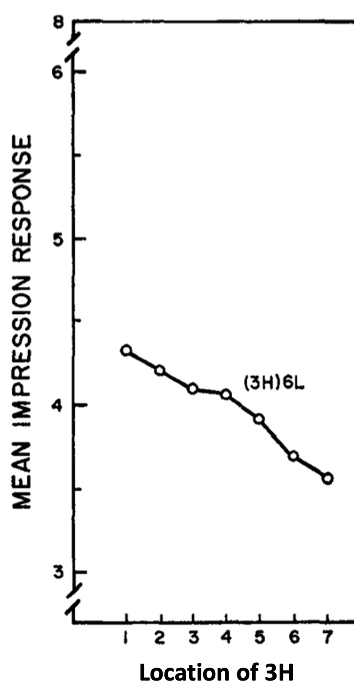
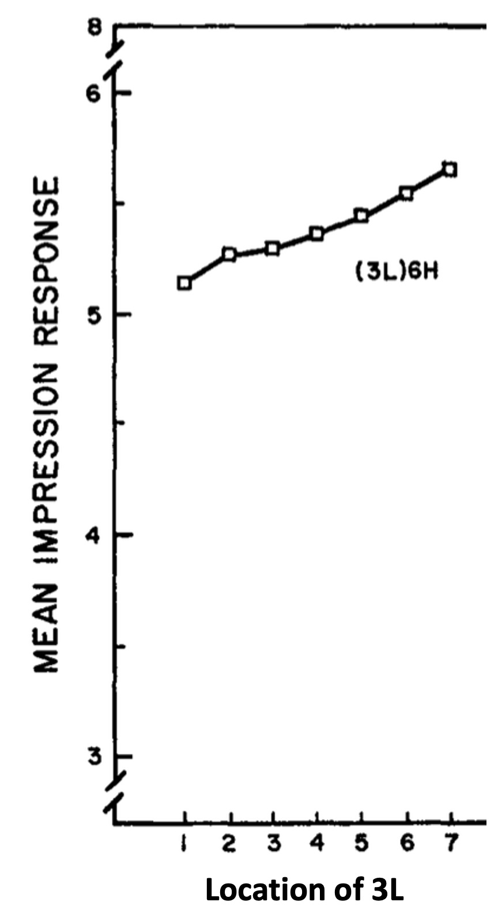
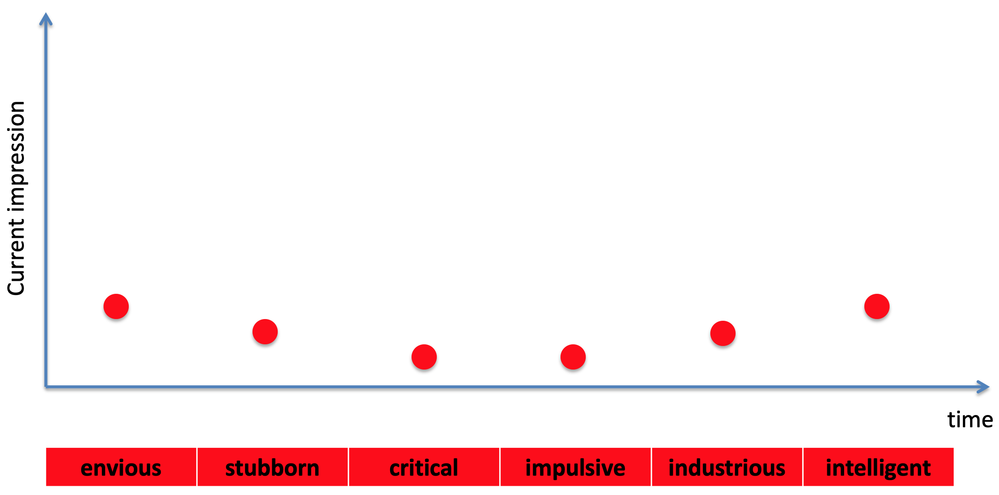
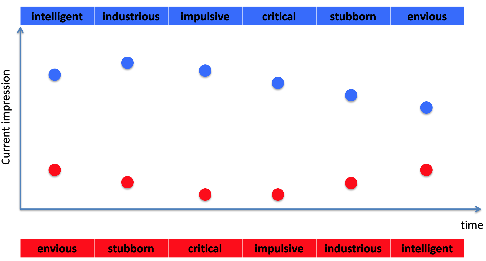

---
title: PSY 333 --- Week 5, Class 1
...

<iframe src="https://arizona.hosted.panopto.com/Panopto/Pages/Embed.aspx?id=8d633b1c-0fae-4fc6-864d-ac310116c6ca&autoplay=false&offerviewer=true&showtitle=true&showbrand=false&start=0&interactivity=all" height="405" width="720" style="border: 1px solid #464646;" allowfullscreen allow="autoplay"></iframe>

# Judgments from information presented over time

In many cases, we don't get all the information needed to make a judgment or decision at once --- instead it comes in slowly over time.  For example, if you're interviewing someone for a job, relevant information could come up at any point in the interview.  Likewise if you're asked to rate you last vacation, you are (hopefully) basing it on the experience as a whole, which may have lasted days or weeks, rather than a single experience.

How we _integrate_ this information over time to make a judgment is the key question for this week.

# Anchoring and adjustment

## Do first impressions matter?

If you've ever interviewed for a job or been on a blind date, you will likely have been told to make a good [first impression](https://en.wikipedia.org/wiki/First_impression_(psychology)).  This folk wisdom has been passed down through the generations and likely pre-dates the field of psychology itself.  The idea is that people will make snap judgments about from the moment they meet you and that a bad first impression could ruin your chances (of a job or a second date) for good.

_But is it true?  Do first impressions really matter?_

Soloman Asch asked this question with a [beautiful experiment in 1946](https://citeseerx.ist.psu.edu/viewdoc/download?doi=10.1.1.463.2813&rep=rep1&type=pdf).  In this study participants were asked to imagine a person with the following characteristics.

  * intelligent
  * industrious
  * impulsive
  * critical
  * stubborn
  * envious

One group of participants heard the description in this order, starting from the positive traits (industrious and intelligent) and ending with negative traits (envious and stubborn).

The other group heard the description in the reverse order, starting from the negative traits (envious and stubborn) and ending with positive traits (industrious and intelligent).

They were then asked to describe their impression of the person.  Note that what's being manipulated between the two orders is what information comes first.  In one case it's the good information, in the other it's the bad.  But the actual words are the same for both groups.  If first impressions don't matter, then both groups would form the same impression of the person.  But if they do matter, then they might form a quite different impression indeed.  This latter result is what Asch found.  In his words

> _The impression produced by [the intelligent-first order] is predominantly that of an able person who possesses certain shortcomings which do not, however, overshadow his merits._

>_On the other hand, [the envious-first order] impresses the majority as a "problem," whose abilities are hampered by his serious difficulties._

So it seems like there are clear differences between the lists, although it would be nice to put some numbers on it!  For that we need to wait 20 years ...

## Anderson 1965

This [paper](Anderson1965) aims at a more quantitative measure of the first-impression effect.  To this end they designed a more systematic version of Asch's study.

In particular, subjects heard descriptions of different people that each contained 9 attributes.  For each person they were asked to rate how much they thought they would get on with that them on a scale of 1 to 8.

In the first version of the experiment, three of the attributes were highly favorable (like intelligent).  These highly favorable attributes were labeled H for short.  The remaining six attributes were low favorable attributes (like envious).

The three H attributes were all presented one after the other.  But exactly where in the description they came was changed from description to description.  This lead to 7 possible orderings of the words in the description

  1. HHHLLLLLL (high attributes first)
  2. LHHHLLLLL (high attributes second)
  3. LLHHHLLLL etc ...

until

  7. LLLLLLHHH (high attributes last)

As you can see below, the average impression score varied depending on where the high attributes occured.  Ratings were higher when good attributes were presented first and decreased as good attributes get later.

One thing to note is that this effect is pretty small (1 point on an 8 point scale), but the effect is real because it replicates in the reverse experiment ...

In this reverse experiment the high and low attribute words were switched.  So now there were six high attribute words per description and three low attribute words.  This time the position of the low attribute words was manipulated, such that  the conditions were

  1. LLLHHHHHH
  2. HLLLHHHHH etc ...

Now the impression score is lower when the L words are first. That is, a bad first impression biases judgment against you!

Both good and bad first impressions count!

## Anchoring and adjustment

[Tversky and Kahneman](https://science.sciencemag.org/content/sci/185/4157/1124.full.pdf/?casa_token=dgaiYxhmuKIAAAAA:l3sgpx5EEK9FJRNtgbmfmxF8Z-xeBZNYPKbh1ny51kLBKSfkweoswhouVFn6sHhQBdpVrA9zK5OyjvQ&__cf_chl_jschl_tk__=76e02a42e6bc121f74330a27fed1cf818bef51e7-1595806777-0-ASFFB38YwzqlxjcPysSOVvWkfJlKI6RBIIZCDVCyi61Vwj9rM4BOY7wAgiBH6Jo15GsUwRWp4-Gu3iIx3AzzqzgDTT3kQT71y1P07djDtBgCMkVxbX0tqY7BwItd8Rk2g00J-G_kETg9b5TRr_jiIcAmvLsd8B_wA6NZ3wzTvFQ_59DdikoS5Bqdhki6CUwOaGpJIFR9tKfp9HQtDpdxFRkz9tYKm8NDHQImA6lvJAUMWstraL5xjUyk2nngwnMpZ6_vmeDUbmPBOJflX1tvVmCzeX_vfZiFiy9ANZDitYKtqP6LnCHOGUF0IZAIFHFTyuWDrpiqvFaPQFRZv6Elm3MVOVevf49yq1lKHIQ5WSXlHjgL59jcOeY9ubWQcM_RVOjlqMJoqI6X-QMqxKle4V8WMDNwguREomscmuzsSojvj32au95Q1lDOwVO8QgwqdSCZOmqs_ljRpBHcT9_yO7w) called this process _anchoring and adjustment_.

The first piece of information is the _anchor_.  This
sets the initial impression and affects how later information is processed

Later pieces of information cause the initial impression to be _adjusted_, but usually not by enough.

As an illustration, let's imagine how our impression might evolve as we are presented with Asch's list from envious to intelligent ...

Envious is first and acts as the anchor.  This is a negative word so we start with a bad first impression.  Later information still affects our impression, but only to adjust our initial impression slightly.

In contrast when intelligent is first, the anchor is positive and so the later negative words only make small adjustments to this positive first impression.

### Anchoring and adjustment can involve either System 1 and System 2 or both

Anchoring and adjustment can be driven by either system

  * System 1: subconscious, implicit
  * System 2: conscious, explicit

#### System 2 example

Consider this question ...
  > _When did George Washington become president?_

If you don’t know the answer, many people consciously anchor on a date they do know, e.g. 1776.  They then adjust to some time after that e.g. 1779, because Washington must have become president after the declaration of independence (the actual date is 1789).

Crucially this process is conscious and deliberate, that is it relies on System 2.

#### System 1 example

In this experiment they had people write down a random number (which was obtained by spinning a wheel).  The wheel was actually rigged so that half the time it gave a small number (10) and the other half of the time it gave a large number (65).

Next people were asked two questions

  1. Is the percentage of African nations in the UN greater than or smaller than the number you just wrote?
     - _Remember, this study was conducted in the 1970s when many African nations were not in the UN, today it is 100%_
  2. What is your best guess as to the percentage of African nations in the UN?

The second question was the main focus.  Note how this second question has _nothing_ to do with the random number at all.  However, people who saw the small random number estimated a much lower proportion for this second question (25%) than people who saw the large random number (65%).

The random number acted as an anchor, even though it had nothing to do with the question.  Such an unconsious process is a hallmark of System 1.
