---
title: PSY 333 --- Week 5, Class 2
...

<iframe src="https://arizona.hosted.panopto.com/Panopto/Pages/Embed.aspx?id=d36ef647-3fb3-4cf2-b971-ac3101175adc&autoplay=false&offerviewer=true&showtitle=true&showbrand=false&start=0&interactivity=all" height="405" width="720" style="border: 1px solid #464646;" allowfullscreen allow="autoplay"></iframe>

# Peak-end bias

This week we are focussed on judgments based on information that comes in over time.  Last time, we looked at judgments where information comes in over time and the judgment is made immediately after the information is presented.  The classic example is a job interview. You interview the person and at the end make a judgment about their suitability for the job. In this case we showed that people use an _anchoring and adjustment_ heuristic, where the first piece of information is the most important --- first impressions matter.

Today we will look at a slightly different kind of judgment, in which the information comes in over time but the judgment isn't made until later.  An example is when someone asks you about your last vacation ...

## How good was your last vacation?

To make an overall judgment about your last vacation you need to take into account everything that happened.  Maybe you went to the beach, got stung by a jelly fish, but had a great time snorkling, but had major delays at the airport.

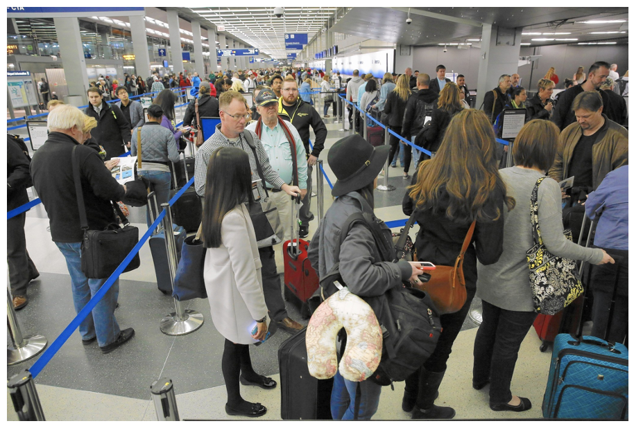

How do you combine this information to make a judgment?

One idea is that we don't actually consider everything when making a judgment like this.  Instead our judgments are biased by the _peak_ experience (the very best and/o very worst experience on vacation) and the _end_  experience (the last thing you did on vacation).  This is called the _Peak-End Bias_ or _Peak-End rule_.

In our vacation case, the peak was snorkling, but the end was a bunch of standing around in an airport.  So our judgment is that the vacation was OK, but not amazing.

## Evidence for the Peak-End Rule

[Barbara Fredrickson and Daniel Kahneman](https://pdfs.semanticscholar.org/85c2/33d9075c32a1eafebb14360c320e74b7ef5b.pdf)
did a great experiment in 1993.  In this study participants watched movies that were either

* Negative (aftermath of a nuclear bomb)
* Positive (penguins diving off a glacier) or

This wasn't the actual movie penguin movie they used, but it's similar, and definitely generates positive feelings ...

<iframe width="560" height="315" src="https://www.youtube.com/embed/apH9QsAdhh8" frameborder="0" allow="accelerometer; autoplay; encrypted-media; gyroscope; picture-in-picture" allowfullscreen></iframe>

During the movies they gave a continuous rating of how positive or negative they were feeling at that moment.  The idea was to capture the in-the-moment experience of how good the experience was

Here's what those continuous judgments looked like during a negative movie ...

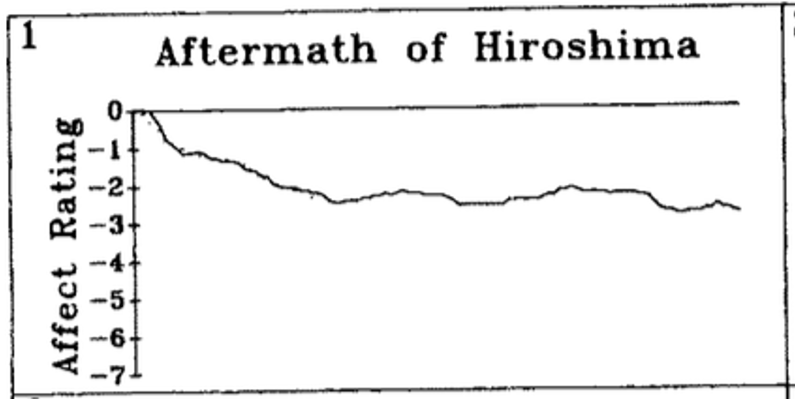

and here's what they looked like during a positive movie ...

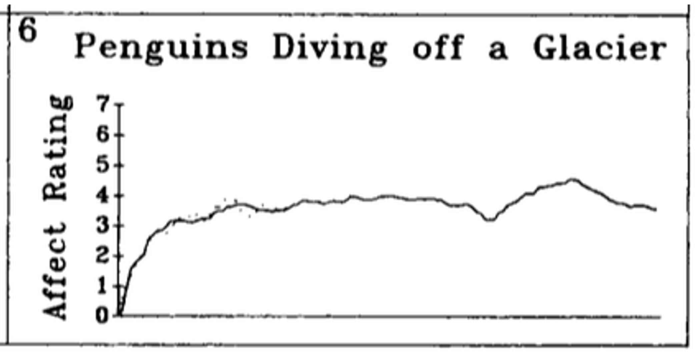

The key measure was at the end of the movie, where the experimenters asked the participants to evaluate how the movie made them feel overall.

The experimenters could then analyze the data to determine what aspects of the in-the-moment experience drove the overall judgment.  In particular, they asked whether the Peak rating (i.e. the highest or lowest in-the-moment rating), the End rating (i.e. the last rating participants gave), or the Duration of the movie best predicted the overall rating.

They found strong evidence that the Peak and End mattered, but no evidence that Duration had any effect.

This is good initial evidence for the existence of the Peak-End bias.

In addition, the null result for Duration is really interesting.  This says that if I watch two movies of penguins, a one minute video and 10 minute video, but both have the same peak and the same end rating, I should rate them the same.  This is despite getting 10 times more positive feelings from the long video!

Here's the original table of results. The key lines are the bottom three showing that Peak and End correlate with overall rating (espsecially for positive videos), but that Duration does not

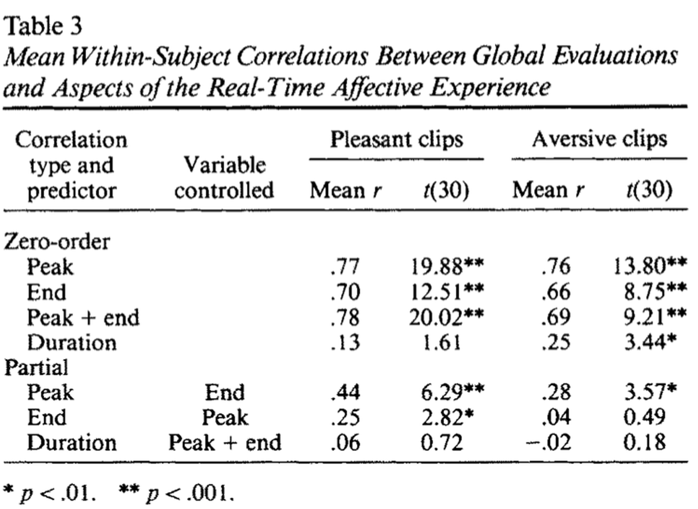

## Breaking Bad

[Breaking Bad](https://en.wikipedia.org/wiki/Breaking_Bad) is widely regarded as one of the greatest television series of all time.

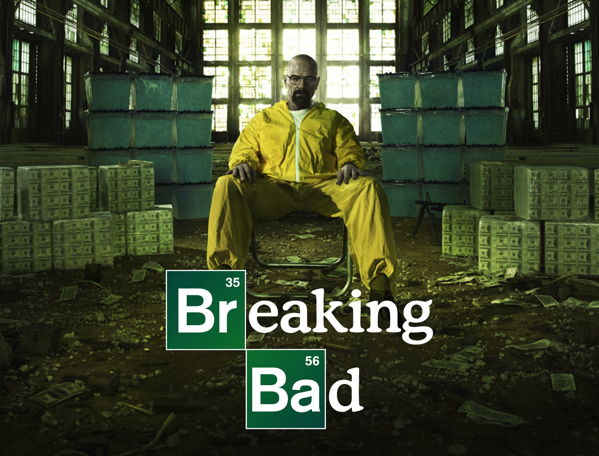

It won multiple awards ...

  * 16 Primetime Emmy Awards
  * 8 Satellite Awards
  * 2 Golden Globes
  * 2 Peabody Awards
  * 2 Critic’s choice awards

And it's meta critic rating is almost perfect ...

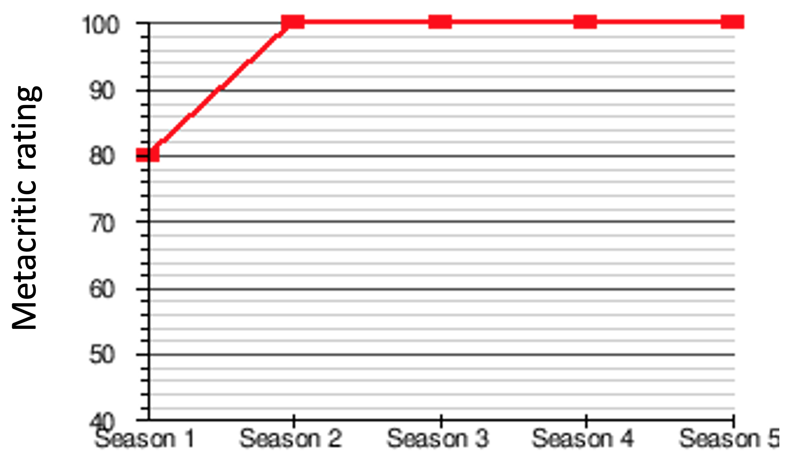

But a whole lot of it is really dull!  In this scene the family sits around the table in silence for a _long_ time ...

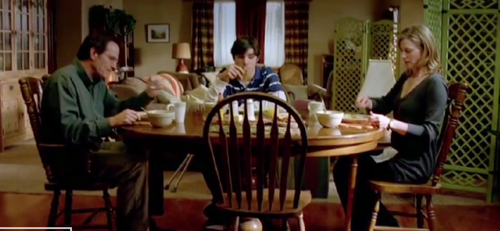

If you've not seen it, the "Honest Trailer" on YouTube gives a pretty good summary (contains spoilers!)

<iframe width="560" height="315" src="https://www.youtube.com/embed/oDqGAUvWKkU" frameborder="0" allow="accelerometer; autoplay; encrypted-media; gyroscope; picture-in-picture" allowfullscreen></iframe>

But despite the dull parts, the Peaks are really high ...

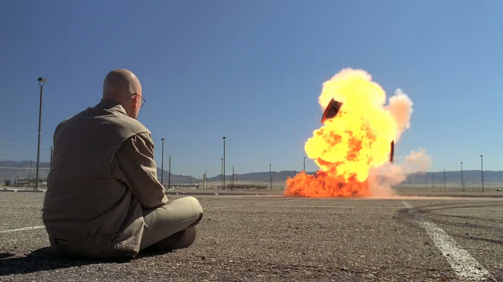

And the ending is incredible ...

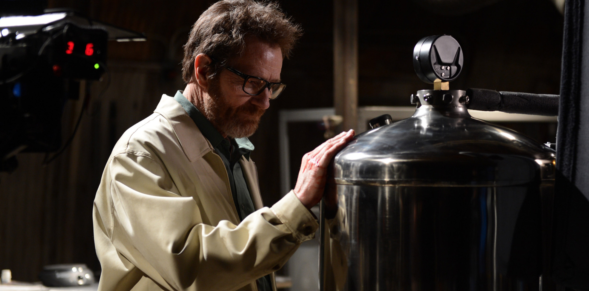

In fact, the end of every season except the first is really great.  Here's the IMDb ratings for each episode plotted over time.  The different seasons are in different colors.

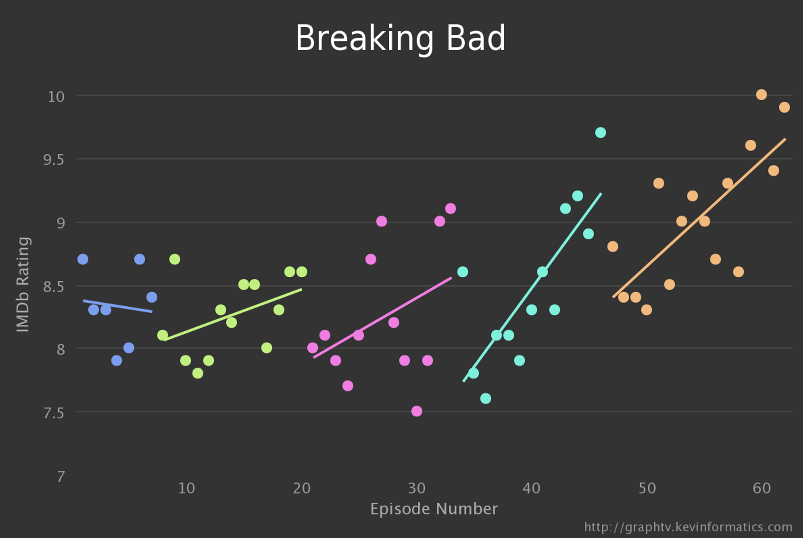

You'll also not that some episodes get a pretty low ranking.  For comparison, the lowest ranked episode (at 7.5 out of 10) is about the same as the average episode from "supernatural teen drama" [The Vampire Diarys](https://en.wikipedia.org/wiki/The_Vampire_Diaries), a show which did not generate quite as much praise.

Nevertheless, because the Peak and End experience are overweighted in our judgments, the boring parts of Breaking Bad don't figure into most people's rating of the show.

## Using the Peak-End bias to change people's preferences

If people use the Peak-End bias then perhaps we can use that to change people's preferences.  For example, we could make a bad experience seem less bad by making the End more pleasant ...

### Preferring more pain over less pain

1993 was a good year for the Peak-End bias (you could even say it was the Peak year).  In a [second study](https://journals.sagepub.com/doi/abs/10.1111/j.1467-9280.1993.tb00589.x?casa_token=_ki0D-abKOUAAAAA:l8PKz0vDZE0Gz1_vSI0TnqLDLT6F7vqxAYlfx6aMan1fmDNEmlsIpiYs4rvgQbCMrSlB1mP2U1kWqw) Kahneman, Fredrickson and colleagues showed that by changing the ending of a bad experience to make it slightly less bad, they could get people to prefer an objectively more painful experience.

The painful experience they used was holding your hand in cold water. If the water is cold enough, this is a painful experience, especially if you hold your hand in for a while.

In the experiment participants put their hands into cold water for 60 seconds or 90 seconds.

In the 60 seconds condition, the temperature of the water was 14C for all 60 seconds.

In the 90 seconds condition,  the temperature of the water was 14C for 60 seconds and the 15C for the last 30 seconds (they changed the temperature by adding a small amount of warm water).

Of these two options, there is no doubt that the 90 second condition is a worse experience.  You get all the pain of the first 60 seconds and then you have 30 more seconds in water that's still very cold, just not quite as cold as it was originally.

However, the End experience differs between the two conditions.  In the 90 second condition, the Ending isn't quite as bad as in the 60 second condition (and the Peak, i.e. worst, experience should be the same in both conditions).  So if people are using the Peak-End rule, they should have a lower discomfort rating for the 90 second condition simply because the End is better.

This is indeed what they found, with 22 or 32 people preferring the 90 second experience to the 60 second experience!

### Colonoscopies

If people can be tricked by the Peak-End rule into preferring more unpleasant experiences over less unpleasnt experiences, perhaps this is something that we can use to get people to go through with painful (but important) medical procedures.  In a classic example of this [Redelmeier and colleages](https://www.sciencedirect.com/science/article/pii/S0304395903000034?casa_token=l3XXcWaml8cAAAAA:URr2dUaSvDTsBFfPCn-gNf_hJJN3iyuXl-_fWzDCezdFPVLmD9YCfjTe5EiWk1ovuIgNNBPzuRk) tested this idea with colonoscopies.

If you are not familiar with them, a [colonoscopy](https://en.wikipedia.org/wiki/Colonoscopy) is an exam used to detect changes or abnormalities in the large intestine and rectum. During a colonoscopy, a long, flexible tube is inserted into the rectum. A tiny video camera at the tip of the tube allows the doctor to view the inside of the entire colon.

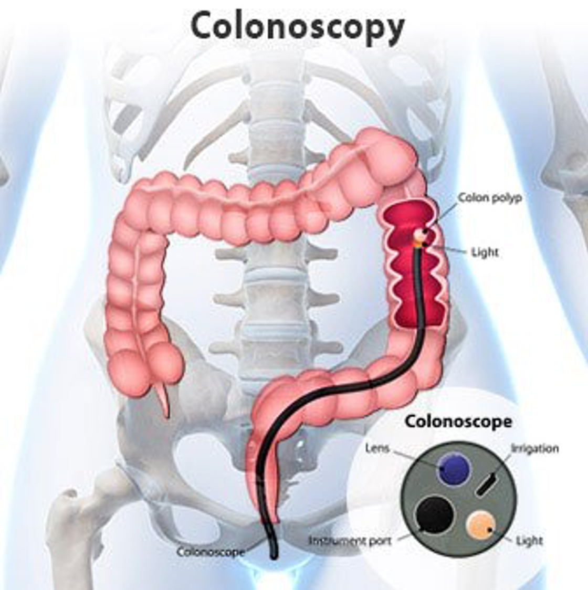

It is an unpleasant and painful procedure and many patients who should get one (e.g. because they are in remision from colorectal cancer and need monitoring to ensure the cancer has not returned) avoid them. Anything that gets people to come to their appointments is a good thing.

In this study the authors first tested whether the Peak-End rule applied to ratings of colonoscopies.  To do this they had people rated their pain over time during the procedure on an 8-point scale and then rate the procedure again after it was done.

As you can see, from these two example plots, the pain ratings can be high (8 out of 8), but there is considerable variability over time.

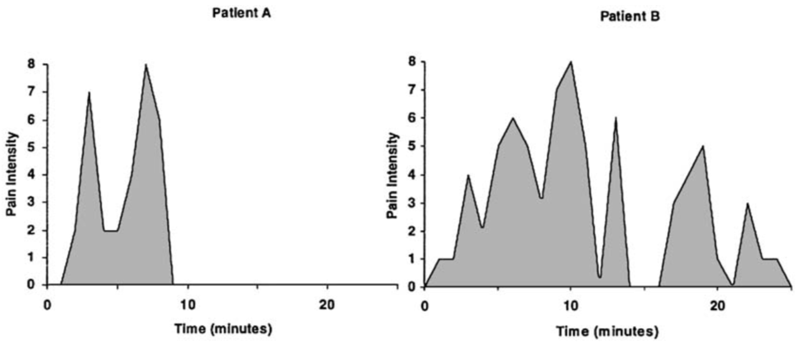

As expected they found that people's overall ratings were best explained by a combination of the peak (i.e. most painful) rating and the end rating.  In the example above, Patient A, would rate the experience worse because their experience at the end was worse than patient B, who's end experience wasn't so bad.

#### Changing the end

Having established that the Peak and End are driving the overall rating, they then tested whether _changing_ the End could improve the rating.  They did this by adding 3 minutes to the end of the procedure, i.e. before they removed the device, in which nothing happened.

Note that this change actually makes the procedure _worse_ from an objective perspective --- it's the exact same procedure but just lasts 3 minutes longer.  However, this made the last 3 minutes much less painful.

When they did this, people rated the procedure overall as 0.5 points less painful (4.4 for the 3 minute condition, 4.9 for the normal colonscopy).

In addition, people were slightly more likely to return for a follow up appointments (on average 5 years later).  Specifically 53% of people came back in the 3 minute condition, 48% in the normal colonscopy.

These aren't enormous effects, but nevertheless a real-world demonstration of the Peak-End bias changing people's behavior for good.

## But what about Anchoring and Adjustment

You may be wondering at this point about where this leaves the Anchoring and Adjustment heuristic.  In both this class and last time the judgments are based on information coming in over time.  But whereas today we said the Peak and End matter, last time we said that the Beginning matter most --- it acted as an anchor.

_How can both Peak-End and Anchoring and Adjustment be true?_

Well, it's actually not totally clear and the textbooks I've read don't really provide much of an explanation.  However, I think there are a couple of differences that might determine whether we use Peak End or Anchoring and Adjustment.  Although more work needs to be done to better understand exactly when each heuristic is used ...

I think that whether you use Peak-End or Anchoring and Adjustment depends very much on _when_ you are doing the judging.  If you make the judgment immediately after the information is presented (and have been forming the judgment as the information is presented), then you are more likley to use anchoring and adjustment.  This is the case of the job interview, where they rate you immediately after the interview.

On the other hand, if you make the judgment long after the information has been presented, and need to activate _memories_ to make your judgment, then I think you are more likely to use the Peak-End bias.  This is because the memories you are likely to recall to inform your judgment are the things that are easiest to remember, the peak, because it was really good or really bad, and the end because it was most recent.
