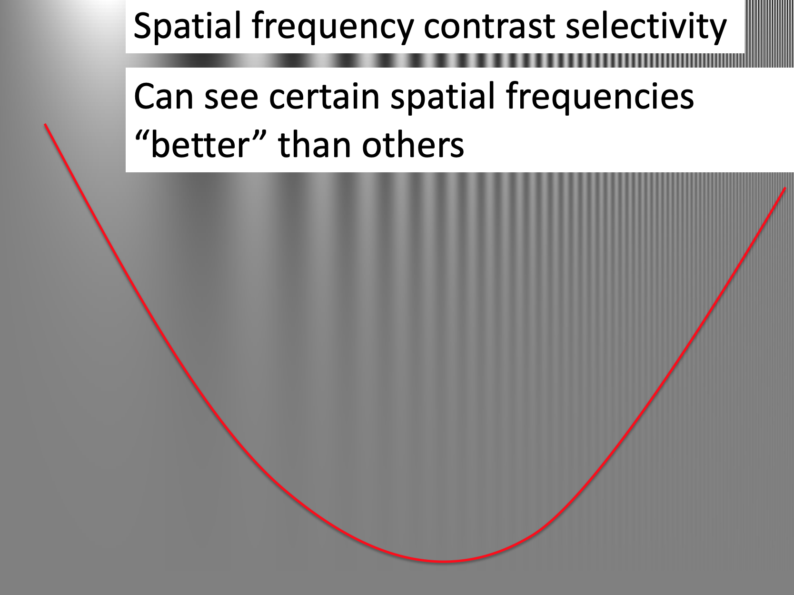

---
title: PSY 333 --- Week 7, Class 1
...

<iframe src="https://arizona.hosted.panopto.com/Panopto/Pages/Embed.aspx?id=8e8a4b85-bf4b-49d7-8379-ac32012a3e4c&autoplay=false&offerviewer=true&showtitle=true&showbrand=false&start=0&interactivity=all" height="405" width="720" style="border: 1px solid #464646;" allowfullscreen allow="autoplay"></iframe>

# Decisions

In this part of the class, we will move on from judgments to study decision making.

## Studying decisions like perception

When we study visual perception we often present highly controlled stimuli to understand how the brain processes the sensory cues.  For example, consider this highly controlled visual stimulus to probe how the brain responds to different spatial frequencies

The above stimulus is made up of areas of light and dark that get progressively closer together as you go from left (when dark and light are far apart, corresponding to a low spatial frequency) to right (when they are close together, corresponding to a high spatial frequency).

Going from top to bottom, the _contrast_ between the light and dark bars decreases. At the top, the dark bars are black and the light bars are white. Going down the dark bars get lighter and the light bars get darker.

What's interesting here even though the contrast changes equally for all the bars as you go down the image, you start to lose the bars earlier at the lowest and highest spatial frequencies.  That is, you can "see" certain spatial frequencies better than others.  Below I've drawn an line roughly corresponding to what I can perceive.  Below the line everything looks grey to me.  Above the line I can see the bars.

This is a really beautiful demonstration of how using a simple a highly controlled stimulus we can shed light on the properties of the visual system.  In this case, measuring its "Spatial Frequency Contrast Selectivity."

The goal of much research in decision making is to design simple and highly controlled decisions to probe the cognitive systems underlying decision making.

## Gambling decisions

One way in which we can set up highly controlled decisions is by having people make gambling decisions.  For example, consider this question, which I asked you in the start of semester survey

<i>
Which do you prefer?

  1. 100% chance of $240
  2. 25% chance of $1,000 and a 75% chance of $0
</i>

This is a very "simple" decision where all the information needed to make the decision is present.  In addition, this decision has a "correct," answer if people's goal is to maximize their _average_ payout (or _Expected Value_).  That we can compute the correct answer allows us to quantify how people deviate from it --- that is, how they make mistakes.

This "correct" answer also allows us to build our first mathetmatical theory of decision making.  As we shall see, this theory is a terrible predictor of human behavior, but it's a good start and provides a basis for the more complex theories to come.

## A first theory of decision making: Expected Value theory

In Expected Value Theory, we assume that people want to maximize their Expected Value --- i.e. their average future payout.  This involves two steps:

  1. Compute the Expected Value of all options
  2. Choose the option with highest Expected Value

### Computing the Expected Value

Computing the Expected Value means computing the average payout we expect from each option.

For the example above, the Expected Value of the first option (100% chance of $240) is pretty simple, if we choose this option we expect to get $240.

$$EV(\mbox{option } 1) = \$240$$

The expected value of the second option (25% chance of $1000 and 75% chance of $0) is trickier.  One way to think about it is to imagine picking this option 1000 times.

  * Out of 1000 times you'd expect to win 250 times (25% of 1000) and lose 750 times (75% of 1000).
  * In each of the 250 wins you'd earn $1000 taking you to a total winnings of $250,000 from 1000 choices.
  * So the average amount per choice is $250 or

$$EV(\mbox{option } 2) = \$250$$

### Making the decision

To make the decision we simply compare $EV(\mbox{option } 1)$ with $EV(\mbox{option } 2)$ and pick the highest.  In this case the $240 we expect from option 1 is lower than the $250 we expect from option 2 so we should choose option 2.

### The equation for Expected Value

More generally there is an equation we can use to compute the Expected Value of an option

$$EV = \sum_i p_i V_i$$

where $p_i$ is the probability of each outcome, $i$, associated with the option, and $V_i$ is the value of each outcome, $i$.

The big $\sum_i$ is a fancy way of saying "take the sum over all outcomes $i$."

This equation may seem a little scary, but it's just another way of writing "take the average."  Let's see how it plays out for our simple decision.

#### Using the Equation to compute the Expected Value of Option 1
For Option 1 (100% chance of $240), we only have one outcome, the $240 for sure.  For this one outcome, $i = 1$ because it's the first outcome and the value of this outcome,

$$V_1 = 240$$

The probability of this outcome $p_1 = 1$ (or 100%).  Sticking these terms into the equation we get that the Expected Value for option 1 is

$$EV(\mbox{option } 1) = p_1 V_1 = 1 \times 240 = 240$$

Which is exactly what we had before, and also obeys common sense!  When the payoff is $240 with 100% probability then you expect to receive $240 when you choose that option!

#### Using the Equation to compute the Expected Value of Option 2

For Option 2 (25% chance of $1,000 or 75% chance of $0) we have two outcomes.  Either we win (first outcome) and get $1000 or lose (second outcome) and get $0.

For the first outcome, $i = 1$ and the value of the outcome $V_1 = 1000$.  The probability of this outcome is $p_1 = 0.25$, corresponding to the 25% chance of winning.

For the second outcome, $i = 2$ and the value of the outcome $V_2 = 0$.  The probability of this second outcome is $p_2 = 0.75$, corresponding to a 75% chance of winning.

Putting this all together, the Expected Value for Option 2 is

$$EV(\mbox{option } 2) = p_1 V_1 + p_2 V_2 = 0.25 \times 1000 + 0.75 \times 0 = 250$$

which is the same answer we had before.

In the Assignment you will use this equation to compute a bunch of different Expected Values for a bunch of different questions.  By the end the equation should make perfect sense.

## Comparing the behavior of Expected Value theory to human behavior

As simple as it is, Expected Value theory is quite different from anything we've encountered before in this class (and most likely anything you've encountered before in Psychology).  Here is a mathematical equation that we can use to make _precise, quantitative predictions_ about human behavior. In contrast, most of the theories in Psychology are are Verbal Theories that make qualitative predictions.

As an example of a Verbal Theory, when we talked about the Availability Heuristic in the first part of this class, we didn't make quantitative predictions about the _exact value_ that people would assign to the likelihood of different events.  Instead we simply said that they would, for example, tend to over estimate the probability of plane crashes because plane crashes are salient events that are more _available_ to our imagination. This lack of quantitative prediction doesn't make Verbal Theories bad, but it can make them more difficult to test because they can be consistent with a wide range of behaviors and, in the worst case, are open to interpretation.

Expected Value theory is a different beast. When we applied it to our toy gambling problem, it made the prediction that people would _always_ choose the 25% of 1000 (also known as the "risky" option).  This is wonderful from an experimental perspective, because all we need to do is run an experiment asking people to choose between these two options and if they don't always choose the risky option **we can rule Expected Value Theory out** as a theory of human decision making.

So, do people always choose the risky option in our gambling decision?  When I asked you this question at the start of the semester, as a class, you had a strong preference _not_ to choose the risky option, with almost 90% of you choosing the $240 for sure!

This might sound bad, but it's actually GREAT!  We ruled Expected Value theory out as a theory of human decision making!  _How often do you hear that in Psychology, that we can disprove a model with data?_

Also, get used to it in this section of the course, because everything I'm going to teach you in the next week or so will turn out to be wrong!  But by proving each theory wrong using more and more sophisticated experiments, we will eventually land on something that might be right ...
