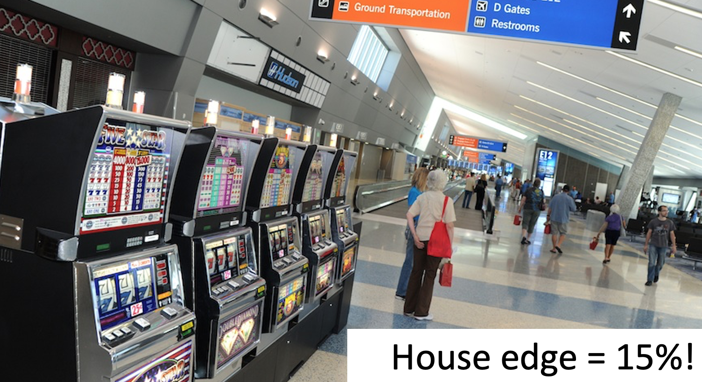
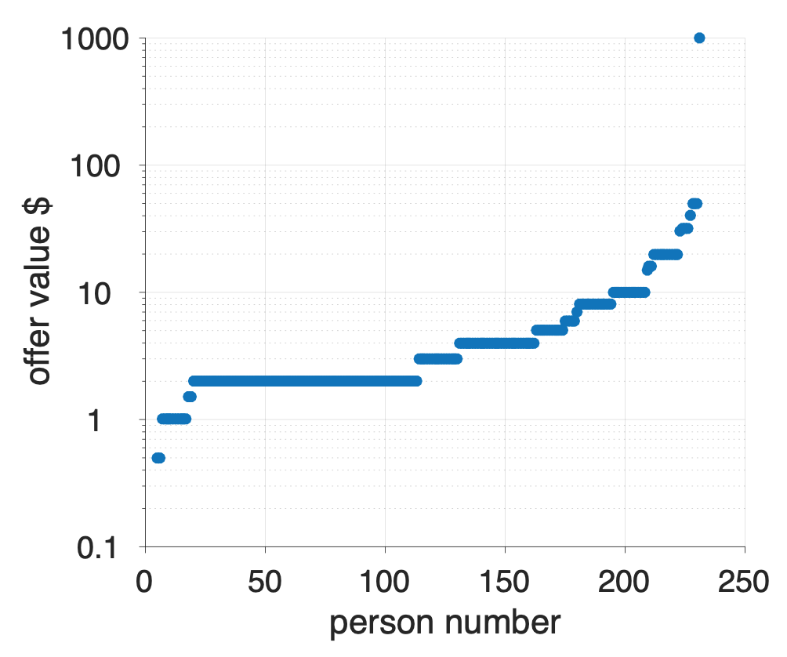
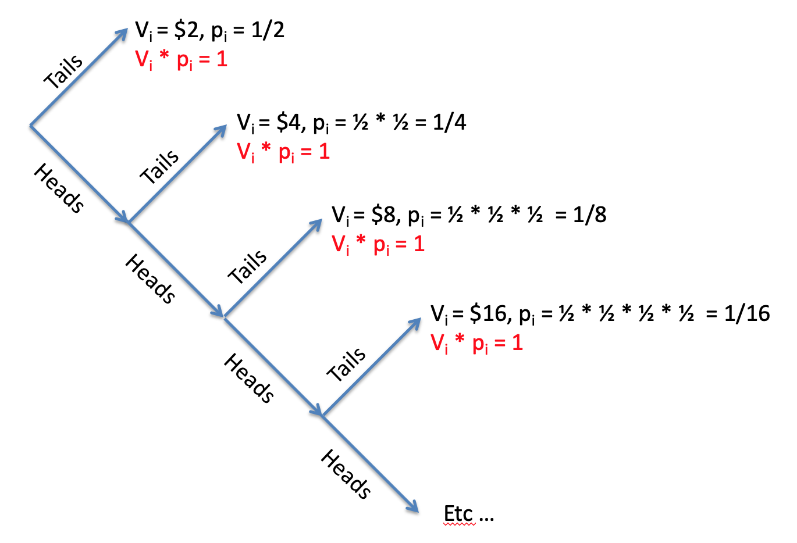

---
title: PSY 333 --- Week 7, Class 2
...

<iframe src="https://arizona.hosted.panopto.com/Panopto/Pages/Embed.aspx?id=06047b84-f772-428f-8472-ac32012a3e11&autoplay=false&offerviewer=true&showtitle=true&showbrand=false&start=0&interactivity=all" height="405" width="720" style="border: 1px solid #464646;" allowfullscreen allow="autoplay"></iframe>

# Problems with Expected Value Theory

Last class I introduced you to our first quantitative theory of human decision making: Expected Value theory.  This theory is a great start for a quantitative theory because it makes precise predictions about how people should behave in gambling decisions.  Unfortunately, these predictions did not match experimentally observed behavior.

In this class, we are going to drive a few more nails into the coffin of Expected Value theory, first by showing that it only applies to a small set of decisions, second by showing that it doesn't explain human behavior in the real world, and third by showing that it predicts such crazy behavior that it absolutely has to be wrong.

You may think that learning about a debunked theory isn't worth it, but actually it's the core of science.  _Every_ theory is wrong, but by understanding how it is wrong we can get closer to the truth.

## Non-monetary decisions

With Expected Value theory, it is easy to make predictions about monetary gambles. We simply compute the expected value of each gamble and pick the one with the highest expected value.

But a true theory of decision making should make predictions about how we make all kinds of decisions.  For example, how about this decision where I'm choosing between a healthy salad and a tasty burger for my lunch?

<figure>

</figure>

Expected Value theory has no way to choose between options like this, where the monetary value isn't clear.  This isn't a proof that Expected Value theory is bad, but certainly points towards it having something missing.

## The existence of Las Vegas

If you ever needed incontrovertible proof that Expected Value theory is a poor theory of human behavior, then the existence of Las Vegas is it.

This is a city built on bad decisions, and bad gambling decisions in particular.  As an example, let's consider a simple bet on red in roulette.

In this wheel we have 37 possible numbers, 18 red, 18 black and 1 green.  Let's assume you place a $1 bet on red.  You now have two outcomes that you care about.  Either you land on red and double your money (value of winning V_1 = $2) or you land on black or green and lose (value of losing V_2 = $0).

The probability of winning is

$$p_1 = p(\mbox{red}) = \frac{18}{37} \approx 0.486$$

The probability of losing is

$$p_2 = p(\mbox{black}) = \frac{19}{37} \approx 0.514$$

So your Expected Value if you choose to gamble is

$$EV(\mbox{bet on red}) = p_1 V_1 + p_2 V_2 = 0.486 \times 2 + 0.514 \times 0 = 0.973$$

This needs to be compared with your Expected Value if you don't play at all

$$EV(\mbox{don't play}) = 1$$

because you get to keep your original dollar.

So if you don't play you get to keep a dollar, and if you do play you expect to get about 97.3 cents back. On average this means that every time you bet $1 on red you lose money and the house takes 2.7 cents, or 2.7% of your bet (a percentage known as the _house edge_).

Expected Value theory says you should never play roulette and similar calculations hold for every game you can play in a casino.  But of course, people do choose to gamble in Vegas, often spending considerable amounts on airfare for the privilege of doing so!  So the very existence of Vegas is one in the eye for Expected Value theory (although EV theory is a great description of the behavior of the casinos!).

### If you must gamble in Vegas

Of course, if you are determined to gamble in Vegas, there are options that are _less worse_ than others.  Here are the house edges for a few popular options (remember that house edge is the percent of your money you lose on average every time you play) ...

  * Roulette (European, one green number = 2.7%)
  * Roulette (American , two green numbers = 5.3%)
  * Slots (in 2012, these numbers are really hard to figure out)
    - Range from 4.73% for $100 slots to
    - 10.77% for penny slots
  * Blackjack (assuming you know how to play) has a house edge of only 1%
    - If you're able to count cards (and don't get thrown out for doing so), it is possible for expert players to actually _gain_ money on Blackjack sending the house edge negative

Whatever you do though, definitely do _not_ play the slot machines in the airport!

With a captive audience these machines are the worst option in all of Vegas with a house edge of 15%!

## The St Petersburg paradox

If the existence of Vegas and the results of the in-class survey aren't enough for you, one final piece of evidence that Expected Value theory is a bad model of human decision making comes from a special decision problem known as the [St Petersburg paradox](https://en.wikipedia.org/wiki/St._Petersburg_paradox).

The decision is deceptive simple and it's one that I already asked you about in the survey ...

> _Imagine a game in which a coin is tossed repeatedly until it lands on tails once, and then you are paid $2^k$, where $k$ equals the number of tosses until tails appeared._

> _What's the most you would be willing to pay to play this game?_

So in this game I toss a coin over and over again until it comes up tails when the game ends.  I then count how many times I tossed the coin in this game, $k$, and I pay you 2 raised to the power of $k$ dollars.

So in one game you might see heads on the first throw, heads on the second throw and tails on the third throw.  I can represent this game as

> HHT

If you saw this, the game would have lasted $k = 3$ coin tosses and you would earn $2^k = 2^3 = 8$ dollars.

Let's consider a few other possible games ...

----------------------------------------------
  Coin toss                         Amount
  result
----------------------         ---------------
T                                 $2

HT                                $4

HHT                               $8

HHHT                              $16

HHHHT                             $32

HHHHHT                            $64
-----------------------------------------------

### Human behavior on the St Petersburg paradox question

The question for this game asks about the _most_ you would be willing to pay to play this game.  The plot below shows the results of the survey.

On the x-axis I'm plotting each person (so point 1 on the x-axis corresponds to person 1, point 100 to person 100 etc ...) and on the y-axis the amount that person was willing to pay to play the game.  To make it easier to visualize, I ordered people by how much they were willing to pay, so people on the left are paying the least (the minimum is 50 cents) and on the right people are paying the most (the maximum is $1000).

The average is about $10.  As we will see in a moment, this _vastly_ underestimates the Expected Value of the game ...

### The Expected Value of the St Petersburg paradox game

If you are using Expected Value theory to decide the maximum you'd be willing to pay to play the game, then you first need to compute the Expected Value of the game.  Then the maximum you'd be willing to pay should be just underneath Expected Value, so that you will (on average) gain money by paying that amount to play the game.

So what's the Expected Value of the St Petersburg paradox game.  To compute this, let's start with the equation for Expected Value and expand out the sum ...

$$EV = \sum_i p_i V_i = p_1 V_1 + p_2 V_2 + p_3 V_3 + ...$$

where the $...$ means keep going until you've considered all possible outcomes of the St Petersburg game.

So what are the possible outcomes of the game?

  * The first possible outcome is that we toss a coin and get tails (T).  In this case we earn $V_1 = 2$ and this outcome occurs with probability $p_1 = 0.5$ (because there's a 50% chance of getting tails.)
  * The second possible outcome is that we get heads on the first toss and tails on the second (HT).  In this case we earn $V_2 = 4$.  The probability of this outcome is $p_2 = 0.25$ because there's a 50% chance of getting heads on the first toss and a 50% chance of getting tails on the second toss so $p_2 = 0.5 \times 0.5 = 0.25$.
  * The third possible outcome is HHT with value $V_3 = 8$ and probability $0.125 = 0.5 \times 0.5 \times 0.5$.

Putting these into the equation, we see something interesting start to happen ...

\begin{equation}
\begin{split}
  EV &= 0.5 &\times 2 &+ 0.25 &\times 4 &+ 0.125 &\times 8 &+ p_4 V_4 + ... \\
     &=     & 1       &+      & 1       &+       & 1       &+ p_4 V_4 + ...
\end{split}
\end{equation}
The first three terms in this sum are all one.  In fact, if we keep going, we will find that _all_ the terms in this sum are 1.

Why?  Let's consider the value of the $k$th outcome.  By the rules of the game, this is $V_k = 2^k$.

Now let's consider the probability of the $k$th outcome.  To get a game of length $k$ you need to toss $k-1$ heads and then one tail.  The probability of getting $k-1$ heads is

$$\frac{1}{2^{k-1}}$$
and he probability of getting one tail is just one half.  So the probability of getting $k-1$ heads AND one tail is

$$p_k = \frac{1}{2^k}$$

So the $k$th term in the sum is

$$p_k V_k = \frac{1}{2^k} \times 2^k = 1$$

So every term in the sum is 1.

How many terms are there in the sum?  It's actually infinite, there are $\infty$ terms in the sum.  To see this consider this tree of possible outcomes.

On each toss you can get tails and end the game or heads and keep going.  But it's always possible to get a head on every coin toss so it's _always_ possible to keep going with the game (although it becomes incredibly unlikely).

So if there are infinitely many terms in the sum and all of the terms are 1, this means the Expected Value of the St Petersburg paradox is infinite!

$$EV(\mbox{St Petersburg}) = \infty$$

Infinity is really big and can be hard to get your head around.  But this prediction about human behavior from Expected Value theory is really crazy.  To put it in perspective, Infinite Expected Value says that the class average answer of $10 to play the game is a total bargin.  Even $1000, which was the largest answer anyone gave in the class, is a bargin to play this game.

Expected Value theory says you should take out loans to play this game.  Seriously, this crazy theory of decision making says that playing this game is a better investment for your tuition dollars than a college degree!

Even a billion dollars is a bargin to play the St Petersburg game. Oprah Winfrey should be willing to spend her entire fortune on it.  So should Kylie Jenner and Jeff Bezos and Elon Musk.  The government should put the entire 4.79 trillion dollar national budget into this game, just think what you could with $\$\infty$!

## Don't invest your student loans in the St Petersburg game!

Seriously.  Expected Value theory is a terrible theory of human decision making.  But by tweaking a little bit, next week we will get a little closer to the truth ...
