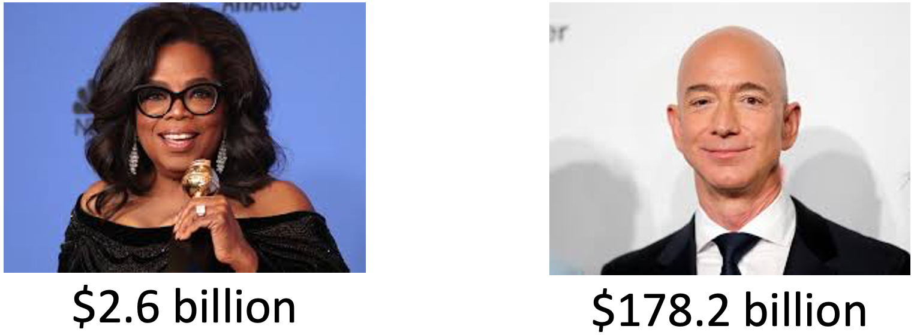
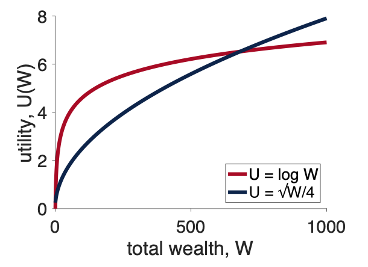
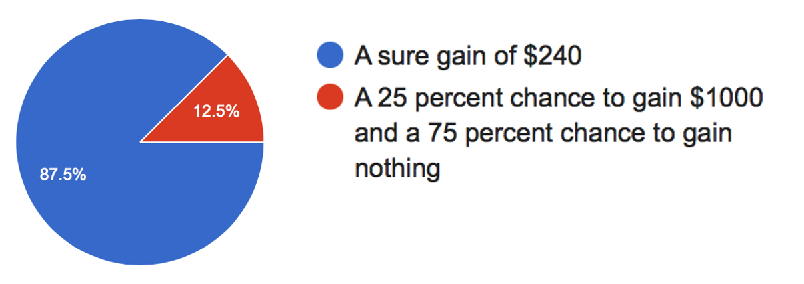

---
title: PSY 333 --- Week 8, Class 1
...

<iframe src="https://arizona.hosted.panopto.com/Panopto/Pages/Embed.aspx?id=34d6d225-eede-4681-95ee-ac40015453d4&autoplay=false&offerviewer=true&showtitle=true&showbrand=false&start=0&interactivity=all" height="405" width="720" style="border: 1px solid #464646;" allowfullscreen allow="autoplay"></iframe>

# Expected Utility Theory 1

Last week we introduced our first theory of decision making, Expected Value theory.  This theory was nice from a mathematical perspective, but a complete disaster in terms of predicting human behavior.  In particular it has (at least) three major problems that we would like to address

  1. It can't handle non-monetary decisions
     - Like between a burger and a salad
  2. It doesn't predict human gambling behavior
     - e.g. it can't account for the existence of Las Vegas
  3. It makes completely crazy predictions for the St Petersburg paradox

This week we will introduce a new theory, called Expected Utility theory, that can address all of these problems.  In fact, we only need to make one small tweak to Expected Value theory to explain all three, and that is to introduce the concept of **Utility**.

Today we will address the first two: handling monetary decisions and predicting human behavior. Next class we will do more on human behavior. In the bonus material we will also show how Expected Utility theory can solve the St Petersburg paradox.

## Utility

When we make decisions in the real world, such as choosing between a salad and a burger for lunch, we don’t (just) compute the monetary value of things, we care about how useful those things are to us.  That is we care about their _utility_ to us.

For example, in the salad-burger choice, if we're on a diet we may prize the health benefits of a salad over the pleasures of eating a burger, in which case a salad is more useful for us than the burger.

<figure>

</figure>

Another example is deciding between studying and hanging out with friends.  There's no (direct) monetary value involved in this decision, so Expected Value theory is out, but the two options may have different utility.  If it's the night before a big test, then studying might have high utility, but if the test isn't for weeks then the utility of studying will be low.

So, the simplest extension of Expected Value theory that we could propose is that instead of thinking in terms of monetary values, in real-world decisions we should think in terms of utilities.

## Utility also applies to money

The concept of utility can also be applied to money itself. That is, we value money not for the dollar bills themselves, but for how useful they are in getting us things we want.

Crucially, this utility of money is subjective, meaning it's different from person to person.  To see this consider how useful it would be to have an extra million dollars.

For most people, $1,000,000 is a life changing amount of money --- you could buy a house, pay off debt, maybe even quit your job.  So the utility of a million is high for most people.

But now think about how useful an extra million would be to a billionaire?  For people like Oprah Winfrey and Jeff Bezos, $1,000,000 is a rounding error in their net worth (for Oprah it’s 0.04% of her net worth, for Jeff it’s 0.0006%!).  These folks can make many times more than a million dollars with just a [good day in the stock market](https://www.theguardian.com/technology/2020/jul/21/jeff-bezos-the-worlds-richest-man-added-10bn-to-his-fortune-in-just-one-day).

<figure>

<figcaption>
</figcaption>
</figure>

For billionaires a million dollars --- the same amount of money that would be life changing for you and me --- has almost no utility at all!

The utility of money is subjective.

## Bernoulli's idea

In 1738, a mathematician Daniel Bernoulli, ran with the idea that utility is subjective to derive an expression for how the utility of money might change with total wealth.  From that expression, he was able to solve the St Petersburg paradox, which was actually proposed by his cousin Nicolas Bernoulli (the [Bernoullis](https://en.wikipedia.org/wiki/Bernoulli_family) was an extremely talented family of mathematicians and academics).

I'm going to show you mathematics he did. This will be scary for some of you, but I want you to see it.  You don't have to understand every step, but I want you to know that it can be done and I want you to understand the qualitative properites of the curve at the end.

### Utility is relative to total wealth

Bernoulli's idea was that the change in utility ($dU$, where the $d$ means "small bit of" and $U$ stands for utility) associated with a small change in my wealth ($dW$) should be equal to the _relative_ amount by which $dW$ changes my total wealth $W$.

Written mathematically, this says

$$dU = U(dW) = \frac{dW}{W}$$

All this equation is doing is putting our intuition about the million dollars into math.  In this case,

$$dW = 1,000,000$$

and $W$ depends on the person.  For the average US person under 35, with net worth about $6,900 (in 2019), this gives a change in utility from receiving a million dollars as

$$dU = \frac{dW}{W} = \frac{1,000,000}{6,900} \approx 145$$

That is a million dollars would increase this person's net worth by 14,500%.

For Jeff Bezos, the same million only has a utility of

$$dU = \frac{dW}{W} = \frac{1,000,000}{178,200,000,000} \approx 0.0000056$$

Put another way, a million dollars would increase Jeff Bezos' net worth by only 0.00056%.  He is very rich indeed!

### Relative utility means that the utility function is concave

Now, this expression for an incremental increase in Utility

$$dU = U(dW) = \frac{dW}{W}$$

allows us to compute the utility for any value of $W$.  To do this we just need to _integrate_ the above equation.  Don't worry if you don't remember this from calculus, but to do this you just write this

$$U = \int \frac{1}{W} dW$$

and then solve the integral to get this

$$U = \log W$$

### This is the important part

Don't worry if you didn't follow that last step, **this is the important part.** We can use this equation for $U$ in terms of $W$ to plot what $U$ should look like as a function of $W$.

When we do that we get a plot that you'll be seeing over and over again in the next few classes.

The key thing about this plot is its _shape_, which is called _concave_ and the utility curve is an example of a _concave utility curve_.

**The key property of concave utility curves is that their slope decreases as the total wealth gets bigger.**

Other forms for $U$ have this too, and actually for the remainder of the class we will use a simpler form than the log equation (which has trouble with zeros).  Instead we will use a square root utility function (blue line below), which has the same property of being less steep as $W$ increases.

$$U = \sqrt{W}$$

## Expected Utility theory

Now that we know that we can assign utilities to arbitrary things (like burgers) and how we should assign utility to money, we can finally construct our next theory of decision making: Expected Utility theory.

In our first theory, Expected Value theory, we made the decision based on the average outcome we could expect from each option.

In our new theory, Expected _Utility_ theory, we make the decision based on the average _utility_ of the outcomes we can expect from each option.  That is we compute the Expected Utility

$$EU = \sum_i p_i U_i$$

where $p_i$ is the probability of outcome $i$, just like it was before and $U_i$ is the utility of outcome $i$.

### Expected Utility theory applied to the salad-burger decision

For the salad-burger choice, Option 1 is salad and Option 2 is burger.

For Option 1 there's only one outcome (you get salad) with a utility of $U_1 = U(\mbox{salad})$ and you get this option with probability $p_1 = 1$ (most restaurants serve the meal that was ordered with 100% probability!).  So the expected utility of this option is just

$$EU(\mbox{Option } 1) = U(\mbox{salad})$$

For Option 2 there's outcome is a burger with utility $U_1 = U(\mbox{burger}$ and probability $p_1 = 1$.

$$EU(\mbox{Option } 2) = U(\mbox{burger})$$

And so if $U(\mbox{salad}) > U(\mbox{burger})$ we choose the salad otherwise we choose the burger.

### Expected Utility theory applied to the gambling problem

Let's go back to our simple gambling decision

<i>
Which do you prefer?

  1. 100% chance of $240
  2.  25% chance of $1000 and a 75% chance of $0

</i>

Let's also assume a square root utility function (log can be problematic with zeros!), so

$$U = \sqrt{W}$$

Now let's compute the expected utility of these two options (assuming we start from 0 wealth).

For Option 1 there's only one outcome with utility $U_1 = \sqrt{240} \approx 15.5$ that occurs with probability $p_1 = 1$.  So the Expected Utility of the first option is just

$$U(\mbox{Option } 1) = p_1 U_1 =  1 \times \sqrt{240} \approx 15.5$$

For Option 2 there are two outcomes.

  * The first outcome ($1000) has utility $U_1 = \sqrt{1000} \approx 31.6$ and occurs with probability, $p_1 = 0.25$.
  * The second outcome ($0) has utility $U_2 = \sqrt{0} = 0$ and occurs with probability $p_2 = 0.75$

Putting this together gives us the Expected Utility for Option 2 at

$$EU(\mbox{Option } 2) = p_1 U_1 + p_2 U_2 = 0.25 \times \sqrt{1000} + 0.75 \times \sqrt{0} \approx 7.9$$

So Option 1 has expected utility 15.5 and Option 2 has expected utility 7.9, so Expected Utility theory picks Option 1 --- the safe, or _risk averse_, option.

Recall that this is much more in line with what people (i.e. you!) did on this question and is the opposite of what Expected _Value_ theory did ...

