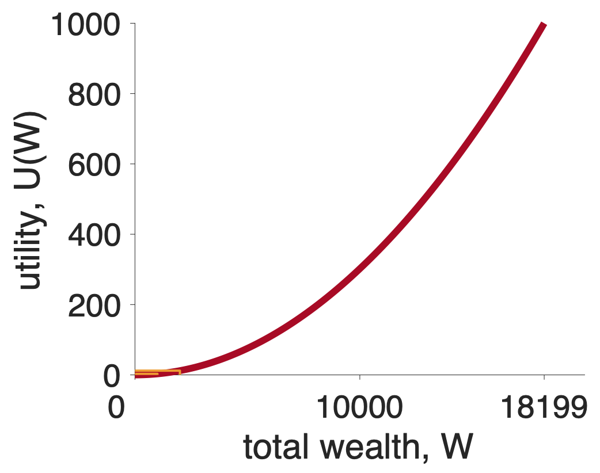
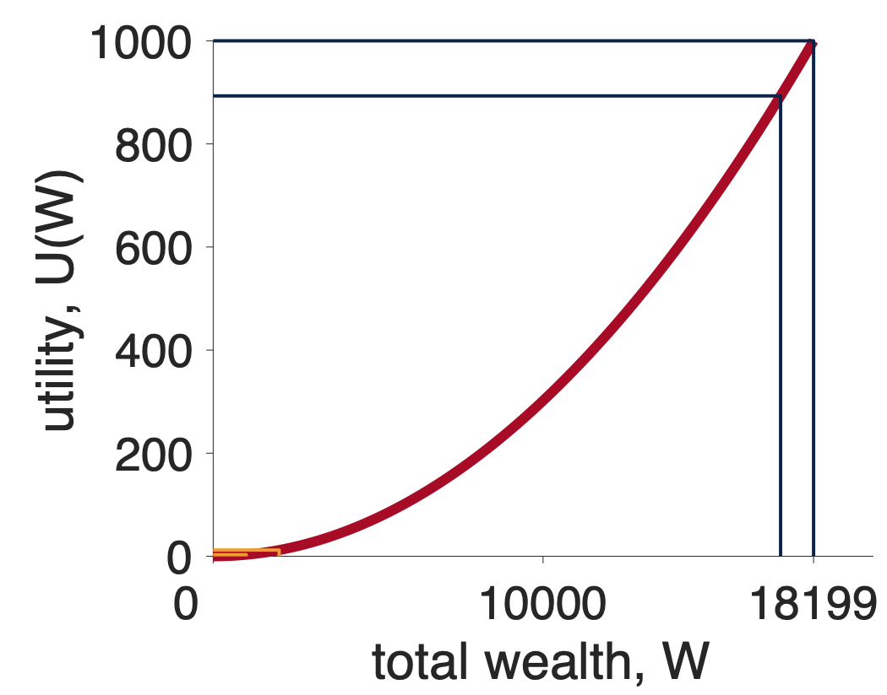
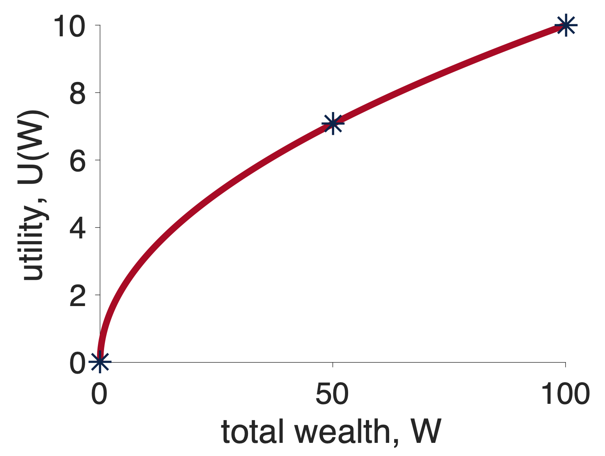
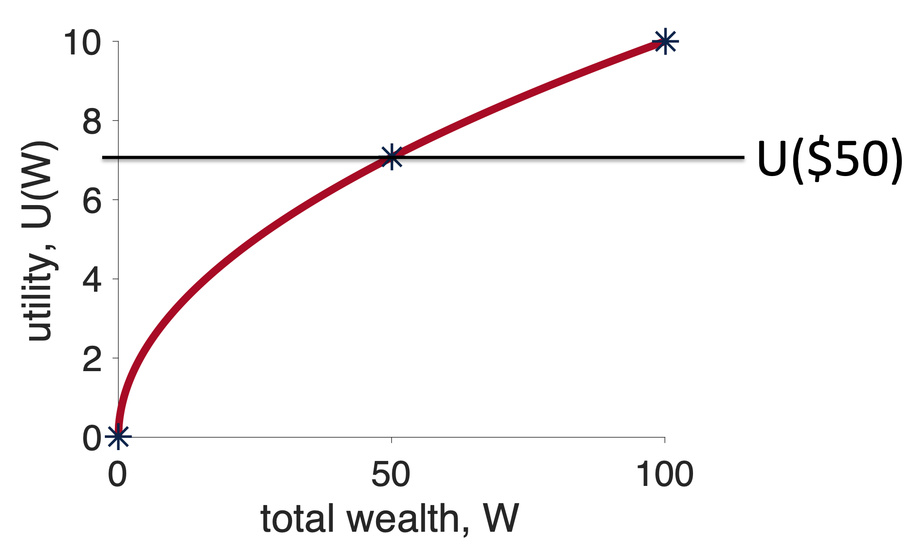
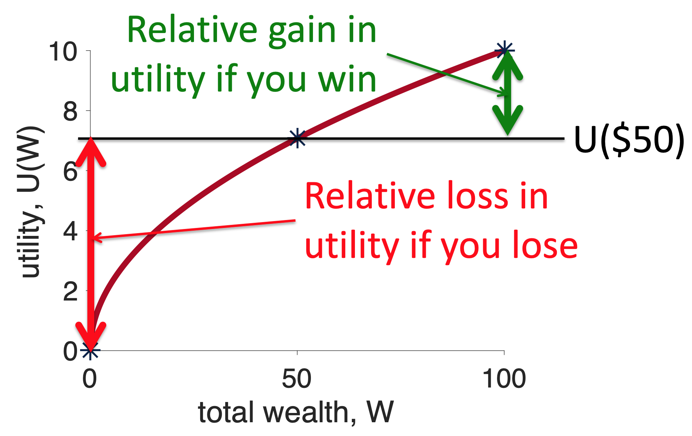
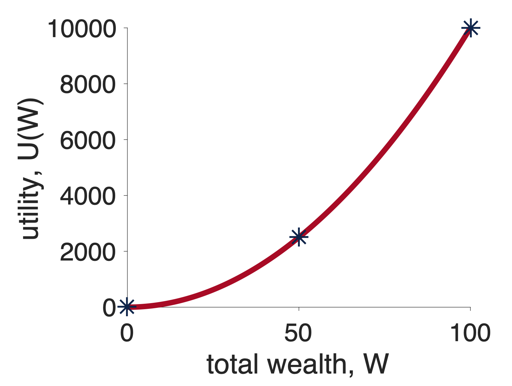
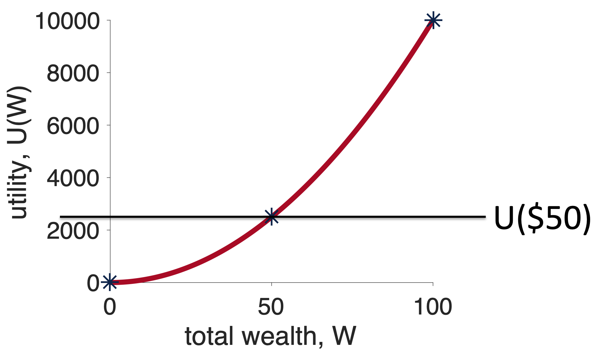
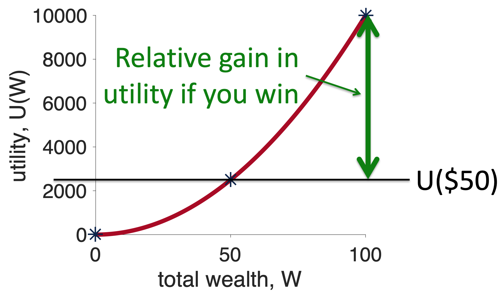
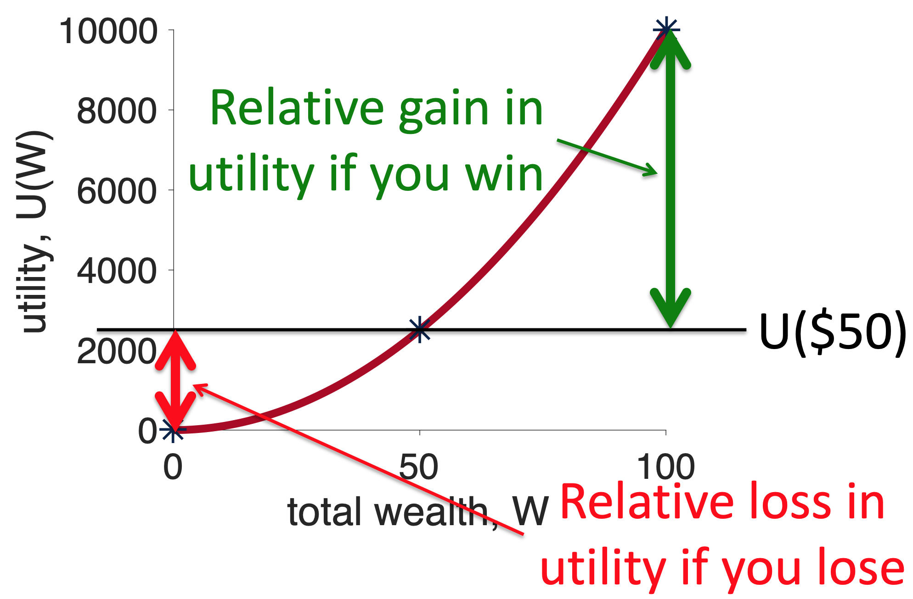

---
title: PSY 333 --- Week 8, Class 2
header-includes: \usepackage{xcolor}
...

<iframe src="https://arizona.hosted.panopto.com/Panopto/Pages/Embed.aspx?id=dffb2211-b0f6-4cca-b6f3-ac36012f6b34&autoplay=false&offerviewer=true&showtitle=true&showbrand=false&start=0&interactivity=all" height="405" width="720" style="border: 1px solid #464646;" allowfullscreen allow="autoplay"></iframe>

# Expected Utility Theory 2

In this class we will continue to show how Expected Utility can address the three problems with Expected Value Theory

1. It can't handle non-monetary decisions
   - Like between a burger and a salad
2. It doesn't predict human gambling behavior
   - e.g. it can't account for the existence of Las Vegas
3. It makes completely crazy predictions for the St Petersburg paradox

Last time we dealt with the first two points. We showed how just the concept of utility can give us a theory that allows us to deal with non-monetary decisions.

We then showed how a square root utility function predicts _risk averse_ behavior on our simple gambling problem.  While this is great, but if Expected Utility theory only predicts that people should be risk averse, then it has one glaring problem, the existence of Las Vegas ...

## The existence of Las Vegas

The existence of Las Vegas was a problem for Expected Value theory because all of the games in Vegas have negative Expected Value and (on average) the house always wins.  But Vegas is an even bigger problem for a theory that is risk averse.  Recall our favorite gambling question

<i>
Which do you prefer?

  1. 100% chance of $240
  2.  25% chance of $1000 and a 75% chance of $0

</i>

In this question, the risky option (Option 2) has the higher Expected Value, so Expected Value theory is actually risk seeking in this game.  But, as we saw last class, Expected Utility theory with a concave, square root utility function prefers the safe option here, it is risk averse.

On the face of it then, the existence of Vegas is even worse news for Expected Utility theory than it was for Expected Value theory because Expected Utility theory is risk averse _even when the risky option is beneficial on average_.  That is, even if there was a game in Vegas with a _positive_ expected value (where the house _loses_ on average), our theory wouldn't play the game!

This would indeed be a problem, and it certainly is for concave utility curves that look like this

Fortunately, we can have a different kind of utility curve that leads to different behavior.

## Convex utility curves

To "derive" _concave_ utility curves, we imagined how much utility a given amount of money would have for people of different wealth. For example, a million dollars has much more utility to the average person than a billionaire like Jeff Bezos.

But there's another way to think about money, that can lead us to derive a different kind of utility curve. Let's imagine a case where you are saving money towards a particular goal.  Let's also imagine that (pre pandemic), this goal was a cruise around the world (pre-COVID price $18,199).  If you don't save enough you can't go.

Now let's imagine a rich benefactor gives you $1,000 towards your trip.  How good does that donation feel?

Well, it depends on how much you've already saved.  If you initially had nothing, $1,000 takes you from $0 to $1,000.  This is nice, but you're still a long way from your goal.  $1,000 feels good, but not great.  It's utility is small.

Now imagine if you've already saved $17,199.  The extra $1,000 means you can finally take the trip of a lifetime. The same $1,000 feels AMAZING.  It's utility is high.

It turns out that a simple curve can capture this intuition.  This curve is known as a _convex_ utility curve and a simple equation is

$$U = k W^2$$

where $k$ is a fixed number (like 1 or 0.1) that doesn't really matter for our purposes.  The main thing is the shape of the curve, which looks like this

Going from $0 to $1,000 increases your utility a little bit (look closely at the yellow lines on the left)

Going from $17,199 to $18,199 increases your utility a lot

## Convex utility curves are risk seeking

Let's see how a convex utility curve deals with our gambling question

<i>
Which do you prefer?

  1. 100% chance of $240
  2.  25% chance of $1000 and a 75% chance of $0

</i>

Let's set $k = 1$ so we have

$$U = W^2$$

Now let's compute the expected utility of these two options (assuming we start from 0 wealth).

For Option 1 there's only one outcome with utility $U_1 = 240^2 \approx 57,600$ that occurs with probability $p_1 = 1$.  So the Expected Utility of the first option is just

$$U(\mbox{Option } 1) = p_1 U_1 =  1 \times 240^2 \approx 57,600$$

For Option 2 there are two outcomes.
  * The first outcome ($1000) has utility $U_1 = 1000^2 \approx 1,000,000$ and occurs with probability, $p_1 = 0.25$.
  * The second outcome ($0) has utility $U_2 = 0^2 = 0$ and occurs with probability $p_2 = 0.75$

Putting this together gives us the Expected Utility for Option 2 at

$$EU(\mbox{Option } 2) = p_1 U_1 + p_2 U_2 = 0.25 \times 1000^2 + 0.75 \times 0^2 \approx 250,000$$

So Option 1 has expected utility 57,600 and Option 2 has expected utility 250,000, so in this case Expected Utility theory picks Option 2 --- the risk seeking option.

## The general case for concave and convex curves

The numerical results we got for that one gambling question (risk averse for concave and risk seeking for convex) turn out to be quite general.  In fact, for any gambling question where the expected values are equal, any concave curve will _always_ be risk averse and any convex curve will _always_ be risk seeking.

Let's see why this is true.  To do this we are going to sketch out a _graphical proof_ that concave curves are risk seeking and convex curves are risk averse.

### Concave utility curves are risk averse

To ground things, let's consider a different gambling question that has equal expected value for the safe and risky options

<i>
Which would you prefer?

  1. $50 for sure
  2. $100 with 50% probability, $0 with 50% probability
</i>

First let's put all the relevant points on a concave utility curve.  In particular, to make this decision we are going to need to know about the utility of $50  ($U(50)$), the utility of $100 (U($100)) and the utility of $0 (U($0)).  While the exact numbers don't actually matter, just for reference, for a square root utility function $U = \sqrt{W}$, these numbers are $U(0) = 0$, $U(50) \approx 7.07$, and $\sqrt{100} = 10$.  These are the stars in the plot below

First, let's think about what will happen if I choose the safe option, Option 1.  In this case, I will get $50 for sure and the utility of this option is just $U(50)$.  Let's mark this on the graph ...

Now, let's think about what will happen if I choose the risky option, Option 2, _relative_ to the fixed outcome I will get from the safe option.

Well, if I choose the risky option, one of two things can happen.  50% of the time I win and 50% of the time I lose.  If I win, I will get $100 and have utility $U(100)$. Relative to choosing the safe option this means I will get $U(100) - U(50)$ more utility by choosing the risky option.  On the graph, this extra utility I get by winning looks like this ...

On the other hand, if I lose the gamble, I get $U(0)$, which relative to the safe option is a loss of $U(0) - U(50)$.  On the plot, this loss of utility I get by losing looks like this ...

Note how the red line (relative loss of utility from losing) is longer than the green line (relative gain in utility from winning).  Now, because winning and losing occur with equal probability, this means that, on average, if you choose the risky option you will lose utility --- i.e. the risky option has negative Expected Utility relative to the safe option.  And the concave curve is risk averse.

#### Saying the same thing in math

Some people find this example easier with the math.  If this is you then you'll appreciate this section.  If not, feel free to skip this and move straight onto the convex curve.

To make your decision you need to compute the Expected Utility of both options.  For Option 1 this is just

$$EU(\mbox{Option } 1) = U(50)$$

For Option 2 this is

$$EU(\mbox{Option } 2) = 0.5 \times U(100) + 0.5 \times U(0)$$

You could then compute the difference in Expected Utility between the two options

$$\mbox{difference} = EU(\mbox{Option } 2) - EU(\mbox{Option } 1)$$

If this difference is positive you will choose Option 2, if it is negative you'll choose Option 1.  So which is it?

Well, we can substitute in the expressions for the Expected Utility of both options to get

\begin{equation}
  \begin{split}
    \mbox{difference} &= 0.5 \times U(100) + 0.5 \times U(0) - U(50) \\
    &= 0.5 \times (U(100) - U(50)) + 0.5 \times (U(0) - U(50))
  \end{split}
\end{equation}

Now, $U(100) - U(50)$ is the size of the green line in the figure and $U(0) - U(50)$ is the size of the red line.  So if the red line is longer than the green line the difference is negative and we will choose the safe option.

> Note: This "proof" is limited to cases where the outcomes for the risky option are equally likely.  A more general proof is possible that shows that for all choices between gambles of equal expected value, a concave curve always chooses the safe option.

### Convex utility curves are risk seeking

The same graphical proof, but with a different outcome, can be applied to convex utility curves.

Again we will start by putting all the relevant points on a concave utility curve.  Again we need to know about $U(50)$, $U(100)$ and $U(0)$.  Assuming a squared utility function, $U = W^2$, these numbers are $U(0) = 0$, $U(50) = 2,500$, and $U(100) = 10,000$.  These are the stars in the plot below

Next we think about what will happen if we choose the safe option, Option 1. In this case, we get $50 for sure and the utility of this option is just $U(50)$.  Let's mark this on the graph ...

Now, we think about what will happen if we choose the risky option, Option 2, _relative_ to the fixed outcome I will get from the safe option.  For the win outcome this is $U(100) - U(50)$, which on the plot looks like this ...

For the losing outcome the relative outcome is $U(0) - U(50)$, which on the plot looks like this ...

Now the green line is longer than the red line and, because winning and losing have equal probability, choosing the risky option has positive Expected Utility relative to the safe option.  Convex curves are risk seeking.  And the existence of people with convex utility curves explains the existence of Las Vegas!

#### The more mathematical answer for convex curves

At this point, you may want to see more math on this point, but it turns out we've already done it when we presented the math for concave curves.  Take another look at that section above, in the equations we never explicitly refer to the shape of the curve, only ever refering to the utility function as $U(x)$.  This means the math in that section applies equally to the convex case, with the only difference being the relative sizes of the red and green lines.

## Concave = risk averse, Convex = risk seeking

The figures below are a simple mnemonic to remember which curve leads to which behavior.

For concave, I imagine that the curve kind of looks like a cave and inside a cave you might find a bear.  Bears are scary and so you should be _risk averse_ about going into the cave

For convex, I always think they kind of look like a ski slope, a _risk seeking_ activity.  To really add to it, I imagine that Las Vegas is at the bottom of the slope.

## Summary

We've done a lot this week.  We introduced our second theory of decision making, Expected Utility theory.  This theory fixes a lot of what was wrong with Expected Value theory.

  1. We have a framework for modeling non-monetary decisions
  2. We can explain human behavior in terms of differently shaped utility curves
  3. We can account for the St Petersburg paradox

But it's not all plain sailing, next week we will show that there are problems with this theory too.
