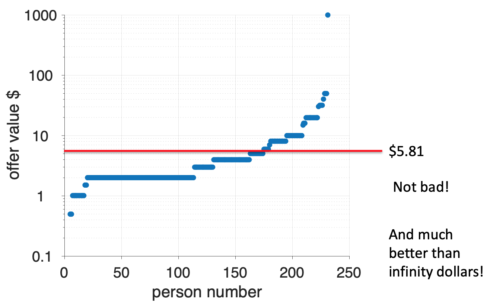

---
title: PSY 333 --- Week 8, Class 1 bonus
...

# The solution to the St Petersburg paradox

## The St Petersburg paradox

In the St Petersburg paradox, we asked how much you would be willing to pay to play this game ...

> _Imagine a game in which a coin is tossed repeatedly until it lands on tails once, and then you are paid $2^k$, where $k$ equals the number of tosses until tails appeared._

So in this game I toss a coin over and over again until it comes up tails when the game ends.  I then count how many times I tossed the coin in this game, $k$, and I pay you 2 raised to the power of $k$ dollars.

In one game you might see heads on the first throw, heads on the second throw and tails on the third throw.  I can represent this game as

> HHT

If you saw this, the game would have lasted $k = 3$ coin tosses and you would earn $2^k = 2^3 = 8$ dollars.

Here are a few other possible outcomes ...

----------------------------------------------
  Coin toss                         Amount
  result
----------------------         ---------------
T                                 $2

HT                                $4

HHT                               $8

HHHT                              $16

HHHHT                             $32

HHHHHT                            $64
-----------------------------------------------

The paradox arises because the St Petersburg game has infinite Expected Value, so you should be willing to pay _any_ amount of money to play it (even trillions of dollars).  How can Expected Utility theory solve this problem?

## The Expected Utility of the St Petersburg game

Let's compute the Expected Utility of the St Petersburg game. For simplicity let's assume we have a square root utility function, so

$$U = \sqrt{W}$$

Let's start with the equation for Expected utility

$$EU = \sum_i p_i U_i$$

and expand out the sum ...

$$EU = \sum_i p_i U_i = p_1 U_1 + p_2 U_2 + p_3 U_3 + ...$$

where the $...$ means keep going until you've considered all possible outcomes of the St Petersburg game.

Recall that there are infinite possible outcomes for this game, but let's consider the first three in detail

  * The first possible outcome is that we toss a coin and get tails (T). This outcome occurs with probability $p_1 = 0.5$ and in this case we earn $V_1 = 2$, which has $U_1 = \sqrt{2} \approx 1.41$.
  * The second possible outcome is that we get heads on the first toss and tails on the second (HT). This occurs with probability $p_2 = 0.25$ and gives us $V_2 = 4$, which has utility $U_2 = \sqrt{4} = 2$.
  * The third possible outcome is HHT occurs with probability $p_3 = 0.125$ and has  value $V_3 = 8$, which has utility $U_3 = \sqrt{8} \approx 2.83$.

Putting these into the equation, we see something interesting start to happen ...

\begin{equation}
\begin{split}
  EV &= 0.5 &\times 1.41 &+ 0.25 &\times 2 &+ 0.125 &\times 2.83 &+ p_4 V_4 + ... \\
     &=     & 0.71       &+      & 0.5       &+       & 0.35      &+ p_4 V_4 + ...
\end{split}
\end{equation}

Note that, unlike the Expected Value case where the terms were all 1, now the terms in the sum are decreasing, from 0.71 to 0.5 to 0.35. This suggests (but does not prove), that maybe the infinite sum will be finite.  Indeed, if we compute more and more terms (which we can easily do in Google sheets) we find that the terms do keep decreasing (although they are always positive) and the sum is finite with a value of

$$EU \approx 2.41$$

This is much less than infinity and suggests that people should be willing to pay a finite amount of money to play the game.

But how much money are they willing to pay?  Utility is not measured in units of dollars, remember that it is a subjective measure of how those dollars feel to you.  To get the monetary amount people should be willing to pay we need to do one more calculation ...

## Converting utility back into money

To convert the utility back into a monetary amount we need to invert the Utility function.  Put another way, we need to figure out the amount of money, $M$, that has utility $U = 2.41$.

If we have a square root utility function, we know that $U$ and $M$ are related like this ...

$$U = 2.41 = \sqrt{M}$$

To find $M$ we simply need to solve this equation, which we can do by taking the square of both sides to get ...

\begin{equation}
  \begin{split}
    M &= U^2 \\
      &= 2.41^2 \\
      &= $5.81
  \end{split}
\end{equation}

This shows that people with a square root utility function should be willing to spend a maximum of $5.81 to play the St Petersburg game.  Comparing this number with the human behavior we find that it's actually a pretty good fit!

