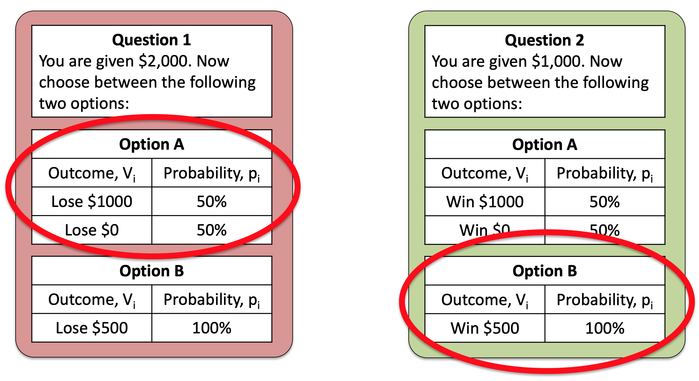
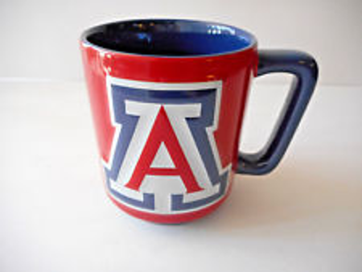

---
title: PSY 333 --- Week 9, Class 1
...

<iframe src="https://arizona.hosted.panopto.com/Panopto/Pages/Embed.aspx?id=65dcd77d-f763-4fdc-b478-ac36012f6ade&autoplay=false&offerviewer=true&showtitle=true&showbrand=false&start=0&interactivity=all" height="405" width="720" style="border: 1px solid #464646;" allowfullscreen allow="autoplay"></iframe>

# Problems with Expected Utility Theory

We did a lot last week.  We introduced Expected Utility theory, did a bunch of math, and showed how this new theory can solve three of the problems with Expected Value theory.

This week is going to be a bit of a breather.  In this class we will discuss some of the problems with Expected Utility.  Next class will be a catchup session.

## Risk aversion for gains and risk seeking for losses

Consider this pair of questions, that I've made a figure of so we can see them side by side ...

Both of these questions appeared in the survey.  For Question 1, 64% of people prefered Option A.  For Question 2, 62% of people prefered Option B.

So, on average, people prefer the risky Option A in Question 1 and safe Option B in Question 2.  That is, they are _risk seeking for losses and risk averse for gains_.

It turns out that this switch of preference between the two questions is a big problem for Expected Utility theory.

_Can you see why?_

Before reading on, take another look at the two questions, can you see the trick to them?

### The trick

The two questions shown above are actually the _same_ question from a mathematical perspective.  In the first, you start with $2,000 and can either lose you can lose $1,000 or $0 with a 50-50 chance (Option A), or $500 for sure (Option B).  So taking into account the initial $2,000 your choice is between

  A. $1,000 or $2,000 with 50% probability
  B. $1,500 with 100% probability

In the second you start with $1,000 and can either gain $1,000 or $0 with a 50-50 chance (Option A), or $500 for sure (Option B).  Taking into account the initial $1,000, your choices for question 2 are

  A. $1,000 or $2,000 with 50% probability
  B. $1,500 with 100% probability

These are identical to Question 1!

### Why is this a problem for Expected Utility theory?

Expected Utility theory only cares about total wealth, it doesn't care about gains or losses.  This means that, because the questions are identical in terms of total wealth of the options, there should be no difference in behavior between the two options.  So it's a real problem that people switch their preference between these two questions.

This effect is called the Framing effect and there are many examples.

## Another example of Framing

In the framing effect we ask the same question twice, "framing" it slightly differently each time.  The questions above are a great example of this.  We had the same basic question, but by changing the initial amount given to people we were able to frame the gamble as either a loss (Question 1) or a gain (Question 2).

Expected Utility theory can't handle Framing at all because it treats the both versions of the question as the same question and predicts identical behavior in both.  People do not behavior like this and framing really matters.

One practical example was run on economics students registering for a conference. Different sets of students saw different framing of the same basic information, that the conference costs $150 if you register early, but $200 if you register after some deadline.

Framing 1 presents the information like this

  * The conference costs $200 to attend
  * But if you register early you get a $50 discount

Framing 2 presents the same information like this

  * The conference costs $150 to attend
  * But if you register late you get a $50 penalty

This slight change of framing, from discounts to penalties, had a massive effect on behavior, with
62% of people who saw Framing 1 registering early but a whopping 93% of people who saw Framing 2 registering early!

If people's decision to register early was driven by expected utility theory the framing wouldn't matter at all.

## The Endowment Effect

Another problem for Expected Utility theory is the Endowment Effect.  An example of this comes from [Kahneman and colleagues in 1990](https://www.journals.uchicago.edu/doi/abs/10.1086/261737).

This study is all about mugs from the University bookstore.  If we did this study at UA we'd be talking about these kind of things

This experiment was done in a classroom. Half of the students were randomly given mugs at the start of the class.

Then, students with a mug were given the chance to sell it and students without a mug were given a chance to buy one.

Before any transaction occurred, both groups named (or rather, wrote down) either

  * the minimum price they would be willing to sell for (if they had a mug)
  * the maximum price they would be willing to buy for (if they didn't have a mug)

Expected Utility theory says these numbers should be the same on average and should correspond to how valuable people think the mugs are.

In practice they said very differnet things.

  * People with mugs wanted an average of $5.75 to sell the mugs
  * While people without the mugs were only willing to pay a maximum of $2.50 to sell them

This difference between selling price and buying price meant that very few mugs actually changed hands.  It's also one more problem for Expected Utility theory to deal with.
