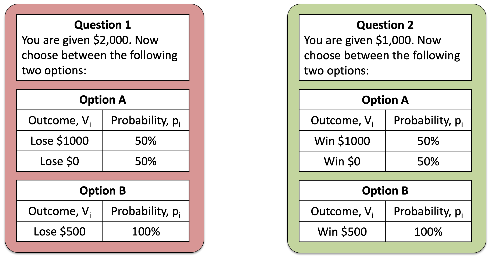
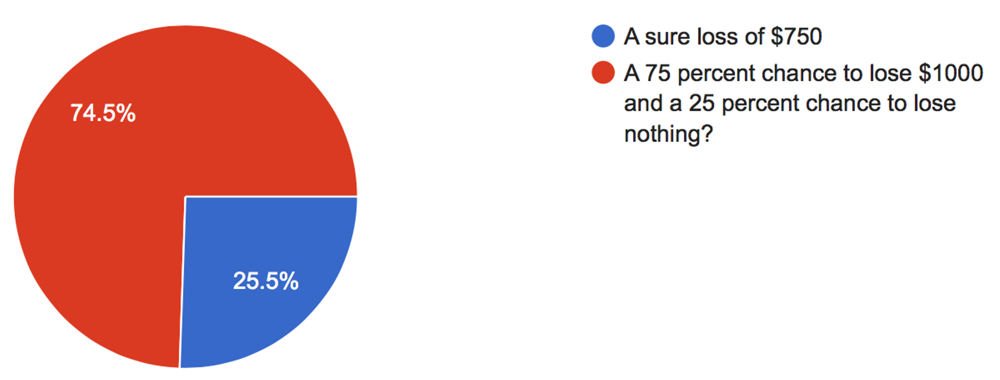
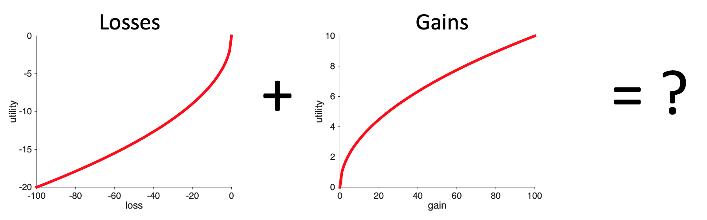
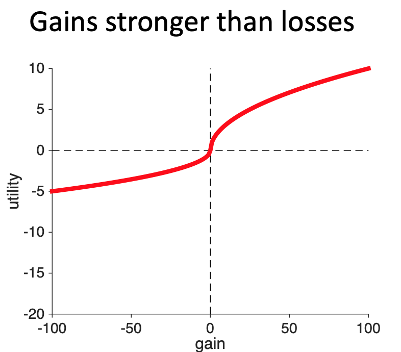
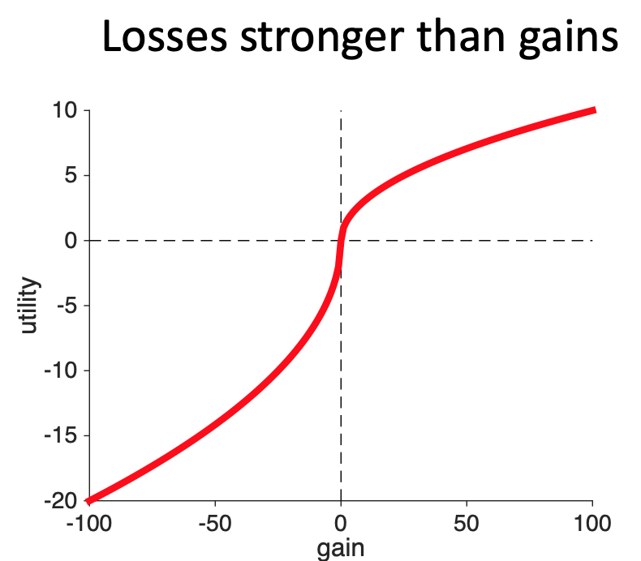
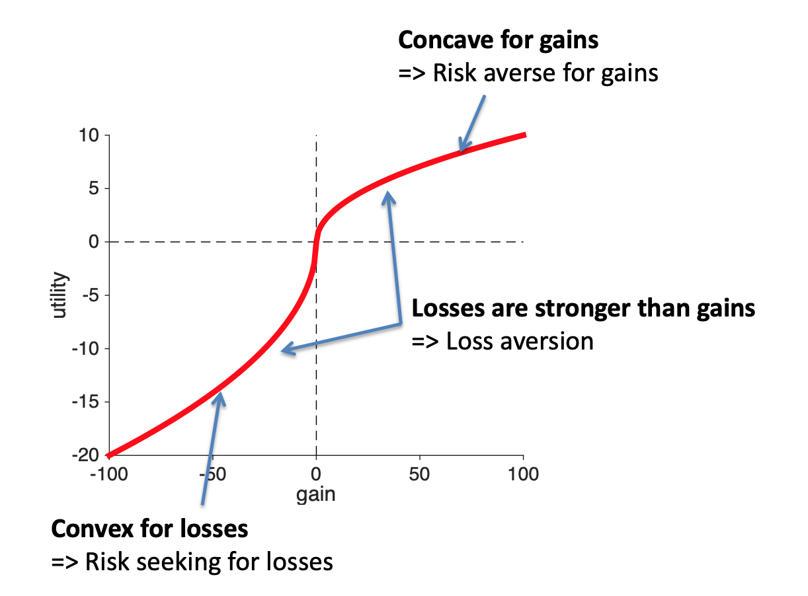

---
title: PSY 333 --- Week 10, Class 1
...

<iframe src="https://arizona.hosted.panopto.com/Panopto/Pages/Embed.aspx?id=34d82ddb-0e7b-41a6-8bb8-ac36012f6ab7&autoplay=false&offerviewer=true&showtitle=true&showbrand=false&start=0&interactivity=all" height="405" width="720" style="border: 1px solid #464646;" allowfullscreen allow="autoplay"></iframe>
# Prospect theory

So far we have introduced two theories that aren't great models of human behavior.  In the next few classes we will derive a theory that does a much better job.  There are problems with this theory too, as there are with all theories, but overall it's a much better account of decision making.

In Prospect Theory, we still use utilities and we still compute an expected utility using probabilities and outcomes. To make it fit with human behavior, though, the functional forms of the probabilities and utilities are different from what we've seen before.  In particular, the equation for expected utility in Prospect Theory looks like this ...

$$EU = \sum_i \pi(p_i) U(g_i)$$

where we still have some familiar terms like the sum over all outcomes ($\sum_i$) and the probability of each outcome ($p_i$) and we still have utilities $U$.  But there are some new terms here: the $\pi$ stands for the subjective probability function (_not_ the number pi 3.1415 ...), while $g_i$ stands for the gain associated with outcome $i$.

It's going to take us a while to unpack all of these terms.  And for this week we will focus only on the utility term

$$U(g_i)$$

## Utility is a function of gain and loss not total wealth

Last week we talked about framing effects, in which, by framing the same question in differnet ways we can change behavior.  One of the simplest examples of framing is this pair of questions that we saw last week

Both refer to the same gamble --- a choice between $1,500 for sure and a 50-50 chance of $2,000 or $1,000.  However, on the left this gamble is framed in terms of losses, while on the right it's framed in terms of gains.

Most people (and indeed most of you) prefered the risk option (Option A) in the loss framing and the safe option (Option B) in the gain framing.  This is not something Expected Utility can handle because the Utility is a function of total wealth, i.e. it only cares about the outcomes at the end (taking into account the initial endowment of either $2,000 or $1,000).

One way to get a theory that makes different decisions for gains than it does for losses is to make the utility  a function of gain and loss instead of total wealth. This is what we mean when we write the utility function as

$$U(g_i)$$

We mean that the utility of each outcome should depend on the relative _gain_ (or loss, which is a negative gain) associated with each outcome.

This is the first step towards Prospect Theory.

One important thing to note here is that, while we've couched this in math, the math itself didn't tell us that utility should be a function of gain and loss, it was the _experimental data_ that forced us to do this as one of the only ways to capture what humans do. Next, we will use data from three more gambling questions to derive what this utility curve should look like

## The shape of the utility curve

We can derive the shape of the utility curve from people's response to three questions (although in reality Prospect Theory is built on much more evidence than this!)

### The shape of the curve for gains
The first question allows us to derive the shape of the curve for gains, and it's the same question we've seen many times before!
<i>
Which do you prefer?

  1. A sure gain of $240
  2. A 25% chance to gain $1,000 and a 75% chance to gain nothing
</i>

In this question, the vast majority of people choose the safe option (this is data from another class in 2015)

This provides very strong evidence that people are risk averse for gains. This in turn, from what we learned two weeks ago, tells us that **the shape of the utility curve for gains must be _concave_ (for most people)**.

### The shape of the curve for losses

A different question from the survey allows us to derive the shape of the utility curve for losses.  In this question, we ask about people's preferences about gambles involving losses

<i>
Which do you prefer?

  1. A sure loss of $750
  2. A 75% chance to lose $1,000 and a 25% chance to lose nothing
</i>

For this question the majority prefer the risky option

From what we learned previously, this allows us to say that the **shape of the utility curve for losses must be _convex_**.

### The relative strength of gains and losses

Finally, to get the full shape of the curve, we need to _combine_ the loss part of the curve with the gain part of the curve in some way.

While you might be just tempted to stick the two ends of these curves together and call it good, there are actually three different ways in which the loss part of the curve and the gain part of the curve could be combined.  This depends on the relative strength of gains and losses.

#### Gains and losses equally weighted

If gains and losses are equally weighted, then combining them will look something like this.  This is the simplest solution where we just connect the convex parts for losses into the concave part for gains at gain = 0.

#### Gains stronger than losses

However, there's nothing in the data so far that tells us anything about the relative strength of gains and losses. So another way we could combine them --- and still account for all the data we've seen so far --- is to have the gains be stronger than the losses. That is, gaining $10 feels more strongly good than losing $10 feels more strongly bad.  With this curve, if you lost $10 and then found $10 you would feel like you'd increased your utility.

#### Losses stronger than gains

Another way of combining the two curves is to make the losses stronger than the gains.  So a loss of $10 feels more bad than a gain of $10 feels good.  With this curve, if you lost $10 and then found $10 you would feel like you'd lost utility.

#### A question to distinguish between the three cases

To distinguish between the three cases, we need a decision that involves the possibility of gains _and_ losses.  This is the only way we will be able to compare the relative strengths of the two.

This question does the trick ...

<i>
Which do you prefer

  1. $0 for sure
  2. A 50% chance to gain $100 and a 50% chance to lose $100
</i>

The three curves predict different behavior on this question, allowing us to tell them apart.

To see how, let's consider how you might make this decision using the different utility curves.  For all three curves the utility of Option 1 ($0 for sure) is easy, it's just

$$U(\mbox{Option } 1) = 0$$

So all we need to worry about is whether the expected utility of the risky option (Option 2) is positive (in which case people will prefer it), negative (in which case people will avoid it), or zero (in which case people will be 50-50 between the two options).

So which one is it?

For all three curves, we can write down the expected utility of Option 2 as

\begin{equation}
  \begin{split}
    EU(\mbox{Option } 2) &= 0.5 \times U(+100) + 0.5 \times U(-100) \\
    &= 0.5 \times ( U(100) + U(-100))
  \end{split}
\end{equation}
where the different curves have different values for $U(100)$ and $U(-100)$ (note that U(-100) is a negative number).

So whether $EU(\mbox{Option } 2)$ is positive, negative, or zero depends entirely on the relative sizes of $U(+100)$ and $U(-100)$.

When gains and losses are equal in strength, $U(+100)$ and $U(-100)$ are equal and opposite and so there sum is zero.  Thus, when gains and losses are equal in strength the model predicts _no preference_ between the options.

When gains are stronger than losses, the size of $U(+100)$ is bigger than the size of $U(-100)$. This means that $U(100) + U(-100)$ is a positive number. Thus when gains are stronger than losses, the model predicts that people should prefer the risky option, Option 1.

When losses are stronger than gains, the size of $U(+100)$ is smaller than the size of $U(-100)$. This means that $U(100) + U(-100)$ is a negative number. Thus when gains are stronger than losses, the model predicts that people should prefer the safe option, Option 2.

_So what do people do?_

They strongly prefer the safe option.

Losses are stronger than gains, a phenomenon known as _loss aversion_.

## The utility curve for Prospect Theory

The results of the experiments above force us to conclude that the shape of the utility curve must look like this.  Note that this curve has three key features that we'll be looking for in the Assignments where we ask you to draw it

  1. Concave for gains
     - Because people are risk averse for gains
  2. Convex for losses
     - Because people are risk seeking for losses
  3. Losses are stronger than gains
     - Because people are loss averse

  

