---
title: PSY 333 --- Week 10, Class 2
...

<iframe src="https://arizona.hosted.panopto.com/Panopto/Pages/Embed.aspx?id=a90fea9d-5fc2-401f-8210-ac36012f7ee9&autoplay=false&offerviewer=true&showtitle=true&showbrand=false&start=0&interactivity=all" height="405" width="720" style="border: 1px solid #464646;" allowfullscreen allow="autoplay"></iframe>

# Prospect Theory --- Utility 2

Last time we derived the shape of the utility curve for Prospect Theory with its three features ...

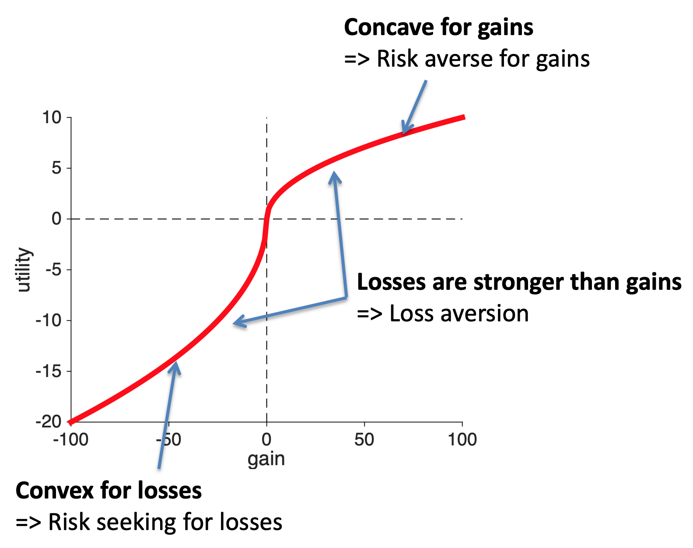

Today we'll take a second look at this curve from a _psychological_ perspective.  We will show how we can derive two of the three features of the curve from other psychological findings.

Hopefully you remember these questions from last time ...

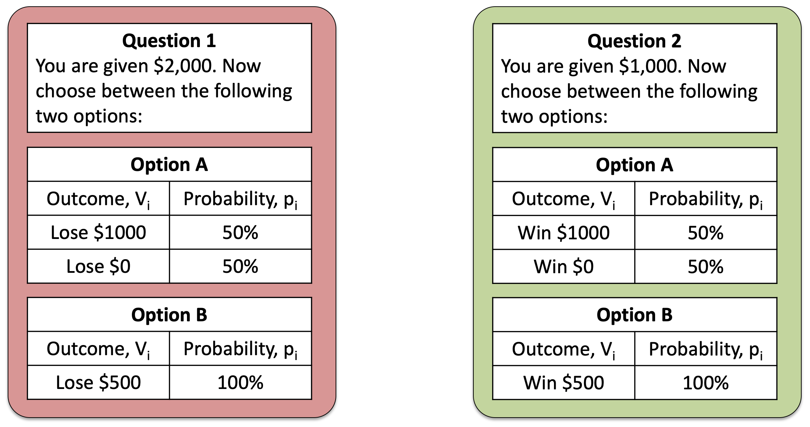

These were the questions we used to illustrate the framing effect.  With the key result being that people were risk seeking for Question 1, but risk averse for Question 2.

Today, we're not going to think so much about the behavior on these questions.  Instead we are going to think about the structure of the questions themselves.  In particular, both questions start with a reference value ($2,000 or $1,000) and then show you the possible outcomes of the gambles.

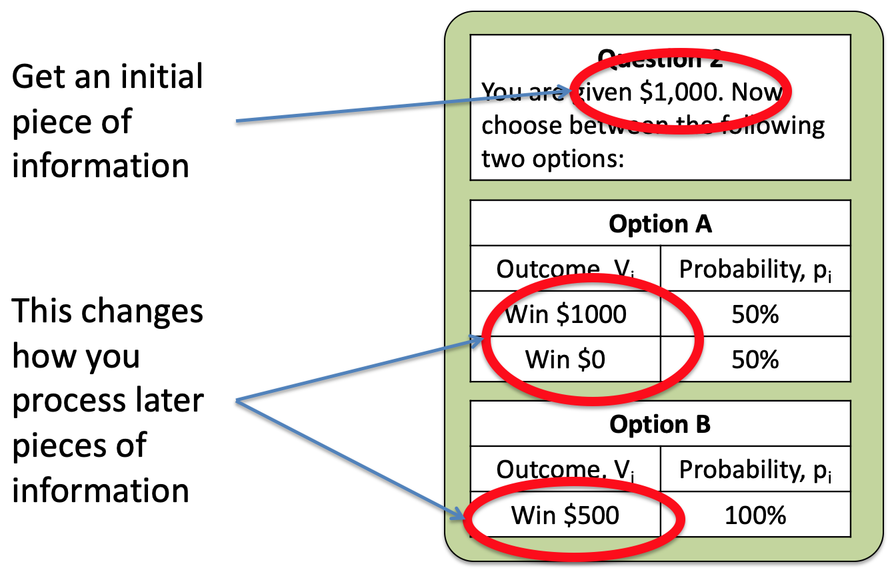

The key behavioral result is that your behavior changes depending on the initial piece of information you get.  So that people are risk averse when the framing number is  $1,000 and risk seeking when it's $2,000.

Where have we seen something like this before?  Where an initial piece of information biases how we process later information ...

It's the Anchoring and Adjustment Heuristic. For example, where the initial word in a description changes how we process later information ...

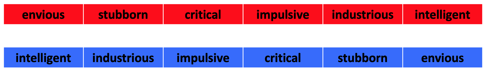

In Prospect Theory, we can think of that initial piece of information as the anchor, which is usually called the _reference point_, and then we process everything _relative_ to that.

That is, utility is defined in terms of the gains and losses relative to the reference point.  On the utility curves this means that the reference point is a gain of zero.

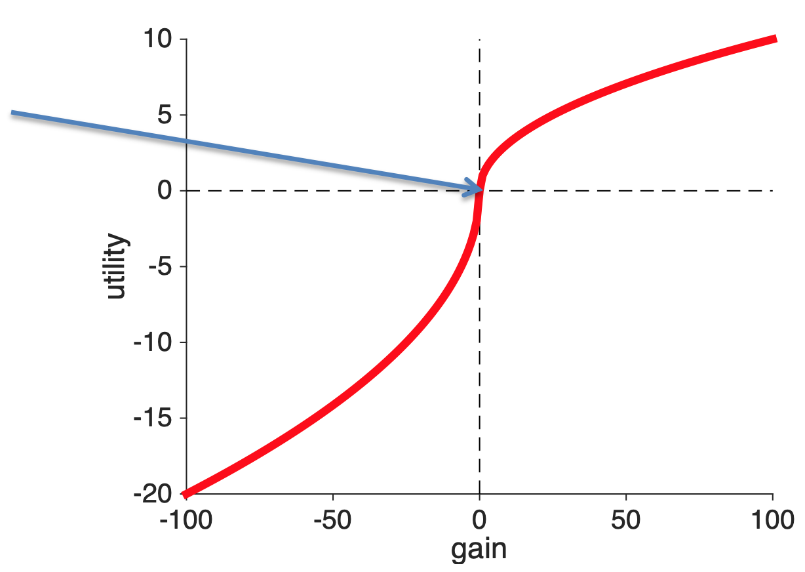

## Utility is concave for gains and convex for losses

Once we know that the reference point is at zero gains, then we only need one more piece of Psychology to derive the concave shape for gains and convex shape for losses.  This piece of Psychology is [Weber's law](https://en.wikipedia.org/wiki/Weber%E2%80%93Fechner_law) and it's one of the earliest results in Psychology from 1860.

Weber's Law is all about how quantities of things are represented in the brain.  For decision making the quantity is utility, but a simpler illustration is to consider weights.

In particular, Weber was interested in the smallest possible change in weight that you would notice.  And how this changes as a function of the original weight you were lifting.  To get an intuition imagine these folks in the gym.  Do you think they would notice if I added 1 pound to the weight they were lifting?

The man on the left probably would notice.  He's struggling to life about 5 pounds, increasing it to 6 is a 20% increase.

The woman on the right probably would not notice.  She's lifting hundreds of pounds, unless she's at her absolute limit, another pound here or there will be imperceptible.

What Weber found was that the smallest possible change in weight people can detect is proportional to the total weight they are lifting.  That is, it's easier to detect small differences when you are lifting small weights.

$$dW = K \times W$$

where $W$ is the weight, $dW$ is the smallest change they can detect and $K$ is an arbitrary constant number.

This means we become less sensitive to changes in weight the bigger the weight is.  Which, if you do the math, or simply think hard enough about it, leads to a concave curve for the perception of weight.

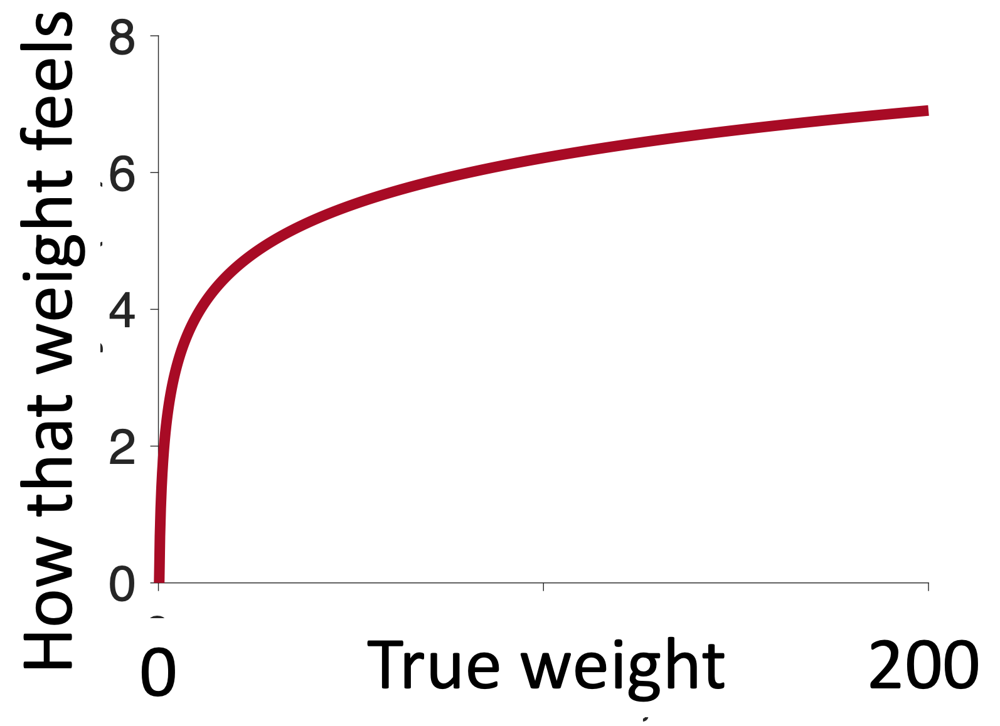

The more weight you are lifting the smaller the perceived change in weight when you add one pound.

It's exactly the same with gains.  The more gain you have, the smaller a $1 increase feels.  Going from $1 to $2 is huge (in relative terms), but going from $1,000,000 to $1,000,001 is tiny.

Thus, _the concave shape for gains can be thought of as a result of how gains are coded in the brain_.

The same story applies to losses.  As the losses get bigger the slope of the curve decrease, which implies a convex utility curve for losses.

So these Psychological insights can get us two out of three properties of the utility curve.  The only thing they can't explain is the relative strength of gains and losses.  For that we need the experiment we discussed last time.

<!--
<figure>

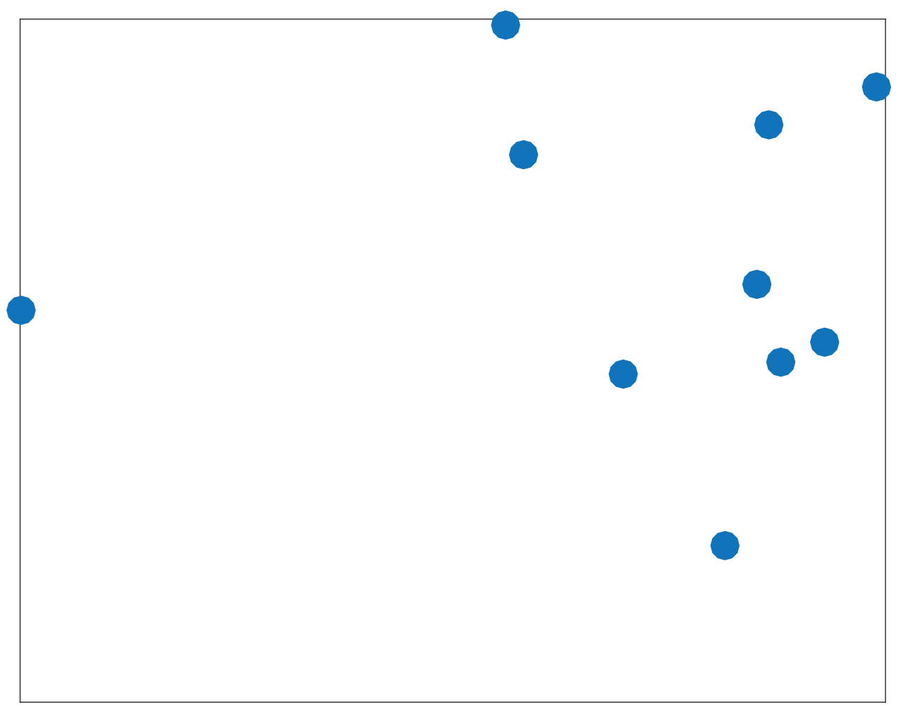
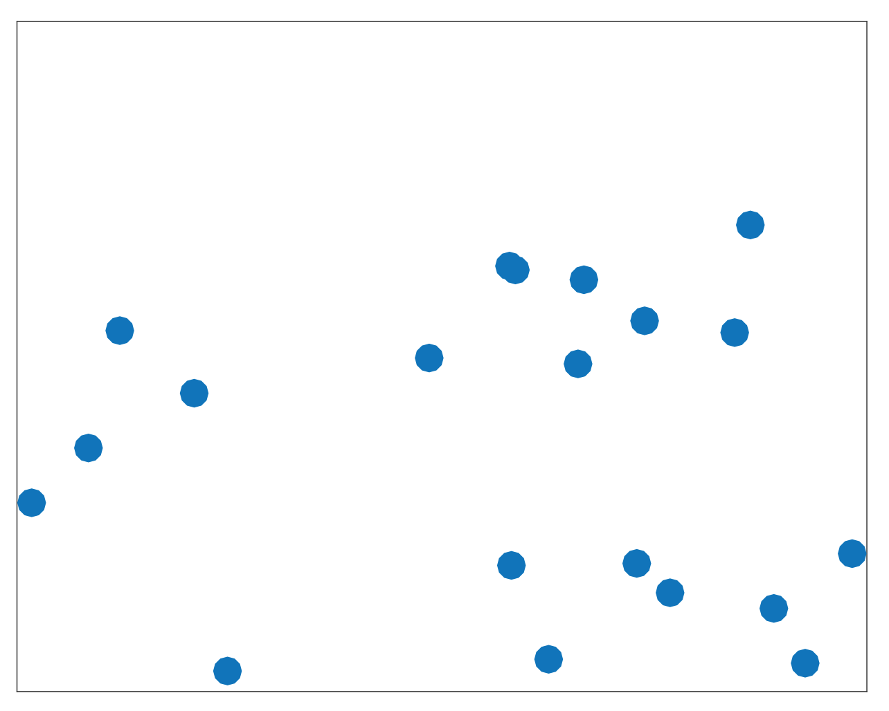

</figure>

<figure>

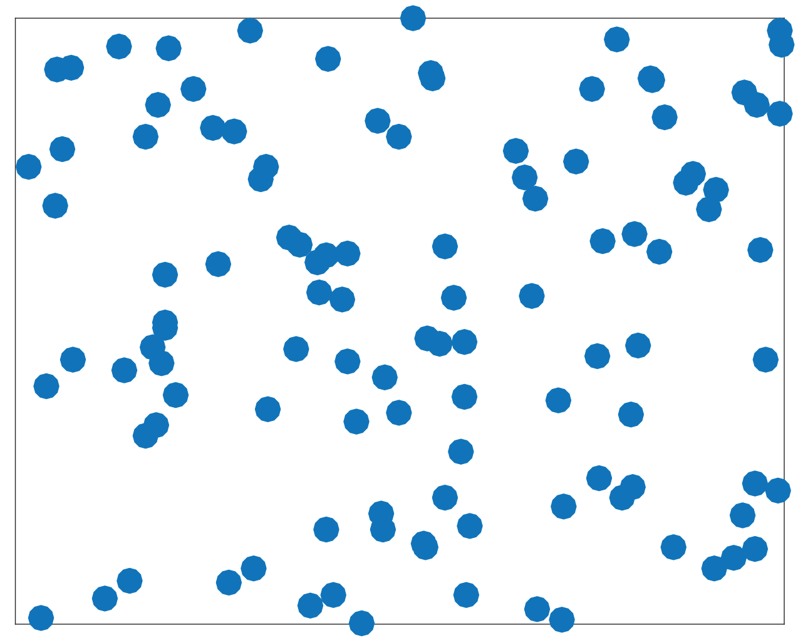
      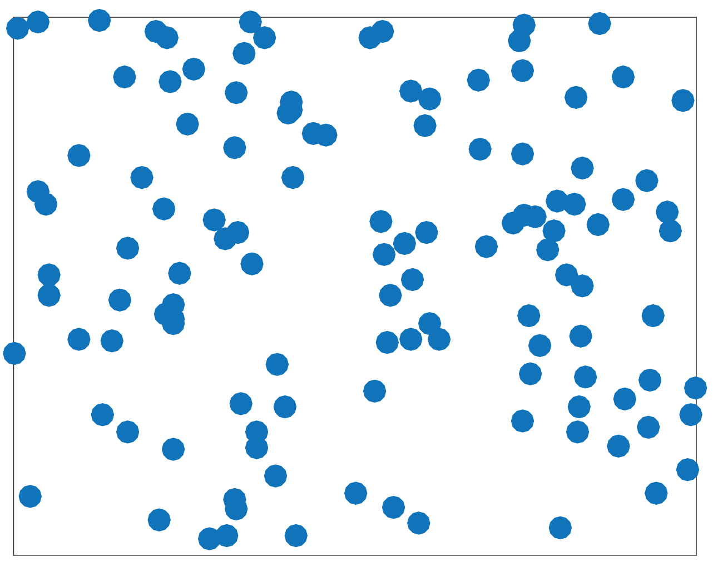

</figure>
-->

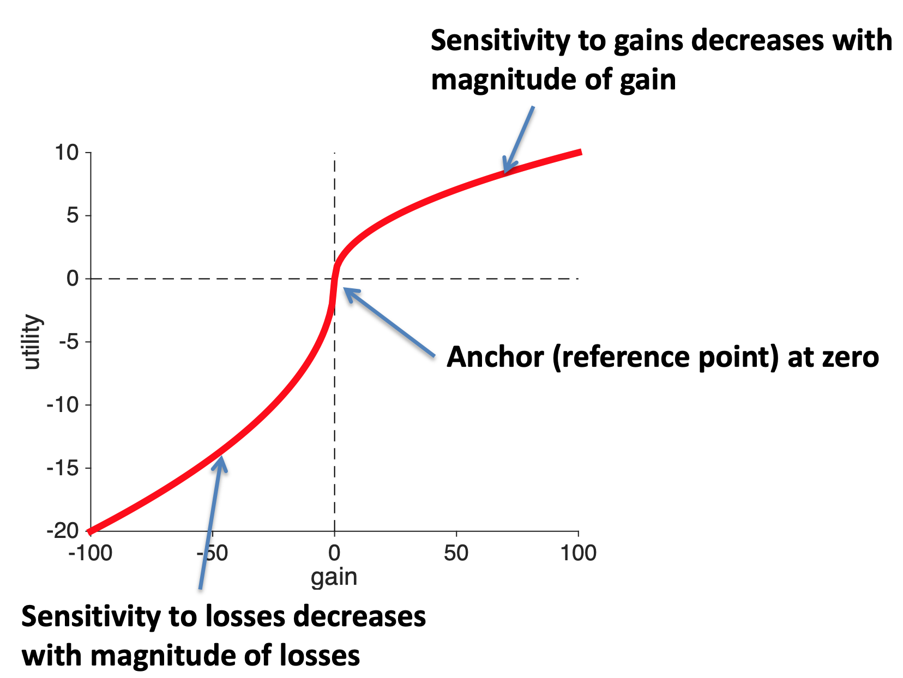

## Reference points in the marathon

Marathons are a great source of behavioral data.  Pretty much every result of every major marathon since at least the year 2000 is online.

In a [wonderful paper](http://faculty.chicagobooth.edu/devin.pope/research/pdf/Website_Marathons.pdf), which was also written up for the popular press in [Runner's World](http://www.runnersworld.com/sweat-science/round-number-times-for-marathons), Allen and colleagues looked at marathon finishing times for nearly 10 million runners taking part in thousands of marathons from 1970 to 2013.

They were interested in whether they could see evidence for reference points in people's marathon finishing times. They could.  In particular, when they plotted the distribution of finishing times they saw clear bumps on the hour and half hour ...

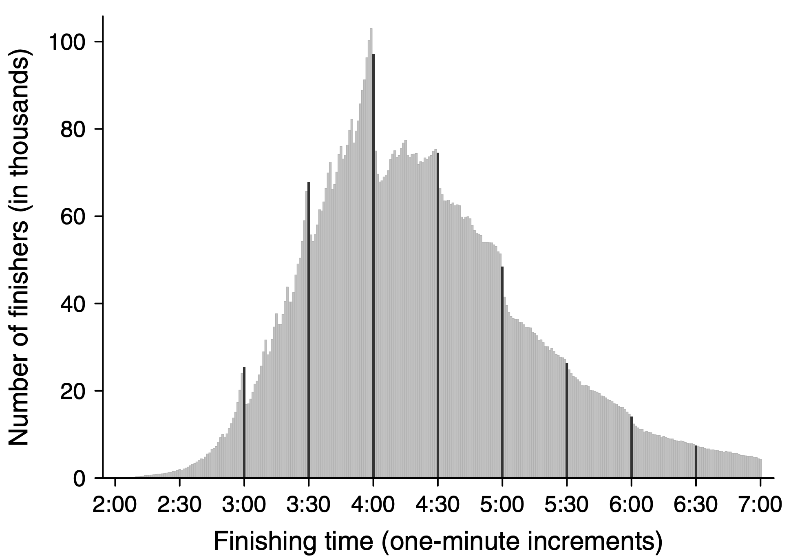

In the above plot, this is most clear on the four hour mark where there's a hug excess of people just under four hours and a (relative) lack of people just after four hours.  For these people it looks like the arbitrary reference point of four hours (or a 3 hour marathon or 2:30 marathon) really motivates people.

In fact, a more detailed dive into the data shows that people actually speed up in the last two miles if they think they can get under the milestone.  Here's data for the four-hour runners.

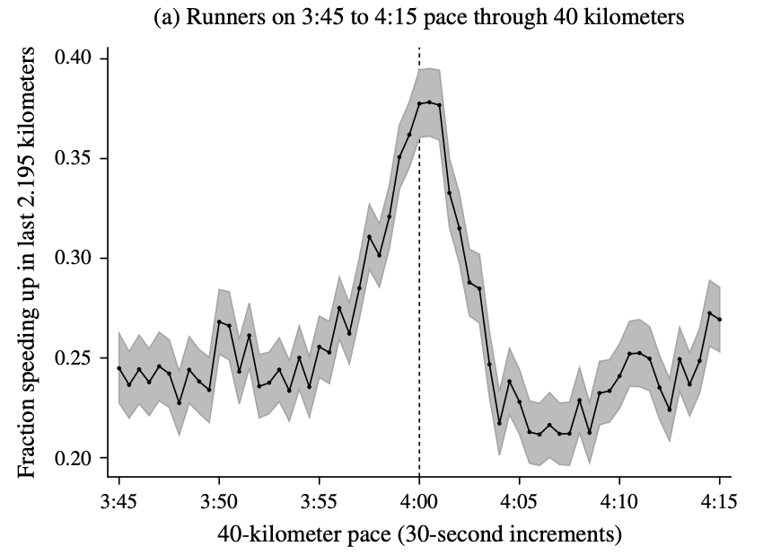

On the x-axis they are plotting the predicted finishing time based on their speed up to 40km (about 1.5 miles from the finish).  On the y-axis the fraction of runners who speed up.

There are a few things to notice about this plot.  First off, the fraction of people speeding up in the last 1.5 miles is pretty small (25%).  Marathons are hard and most people slow down towards the end.  This tells you how hard it is to speed up.

Second, though is that people who think they can beat 4 hours (i.e. who's predict finishing time is 3:55 to 4:05 based on their pace upto 40km) are more likely to speed up than everyone else (up to 40% of people right on the edge of 4-hour pace speed up).

Why?

Well, let's plot the utility curve for marathon finishing times.

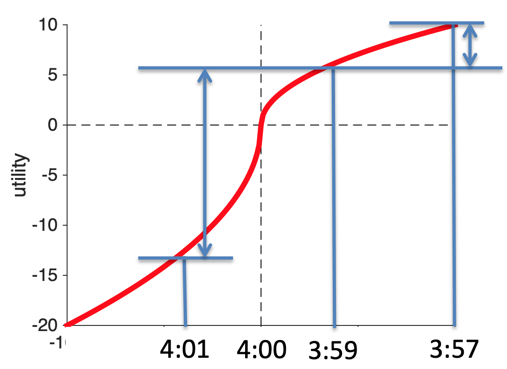

The reference point is at 4 hours (for people aiming to finish in 4 hours).  Anything slower than four hours is a loss. Anything faster than 4 hours is a gain.

Now let's imagine I'm on for a 4:01 finishing time, if I could speed up and cut 2 minutes off my time, my increase in utility would be huge.  I go from 4:01 to 3:59 and I'm a sub-4-hour marathoner!

Contrast that with the same increase in speed for someone who's already on for 3:59.  For them going 2 minutes faster and scoring 3:57 increases utility a bit, but it's hardly anything to brag about because you haven't broken the arbitrary reference point.

How do I know this is true?

Because I ran a marathon once --- here is my finishing photo ...

As you can see I was pretty happy to get under 4 hours and I remember that being my goal the whole way around.  And the whole way around, and especially in the last six miles when I started to flag,  I was busting a gut to stay under the four hour time.

I'm glad I did it though, the utility of beating that arbitrary reference point was high!  And I certainly wouldn't be putting this picture in my lecture notes if my time was 4:00:01 ...

It's also not just me, amateur runners that do crazy things for arbitrary thresholds.  Nike and Ineos put millions of dollars into Eliud Kipchoge run a sub two-hour marathon in 2019.

In addition to [fancy shoes](https://www.cnn.com/2020/01/31/sport/nike-world-athletics-vaporfly-alphafly-ban-spt-intl/index.html), a carefully selected course and perfect weather conditions, he also had a team of [43 pacemakers](https://qz.com/1727150/breaking-marathon-barrier-required-43-world-class-runners/) to help set the pace and run in a crazy formation to reduce wind resistance!  These pacemakers included several Olympians including the 1,500 meter Olympic gold medalist (Matthew Centrowitz), the 5,000 Olympic silver medalist (Paul Chelimo).

As if that wasn't enough they also had a special pacer car that went at exactly the right speed and projected exactly where they should be running on the road in green lasers!    All this is to say that arbitrary reference points can make humans do really crazy things!

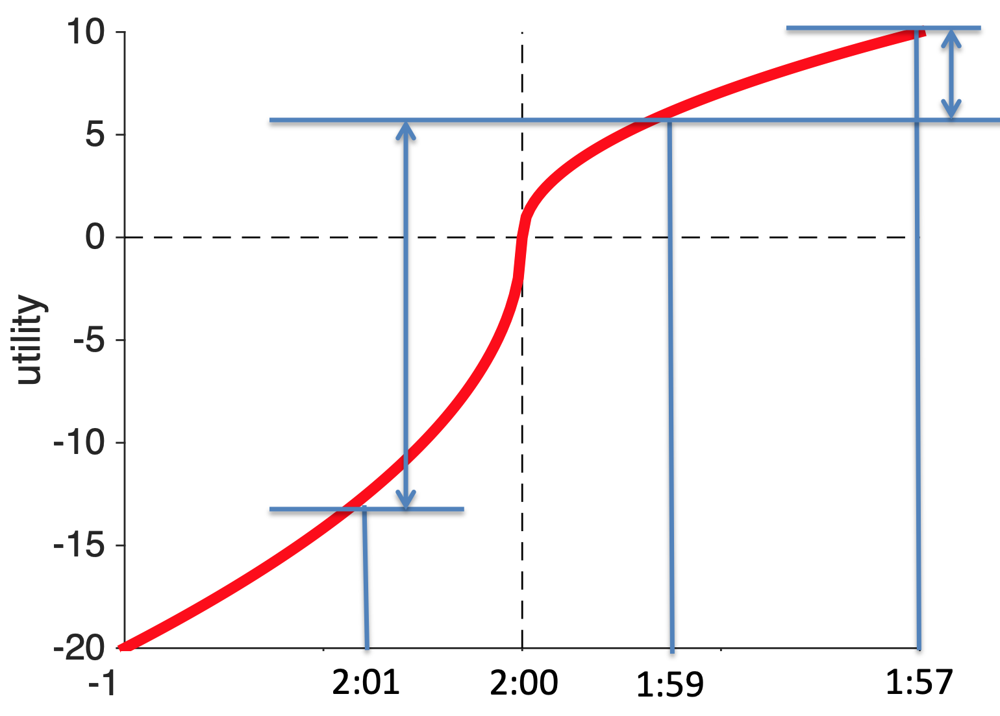

