---
title: PSY 333 --- Week 11, Class 1
...

<iframe src="https://arizona.hosted.panopto.com/Panopto/Pages/Embed.aspx?id=b6425891-121d-416f-8de7-ac3701191628&autoplay=false&offerviewer=true&showtitle=true&showbrand=false&start=0&interactivity=all" height="405" width="720" style="border: 1px solid #464646;" allowfullscreen allow="autoplay"></iframe>

# Subjective Probabilities

Last week we introduced Prospect Theory, our final theory of decision making.  Even this theory isn't perfect, but it can handle all of the problems we've encountered with Expected Utility Theory and Expected Value Theory and it was good enough for the [2002 Nobel Prize in Economics](https://www.nobelprize.org/prizes/economic-sciences/2002/kahneman/facts/).

> As an aside, Kahneman only won half the Nobel prize in 2002. The other winner was [Vernon L. Smith](https://en.wikipedia.org/wiki/Vernon_L._Smith), who's work we don't cover in this class, but who was a faculty member at the University of Arizona for 25 years!

In Prospect Theory we compute expected utilities using this equation

$$EU = \sum_i \pi(p_i) U(g_i)$$

where $U(g_i)$ is the utility of gain $g_i$ and $\pi(p_i)$ is the subjective probability of probability $p_i$.

Last week our focus was on the shape of  the utility curve, $U(g_i)$.

Today we will focus on the subjective probability $\pi(p_i)$.

## What is subjective probability?

Subjective probability is to probability what utility is to gains.  So if utility is how you subjectively _feel_ a particular gain or loss, subjective probability is how you subjectively _feel_ about a probability.

To get some insight let's imagine playing the [Wheel of Fortune](https://en.wikipedia.org/wiki/Wheel_of_Fortune_(American_game_show)) ...

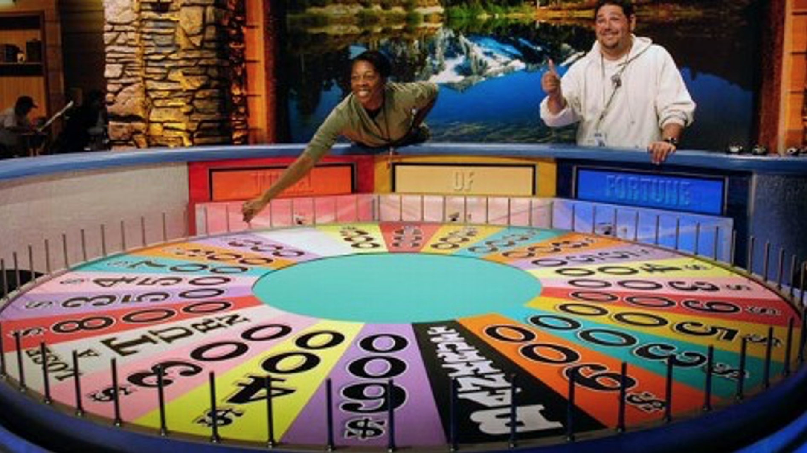

In this game you spin a wheel that has different outcomes on it.  In the show these outcomes can be different amounts of money, special prizes, lose a turn, and BANKRUPT, where you lose all your money.

To keep things simple we will consider a wheel with just 8 outcomes that are either $100 or BANKRUPT --- not much of a TV show, but better for our purposes ...

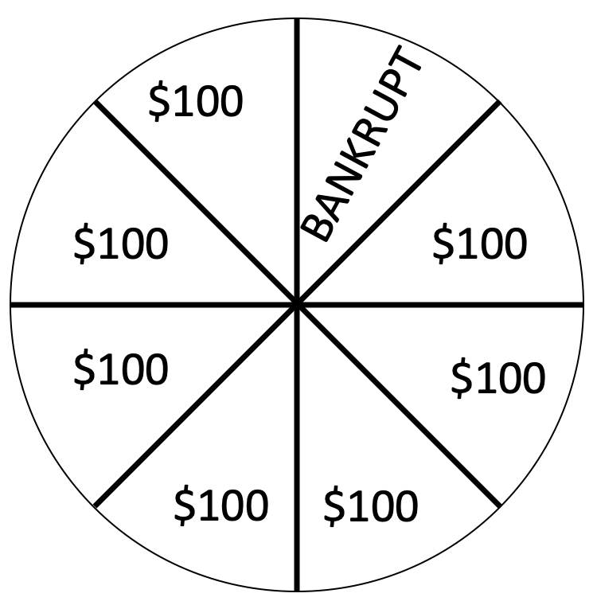

Now let's imagine changing this wheel, by removing the BANKRUPT and thinking about how this change makes you _feel_.  So, our initial wheel with one BANKRUPT out of 8 now has no chance of losing ...

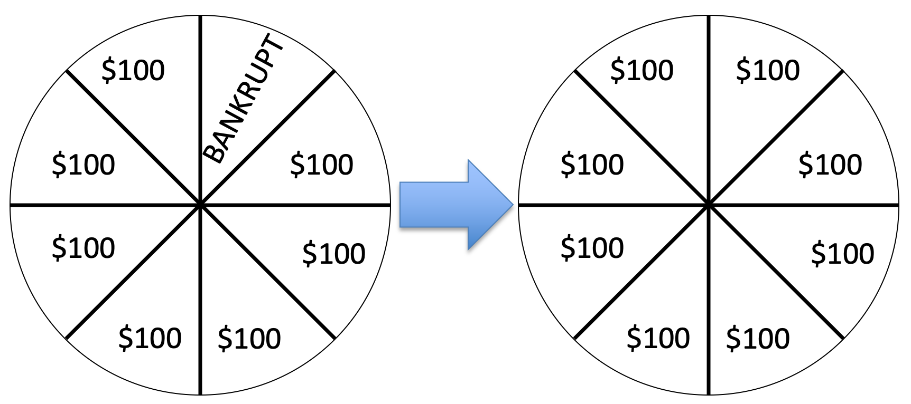

If you're like me, this change feels really good and actually quite big.  I've gone from having some change of losing (12.5% chance to be precise) to having no chance of losing --- that's great!

Now let's imagine the same 12.5% reduction in probability of losing, but starting from a wheel with 4 BANKRUPTs ...

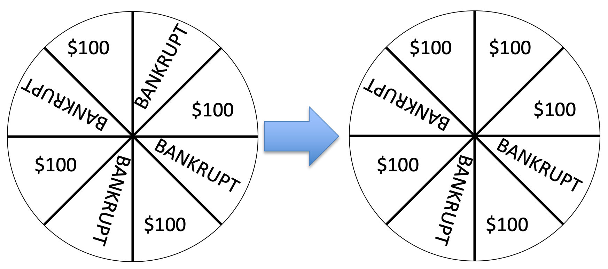

If you are like me, this change feels smaller than the first wheel.  In both cases I have a pretty high chance of losing.  However, the change in probability is _exactly the same_ (12.5%).  The subjective feeling of that 12.5% is different in the two cases.

Finally, let's imagine starting from an all BANKRUPT wheel ...

This also feels like a large change in probability, I've gone from being guaranteed to go BANKRUPT to having at least some chance of getting $100.  Again the _actual_ change in probability is still the same.

## Deriving the shape of subjective probability curve

These three "data" points are enough to generate the shape of the subjective probability curve.  Let's see how ...

First, before we can do any sketching of shape, we need to think about what quantities are going on the axes of our plot.  It isn't gain and Utility this time.  Instead if we are plotting the subjective probability ($\pi(p_i)$) as a function of actual probability ($p_i$), we need $p_i$ on the x-axis and $\pi(p_i)$ on the y-axis.

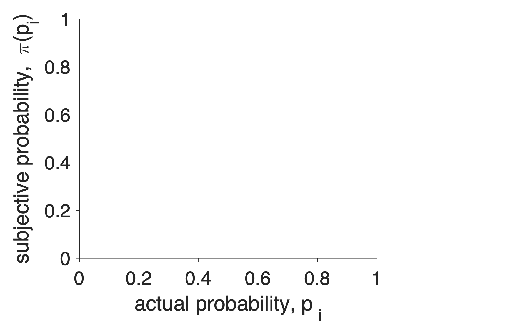

Next, let's make some assumptions about the subjective probability of 0 and 1. If I tell you that the probability of something happening is either 0 or 1 then we are talking about _certainty_ --- these things will definitely not happen or definitely will happen.  People are pretty good at understaning what definitely means, so let's assume that the subjective probability of 0 is 0 and the subjective probability of 1 is 1. We can write this mathematically as

$$\pi(p_i = 0) = 0 \quad\mbox{ and } \quad \pi(p_i = 1) = 1$$

In addition, we can add two points to the plot ...

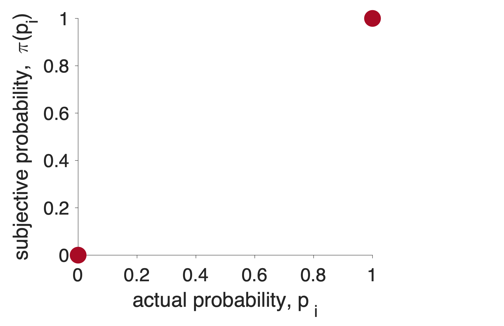

Now let's consider the first wheel.  In this case a change from actual probability 12.5% ($p_i = 0.125$) to actual probability 0% ($p_i = 0$) felt big.  So let's make the subjective probability of 12.5% bigger than 12.5%.  Let's make it 21%, so

$$\pi(p_i = 0.125) = 0.21$$

and add this point to the plot ...

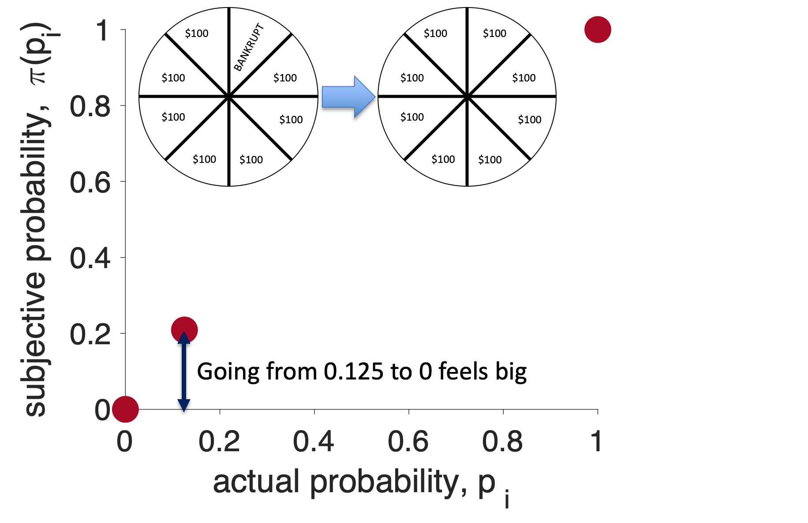

Now let's consider the second wheel.  In this case the 12.5% change in actual probability from 50% to 37.5% felt small.  This means that the subjective probability of 50% and 37.5% should be close together.

In addition, we know that the subjective probability of 37.5% should be higher than the subjective probability of 12.5% from the last wheel.

I'm going to capture these two feature by saying

  1. the subjective probability of 37.5% is 0.35,   $\pi(p_i = 0.375) = 0.35$
     - higher than the subjective probability of 12.5%
  2. and the subjective probability of 50% is 0.42,  $\pi(p_i = 0.5) = 0.42$
     - small change in subjective probability from 37.5% to 50%

> _Note that the numbers here are for illustrative purposes only, when you sketch the subjective probability curve for the assignments you don't need specific numbers, **it's the shape the matters**_

Putting these points on the curve I get ...

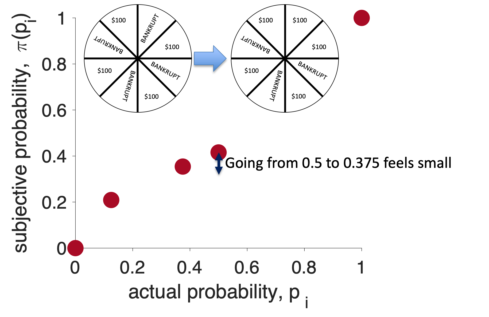

For the third wheel the change in probability from 100% to 87.5% felt big again so we need a large change in subjective probability on the right hand side of the plot.  In addition, we know that the subjective probability of 87.5% must be higher than the subjective probability of 50%.  Remember also that we assumed the subjective probability of 100% is just 1, so we only need to add a point for the subjective probability of 87.5%.  I will assume this is 0.67 ...

$$\pi(p_i = 0.875) = 0.67$$

Adding this point to the plot I get ...

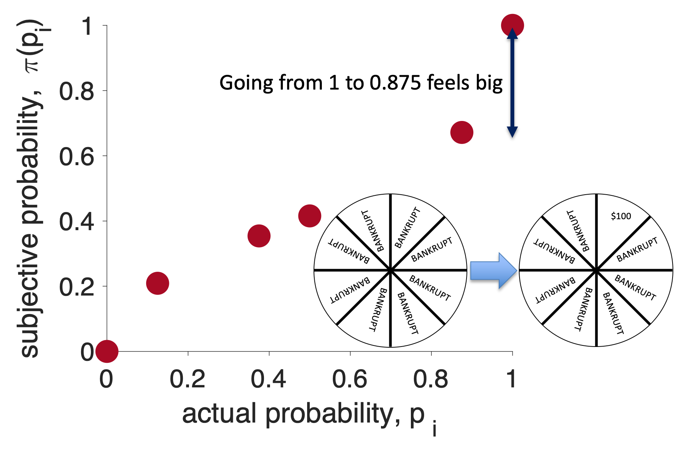

Let's get the overall shape of the subjective probability curve by connecting all of these points with a smooth line ...

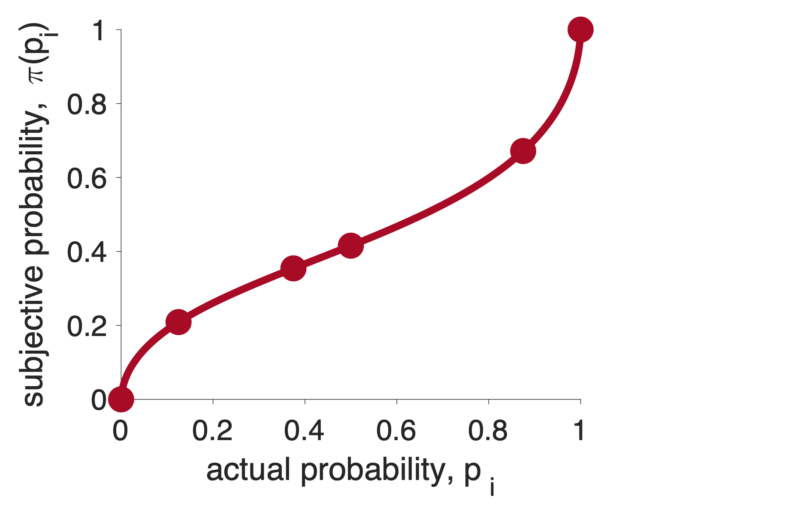

Finally, I'm going to add one more line to the plot.  This is the line $x = y$.  This line represents what the subjective probability _would_ be, if people we perfect at probabilities.

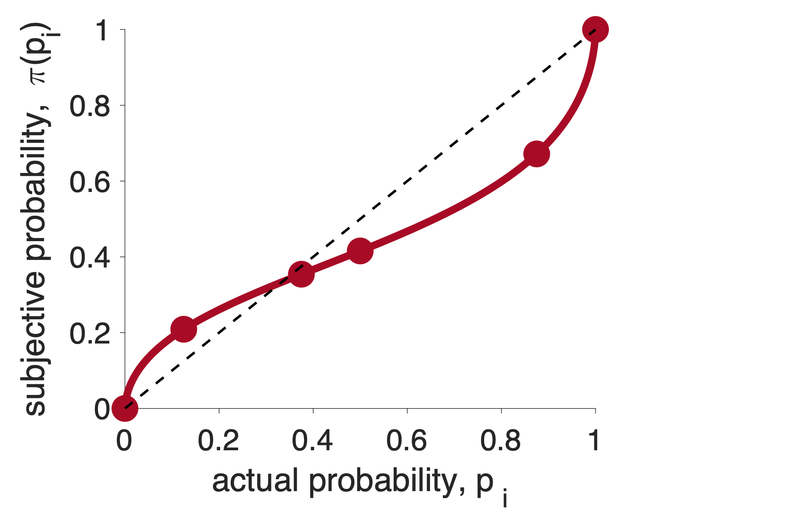

This last line allows us to see the **two key features of the subjective probability curve**.

Feature 1: People tend to overweight small probabilities.  That is the subjective probability of small probabilities is _higher_ than the true Probability

$$\pi(p_i) > p_i \quad \mbox{for small } p_i$$

Feature 2: People tend to underweight large Probabilities

$$\pi(p_i) < p_i \quad \mbox{for large } p_i$$

On the plot, these two features can be added like this ...

This is the shape of the subjective probability curve for Prospect Theory.

### Reference points in the subjective probability curve

Note that, just as we could understand much of the shape of the Utility curve in terms of reference points.  We can also understand the shape of the Subjective Probability curve in terms of reference points.

In particular, the two reference points in this curve are at probability 0 and probability 1.  Note that as we move away from either of these points, the curve gets less steep.  Exactly like it did for the _one_ reference point (gain = 0) for the Utility curve.

## The two curves for Prospect Theory

Along with the Utility Curve, it forms the basis of the theory.

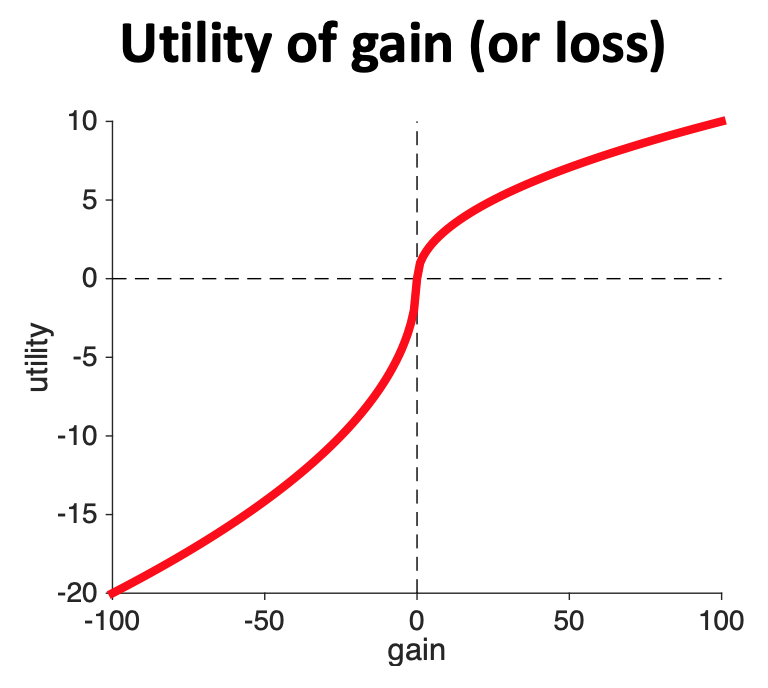
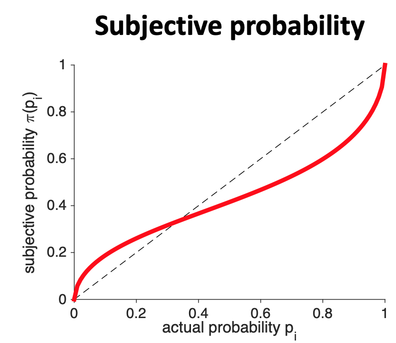

Finally, and this is entirely optional, if you are a math junky the equation people often use for subjective probability is

$$\pi(p) = \frac{p^\gamma}{(p^\gamma + (1-p)^\gamma)^{1/\gamma}}$$

where $\gamma$ is a number between 0.5 and 1.
