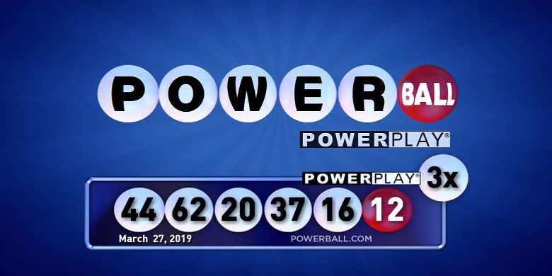
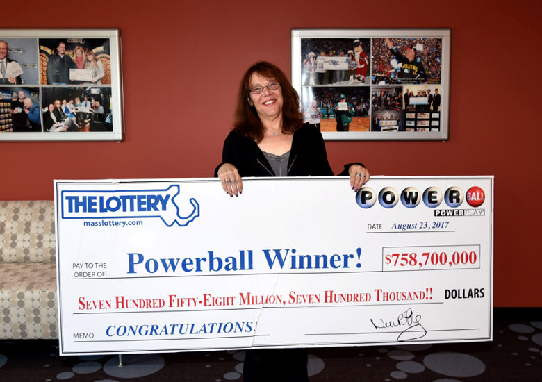
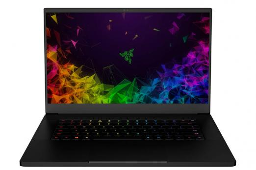

---
title: PSY 333 --- Week 11, Class 2
...

<iframe src="https://arizona.hosted.panopto.com/Panopto/Pages/Embed.aspx?id=6e145d7d-53b0-41f1-bd41-ac370119174f&autoplay=false&offerviewer=true&showtitle=true&showbrand=false&start=0&interactivity=all" height="405" width="720" style="border: 1px solid #464646;" allowfullscreen allow="autoplay"></iframe>

# Subjective Probability 2

Last time we derived the shape of the subjective probability curve in Prospect Theory.  This had two key features: underweighting small probabilities and overweighting large probabilities

Today we will use this curve to explain why people buy lottery tickets and insurance.

## Why buy lottery tickets?

Last week, when we discussed the Utility curve, we saw that people are _risk averse_ for gains.  If this is true, then why do people buy lottery tickets?

One answer to this question is to simply say that _most_ people are risk averse for gains (with a concave curve for gains), but some are risk seeking (with a convex curve for gains).  This is a valid hypothesis, but not particularly satisfying and the shape of the subjective probability curve offers another explanation ...

In particular, we know from the shape of the curve that people tend to overweight small probabilities and lotteries, almost by definition, have _small_ probabilities of winning.  For example, your odds of winning the jackpot in PowerBall [are about 1 in 300 million](https://www.cnbc.com/2019/05/31/these-are-the-odds-youll-win-the-350-million-powerball-jackpot.html#:~:text=The%20odds%20of%20winning%20the,prize%20are%201%20in%2024.87.). This converts to a probability of winning around $0.000000003$, an astronomically low probability!

One reason people buy lottery tickets is that they don't realize quite how low their chances of winning are.  The obviously know the odds are low, but it their subjective probability of 1 in 300 million is 1 in 3 million _then they are overestimating their chances of winning by a factor of 100!_.

> _As an aside, what's the Psychological reason people overestimate small probabilities?  It's the Availability Heuristic that we covered in Week 2!  It's easy to imagine winning the lottery, and you only ever read news articles about the winners, and so the idea of winning is more available than losing, hence people overestimate the probability!_

### A toy lottery

Imagine deciding whether to spend $10 to play this toy lottery

  * Odds of winning 1 in 100 million, $p(\mbox{win}) = 0.00000001$
  * Prize for winning 100 million dollars

Note the Expected _Value_ of playing this lottery is $\$1 = 100,000,000 \times 0.00000001$.  So Expected Value theory says you should not be willing to spend $10 to play this lottery.

But now let's assume you overweight that small probability by a factor of 100.  That is, you think the probability is 1 in a million.  Let's also assume (for simplicity) that you have a utility curve that treats the gain as the utility $U(g_i) = g_i$.

In this case, your utility is 100,000,000 and your subjective probability is 0.000001, so your Expected Utility from Prospect Theory is 100. So you should definitely be willing to spend $10 to play this lottery.

### People are risk seeking for small probability gains

More generally, the lottery example illustrates a key point of Prospect Theory, namely that people are _risk seeking for low probability gains_.

This is in contrast to their behavior for high probability gains, in which case they are risk averse as we saw last week.

Note that this switch from risk averse to risk seeking is entirely driven by the shape of the subjective probability curve.

## Why buy insurance

Whenever you buy a new computer, you always get the option of buying some kind of insurance package to replace it, if it's stolen, or fix it, if it stops working.  This insurance is quite expensive and is, on average, not worth it (so long as you can afford to replace your stolen/broken computer).

However, insurance is all about loss --- breaking your computer is akin to losing $1000 or more.  And not insuring your computer is akin to a risk seeking choice. So buying insurance is a _risk averse_ choice. But we saw last week that people are _risk seeking_ for losses, if that is the case, then why is their an insurance industry at all?

Again we appeal to subjective probabilities for an exaplanation.  And again it's useful to consider a toy example.

### Insurance for a computer

Let's imagine you buy a new computer for $1,000.  And have to decide whether to insure it for $40.  Let's also assume that the probability you will need to use the insurance (e.g. due to breakage or theft) is 1%.

Framed as a gamble our choices are

  * Buy insurance and lose $40 for sure
  * Don't buy insurance and lose $1,000 with 1% probability and $0 with 99% probability

Note that Expected Value theory says you should not buy the insurance because the Expected Value of the insurance is $10.

However, if you overweight the probability that you will use the insurance then things change.  Let's assume your subjective probability of 1% is 0.05, $\pi(p = 0.01) = 0.05$.

In this case (assuming again for simplicity that $U(g_i) = g_i$, so $U(-1000) = -1000$ and $U(-40) = -40$) the expected utility for buying the insurance is

$$EU(\mbox{buy insurance}) = -1000 \times 0.05 = -50$$

which is a bigger loss than the Expected Utility of -40 for buying the insurance.  Which makes buying the insurance the better deal.

### People are risk averse for low probability losses

More generally, because people overweight low probabilities, they are risk averse for low probability losses.

## The five behaviors in Prospect Theory

Overall Prospect Theory has five key behavioral types depending on whether the choices are for gains, losses, or a mixture and depending whether the probabilities of the outcomes are low or high.

 1. For large probability gains, people are risk averse
 2. For large probability losses, people are risk seeking
 3. For small probability gains, people are risk seeking
 4. For small probability losses, people are risk averse
 5. for large probability gambles involving gains and losses, people are loss averse
