---
title: PSY 333 --- Week 12, Class 1
...

<iframe src="https://arizona.hosted.panopto.com/Panopto/Pages/Embed.aspx?id=2d9eb754-75bd-41a3-b848-ac39012765fe&autoplay=false&offerviewer=true&showtitle=true&showbrand=false&start=0&interactivity=all" height="405" width="720" style="border: 1px solid #464646;" allowfullscreen allow="autoplay"></iframe>

# Social decision making and games

In this final part of the class we will look at judgments and decisions that involve multiple people.  This includes judgments made in groups, decisions that affect other people, and competitive games.  Before going into detail it's worth thinking of a few examples and also thinking about why we choose to make these judgments and decisions together ...

## Examples of group judgments and decisions

Voting is the cornerstone of democracy.  The amazing idea, which is not always achieved in practice, is that everyone in a democracy has an equal say in who our leaders should be.

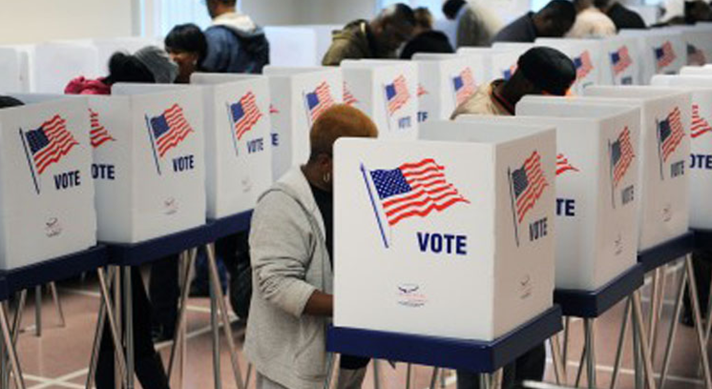

One elected, of course, our leaders make many of our decisions for us (we don't get to vote on every bill that's debated in congress).  But even in government, there are checks and balances to make sure that no one is making the decisions entirely alone

In the legel system, the most important decisions in the Supreme Court are made by a group of people

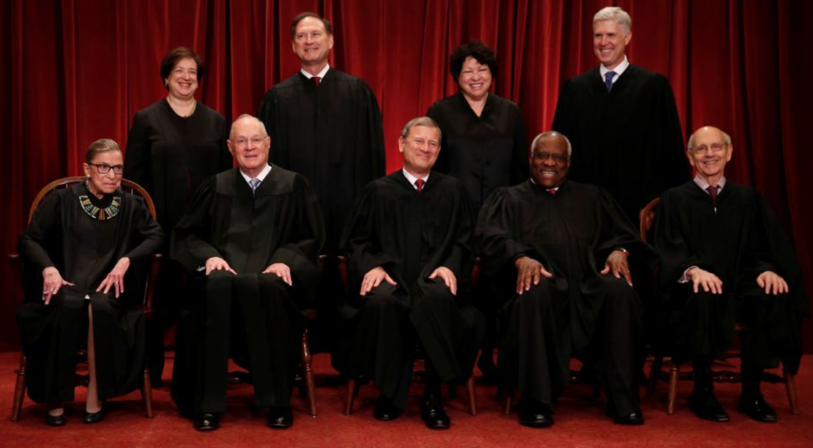

Even in lower courts, many judgments are ultimately made by juries

We also recognize the importance of juries in TV talent shows!

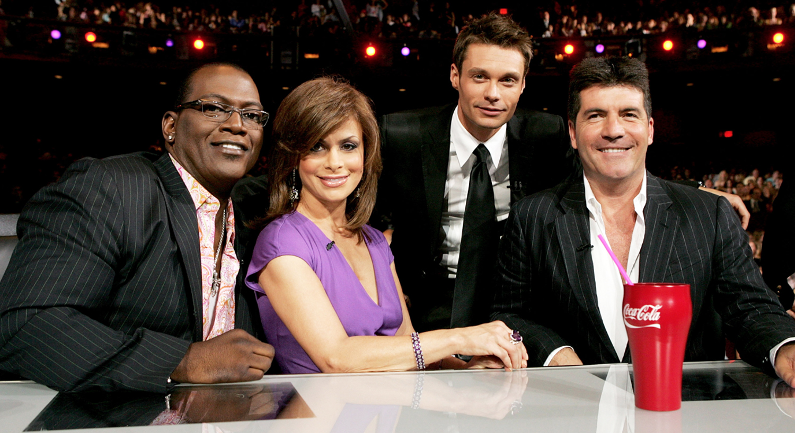

### Twitch plays pokemon

A slightly less efficient illustration of group decision making comes from the project [Twitch Plays Pokemon](https://en.wikipedia.org/wiki/Twitch_Plays_Pokémon), which became a suprise hit on Twitch in 2014.

In this game, an anonymous Australian programmer setup the game Pokemon Red so that it could be controlled by the chat feature in Twitch.  To suggest a command people had simply to type what they wanted the character to do into the chat (e.g. "Up").

In addition they could also influence how the character was controlled by typing either "democracy" or "anarchy".  Depending on the number of votes for either option (in a period of time) the control would switch from one to the other.

In democracy mode, the movement executed was the most popular movement suggested in chat in the last 30 seconds.

In anarchy mode, every chat entry was executed.

On average about 8,000 people  were trying to control the game at any moment.  Amazingly, the game was completed in about 16 days continuous game play,
despite sabotage attempts from trolls!

The crazy nature of the control lead to all sorts of group interactions, factions and even a religion centered around "Bird Jesus"

If you've got 300-odd hours to kill, here's the first 11 hour video (in a series of 31 mosly 11-hour videos) of the full playthrough (PS: "I was busy watching the Twitch Plays Pokemon video" is not an excuse to miss class!)

<iframe width="560" height="315" src="https://www.youtube.com/embed/5-_cJJD070U" frameborder="0" allow="accelerometer; autoplay; encrypted-media; gyroscope; picture-in-picture" allowfullscreen></iframe>

### Place on Reddit

Another example comes from Reddit in 2017 who setup a group art project called [Place](https://en.wikipedia.org/wiki/Place_(Reddit)#:~:text=Place%20was%20a%20collaborative%20project,from%20a%2016%2Dcolour%20palette.).  This was a 1000 x 1000 pixel canvas that everyone on Reddit could draw on.  Each person could change one pixel every 5-20 minutes and users had 72 hours to draw what they wanted before the canvas would be saved forever.

As with Twitch Plays Pokemeon, this led to all kinds of crazy interactions with different teams forming around different colors and different pictures.  The video below shows the evolution of the project compressed down to four minutes.

<iframe width="560" height="315" src="https://www.youtube.com/embed/XnRCZK3KjUY" frameborder="0" allow="accelerometer; autoplay; encrypted-media; gyroscope; picture-in-picture" allowfullscreen></iframe>

## Decisions that affect other people

Other judgments and decisions aren't made in groups, but your actions nevertheless affect other people.

Giving money to charity is one of the simplest examples of this.  This is a decision you make alone but can have an enormous effect on other people.  Just the fact that your decision can affect other people (who you may never actually meet) affects your decision.

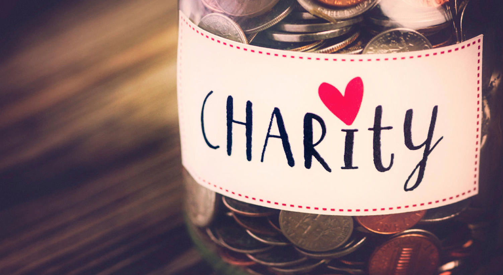

Competitive games are another example of decisions that affect other people, but that are utlimately made on our own.  Which move should I make in Chess is one example ...

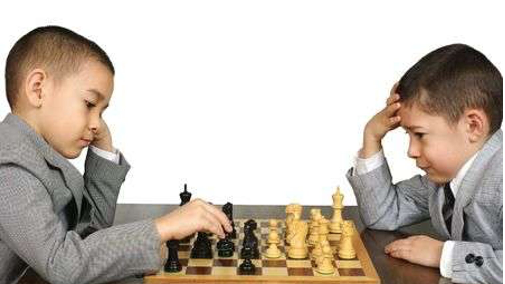

The game of chicken --- should I turn aside or keep going? --- is another

Tennis players have to decide which side of their opponent (left or right) they should serve the ball to.

Soccer players taking a penalty have pretty much the same decision when deciding where to aim their kick

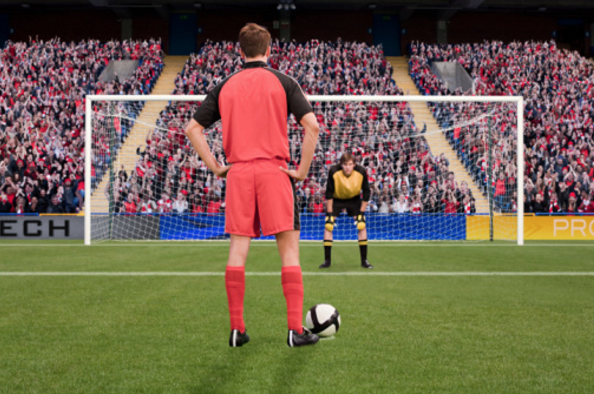

Of course, there are many other examples of judgments and decisions made in groups.  What examples can you come up with?

# Wisdom of the Crowds

To start our foray into group judgment and decision making, we will start with one of the simplest types of group judgments known as "The Wisdom of the Crowds".

In Wisdom-of-the-Crowds experiments, a bunch of people make judgments on their own --- there is no social interaction involved in these judgments.  The trick is that we then agregate all of their judgments to get an average judgment that turns out to be remarkably good.

## The weight of an ox
In the first demonstration of this effect, Francis Dalton asked people at a county fair to guess the weight of an ox.

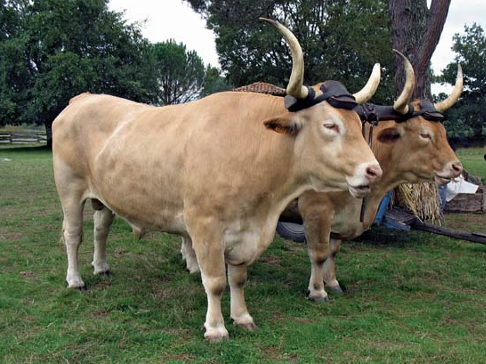

787 people made guesses.  Individual guesses varied widely (some people were experts (e.g. farmers) some were not (e.g. accountants).

However, the average of all the guesses (1207 lbs) was remarkably close to the actual weight of the ox (1198 lbs).  That is, the average guess of the crowd was _within 1%_ of the true weight!

This surprising result is known as the _Wisdom of the Crowds_.

### How many people do you need in your crowd?

[Ashton and Ashton 1985](AshtonAndAshton1985.pdf) had people try to guess the number of advertising pages sold by Time magazine over a 14-year period
Subjects were employees of Time Inc (so all had some expertise), but some had more expertise than others.

Averaged responses of groups of up to 13 people. Up to 5 people improved the judgment (after that improvement was small). Note that "MAPE" is just their acronym for error, see the [paper](AshtonAndAshton1985.pdf) for more information.

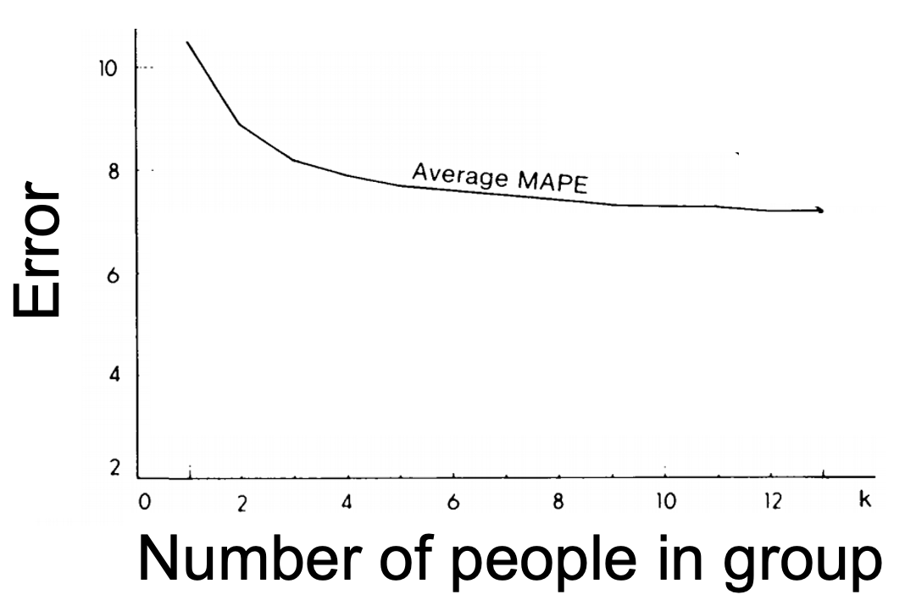

They also tested whether giving additional weight to the estimates of experts (e.g. people who actually sold advertising pages in the magazine) improved the performance of the group.  It did, but only slightly.  In this case, a group of non-experts was almost as good as a group of experts.

## Judgments about the replicability of an experimente

[Camerer et al. 2018](https://www.nature.com/articles/S41562-018-0399-Z) asked scientists to predict probability that a given study would replicate. They then actually tried to replicate the studies and compared the predictions of the group of experts to the outcome of the experiments.  They were remarkably close

On the x-axis is the predicted probability that each  experiment would replicate.  On the y-axis is the list of experiments.  The color indicates whether the experiment actually replicated or not.  Yellow indicates the study did not replicate, blue indicates it did replicate.

_Studies rated by the group as unlikely to replicate did not replicate!_

## How long to bake a cake?

[Griffiths and Tenenbaum 2006](https://journals.sagepub.com/doi/full/10.1111/j.1467-9280.2006.01780.x?casa_token=6_ko47-hgGYAAAAA%3APuD7fGEHjzfFNh3nTI9XGwfJ07RU8ELB56Zl4YrHZW4aLKq1Oj2ViQro-bikNlKLbzncsi26zopv6w) asked people to make everyday judgments.  One example asked about cakes

> _Imagine you are in somebody’s kitchen and notice that a cake is in the oven. The timer shows that it has been baking for 35 minutes. What would you predict for the total amount of time the cake needs to bake?_

Another asked about lifespan

> _You meet an 83 year old man.  At what age do you think he will die?_

All of their questions had this form.  You had to make a judgment about a number, but you were give some information about that number.  In the cake case, you know the bake time must be at least 35 minutes, for the lifespan case, you know the minimum is 83.

Depending on the information I give you (about how long the cake has been in, or how long the person has been alive) you should give different answers.  In addition, there's actually a _correct_ answer to these questions.  To see why, let's look at the lifespan example in more detail ...

### The correct answer to the lifespan question

If we look at lifespans across the population, there is a distribution.  Some people live a long time and, tragically, some die very young.  Most of us die somewhere in the middle.  The mean of this distribution is about 78 years for men in the US.

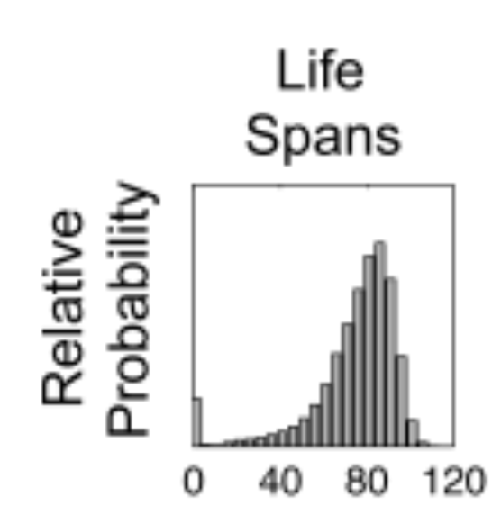

If I know that someone has already lived to be 83, the mean age of the whole distribution (78) is a bad guess.  I can get a better guess by _truncating_ the distribution, which means setting the probability of dying at less than 83 to 0.  The mean of the resulting  distribution is around 90.

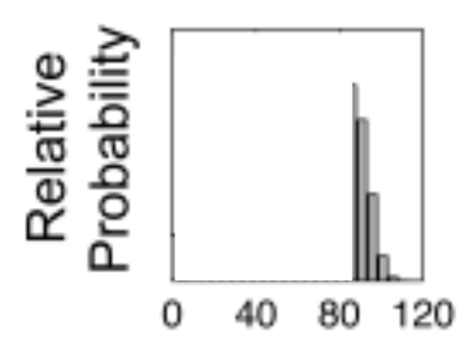

More generally I can play this game for different initial ages.  For an 18 year old the distribution looks like this and the mean is about 79

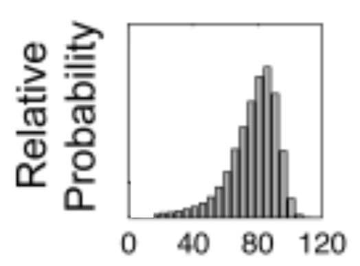

If I do this for a bunch of different ages I can plot the predicted total lifespan as a function of the age of the person.  That's the solid line in this plot and it increases with the age of the person.

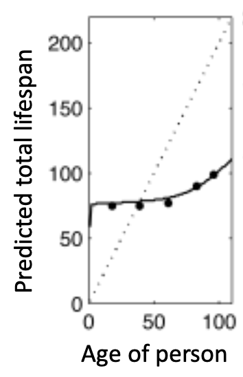

What's amazing about this plot is the black lines.  These are the average of people's guesses, which are almost _exactly_ equal to the correct answer!  Again this is an incredible demonstration of the Wisdom of the Crowds!

### Repeating the procedure for different questions

In all, they asked 8 different questions.  And in almost all cases the average almost perfectly matched the correct answer!

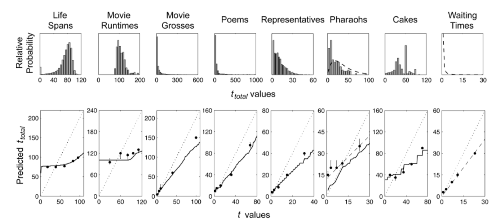

The only one people did poorly on was a question about Egyptian Pharaohs, which most people don't know much about to begin with.  This suggests that the crowd can indeed by wise, but only if they have a base level of knowledge to begin with.

## The wisdom of a crowd of fish

Finally, it's not just crowds of humans that can make wise decisions, crowds of fish are pretty smart too.  In [one study](https://science.sciencemag.org/content/339/6119/574.abstract?casa_token=CIzpT-vYoCoAAAAA:tOCJLZMbuD1_TV41cO2Fr1Xc9_gDHk9RZcl1sqiQ2QVgeq342Ob8CTWNh5O6RB6ThjKoVH917cBzag0) the authors looked at group decision making in Golden Shiner fish.

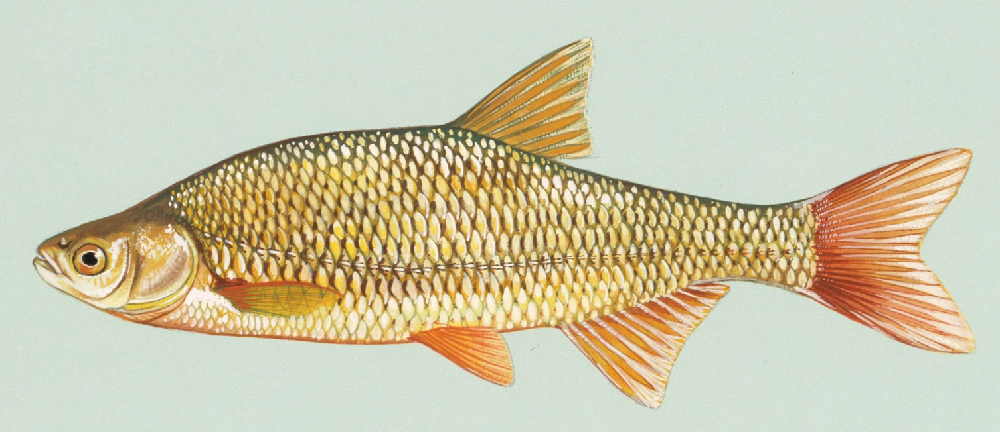

These fish like to hide in shadows (presumably to avoid prey), but on their own they do a really bad job.  In this experiment, the authors tested the fish's ability to move into shadows that changed over time, which the experimenters created using a special lighting setup in the lab.

Here's a schematic of the experiment.  The fish are labeled in green and the shadows as dark areas.  There are three different time points here.  On the left is the start of the trial in which the light is shone on the fish.  In the middle is as the swim around trying to get out of the light.  And on the right is as they successfully swim into the shadow.

They measured how quickly and how often the fish found the shade to get a "performance" score and then asked how the fish's performance changed with the size of the group.  As you can see below, individual fish aren't very good, but groups of 256 fish do much better.  Crowds of fish can indeed be wise!

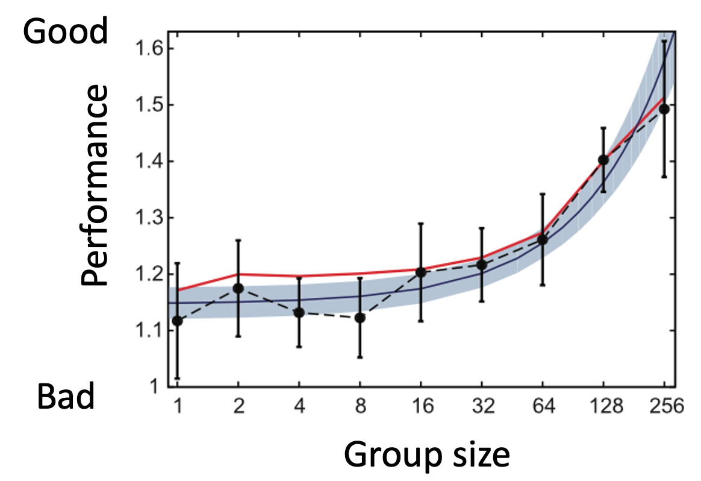

Note that one difference between this study and the human tests of Wisdom of the Crowds is that the fish can interact.  So it's isn't quite a pure "wisdom of the crowds" effect, but clearly it's related and is surely important for the fish's survival.
