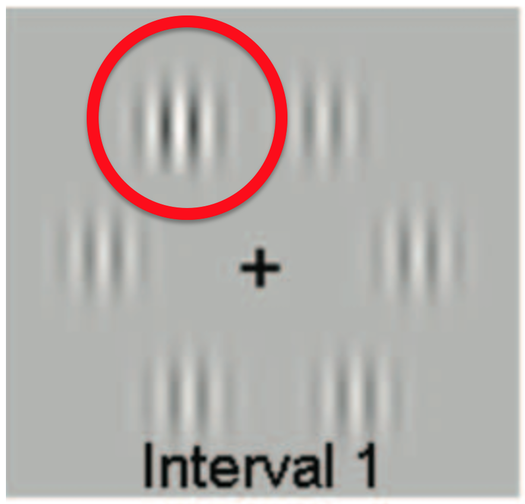
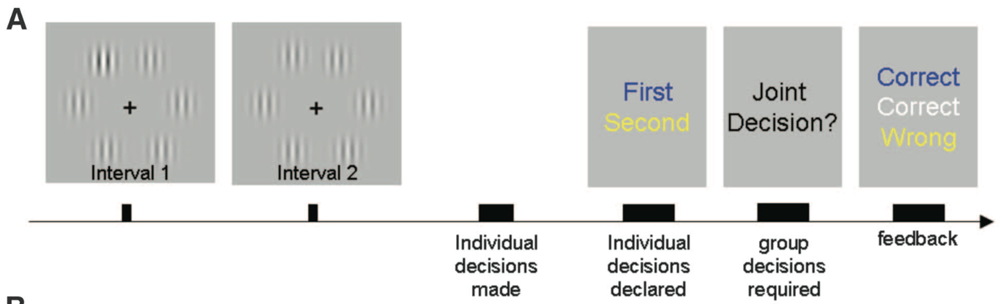

---
title: PSY 333 --- Week 13, Class 1
...

<iframe src="https://arizona.hosted.panopto.com/Panopto/Pages/Embed.aspx?id=1b15e313-371a-4b40-96b2-ac39012ad7ed&autoplay=false&offerviewer=true&showtitle=true&showbrand=false&start=0&interactivity=all" height="405" width="720" style="border: 1px solid #464646;" allowfullscreen allow="autoplay"></iframe>

# Judgment and decisions in groups

In this class we will look at what happens when people make judgments and decisions in groups where we allow them to communicate freely.  Most of these studies involve simple perceptual judgments because these are easier to quantify.  This is a very new area of research, with the first paper on this topic coming in 2010.

## Perceptual decisions in pairs

In the first study in this area [Bahrami and colleages](https://science.sciencemag.org/content/329/5995/1081.abstract?casa_token=nqYZIdDlFi8AAAAA:G2uv8djr8tqmPoF6lZM56sp3hHvOb_1ADUSKcBKQvYZXY2A71PPCSCNowmEOIMbQ7XeJPDSvIon-s6Y&__cf_chl_jschl_tk__=bc064f9c71202f46b3d3b0f6d23a44de96367e20-1595790854-0-AWNV2PCPUATKqy9NBbqNwNpKyobP6MZpDmvtK2Q9gvfpJnzL2lEKjrSbLBH-jvrFmUnKljdA2R1SNZsA8YIeES4__9BFj-B4HDXNsMTZ7tl3jdgGGhocnIgLRZkJ0iAxd480XwYKO_mmoUyGDEPjnFB04waysMu7XqVkJHQ-3iND79JLCzkUufMlSmoDVzrI3QsTG-g6ujckpL3REm6ygbgA5PKeySNaCoXSmZxaD9Lkpc1vkKyU-sJyyjrFEaVowJX95DOOAj-i09MRTcPmIFLv6Pm5ejC0K9fLbA9J7GrT-tZt4x2xeMhPOyC0g4UqQ5qX0I69qfbGB5xUPWXLYsih7rhlBpTxvVBafJzZBPE7AN9yHVwUdDbOPmheb8W8kk9OCbxoiNz5EkOi_Dhl8LCUVZ4U1AqrnMGBG8e1HLldCYeTHq8nFpe4Pzv8wEoY8dVVK8tie06BXwTufEM5-DY)
looked at simple perceptual decision making in pairs.

In their study people had to make judgments about stimuli that looked like this.  On screen are six [Gabor patches](http://neuroanatody.com/2016/05/whats-in-a-gabor-patch/), basically just circles filled with bars of light and dark shading.

The task was to identify the Gabor that had slightly higher contrast than the others.  Can you see it in this one?

Here I've highlighted the correct answer.  Can you see it now?

In the actual task, people saw two such images in quick succession.  The high contrast Gabor was only in one of the images and the decision people had to make was which of the two images the high contrast Gabor appeared in.

The timeline of the task looked like this. First the two images are presented and the disappear. Then people make a judgment alone, reporting whether the first or second image had the high contrast Gabor (here one person said it was first, the other said it was second).  Then they got to talk to each other for as long as they wanted.  Then they made a joint decision and got feedback on all of the choices --- the two individual choices and the joint choice.

The stimuli were changed from trial to trial to make it easier or harder.  They did this by changing how obvious the higher contrast Gabor was. That is, they changed the contrast difference between the high contrast Gabor and the other Gabor patches.

They could then analyze behavior as a function of this contrast difference.  Below is what this kind of plot would look like (although not, yet, the actual results).

On the x-axis we plot the difference in contrast between first and second images.  Large negative numbers indicate that it was an easy trial with the high contrast option in the first image.  Large positive numbers indicate that it was an easy trial with the high contrast option in the second image.

The y-axis denotes the fraction of times people chose the second option for a given contrast difference.  As the contrast difference increases, people are more likely to say that the second stimulus contained the high contrast Gabor.  But note that they are not perfect --- even on the easiest trials they do not always choose the right answer.

Using plots like this they could quantify the choice, not only of each person, but also of their joint decision.  By doing this they could tell whether the joint decision was better than the decision of each person alone.

This is what's plotted below for one pair of people.  Behavior of participant 1 is plotted in blue and participant 2 is plotted in red.  Their joint behavior is plotted in black.  The key finding is that the black line is steeper than either the red or blue lines, corresponding to more accurate decisions when they made their choice together than when the made their choice alone.

Put another way, two heads are indeed better than one!

## Does expertise matter?

[Sella and colleages](https://discovery.ucl.ac.uk/id/eprint/10054315/1/WhoGainsMore_2Dec.pdf) investigated whether expertise mattered for group decisions.  That is, if you pair an expert and a novice, how well do they perform?

The task here was a quirky one.  Participants had to place a random number on a number line. You might think this is easy, but actually it's quite hard. Here's an example where they are asking you to place the number 766 on the number line between -1000 and +1000.

It turns out that some people are great at this task --- they are the "experts" used in the study.  Other's are not so good --- "novices."

In this study they paired experts with novices, had them make a decision on their own and then chat, before making a single joint decision.

The results were intriguing.  As expected, experts do better than novices (blue lower than red).  However, the joint decision was better than the experts alone.  That is, input from novices, who are much worse at the task than experts, helped the experts to make a better joint decision.

Finally, they asked people to judge how good they were at the task.  Novices tended to overestimate how good they were, while experts tended to underestimate their own ability.  This is an example of the [Dunning-Kruger effect](https://en.wikipedia.org/wiki/Dunning%E2%80%93Kruger_effect) in which people who don't know much tend to overestimate their own ability.

## Wisdom of the interacting crowd

So far we've focussed on perceptual judgments.  This has advantages because everything is super controlled.  However, these very simple judgments are pretty far from the kind of things we _really_ care about (e.g. juries judging guilt).

In the final study, [Navajas and colleages](https://www.nature.com/articles/s41562-017-0273-4) did something more akin to a Wisdom of the Crowds experiment to ask people to make judgments about (slightly) more relevant events, for example the number of goals scored in the 2010 World Cup finals.

This experiment took part in an auditorium with thousands of people.

A presenter read out the question and then people answered it first on their own and then in groups of 5.

Groups were free to discuss in any way they liked, here's one group talking it out ...

Each group gave a single group judgment.

In addition, after the group judgment had been made, each individual also made their own individual judgment again.

Then the experimenters compared different ways of aggregating the behavior of the crowd.

In the simplest case, they just did the Wisdom of the Crowds thing and averaged all the individual responses (i.e. the responses people made before talking in their groups).  That's the blue line in the figure below.  The average estimate got bigger the more people they averaged over --- the same effect we've previously seen with Wisdom of the Crowds experiments.

Next they averaged the decisions of the groups.  That's the black line.  Averaging the groups was better than averaging the individuals, probably because some individuals gave completely wrong answers and these were weeded out in the group discussion.

Finally, they averaged all of the individual estimates that were made _after_ the group discussion.  This the red line in the plot and this was the best.

Amazingly, if you compare the red line to the blue line, you can see that the average estimate of just 10 people who've listened to a group discussion (red line) is better than the average of 1,400 people who've never had a chance to talk (blue line).

_A small group of interacting individuals is better than a giant crowd of people acting alone!_
