---
title: PSY 333 --- Week 13, Class 2
...

<iframe src="https://arizona.hosted.panopto.com/Panopto/Pages/Embed.aspx?id=a6977c17-1ee2-42fb-a2d2-ac3a011efd42&autoplay=false&offerviewer=true&showtitle=true&showbrand=false&start=0&interactivity=all" height="405" width="720" style="border: 1px solid #464646;" allowfullscreen allow="autoplay"></iframe>

# Games

In the final part of our section on group judgments and decisions, we will look at Games.  We won't be getting at anything as complex as Chess or a complete game of Soccer, instead we will be focussing on highly simplified Games that allow us to pick apart the components of human behavior.

Today we will consider three of these highly simplified games that, despite their simplicity, give remarkable insight into people's social decision making.

## Illustrating games with candy

When I illustrate these games in class, I have people make decisions about candy.  I get two volunteers to come to the front of the class and then they get to play the game for real Snickers bars or whatever left over Halloween candy I can find.

> FIGURE 1 - HALLOWEEN CANDY

Obviously this doesn't translate so well to the online setting, but the examples still help so I will describe them in words in the examples below.

To start the class, we always begin with perhaps the simplest Game of all, the Dictator Game ...

## The Dictator Game

In the Dictator Game there are two players (A and B).  When we play this game in class, at the start of the game I give Player A ten pieces of candy.

The "game," such as it is, consists of a single decision by Player A.  They must decide how much of the candy to share with Player B.  That's it!

Representing this game schematically, it looks like this ...

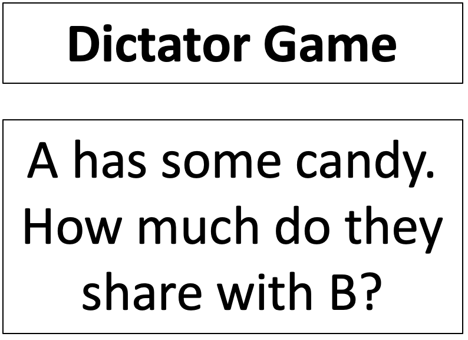

Note that, as simple as this game is, it is actually quite similar to the real world situation of deciding whether and how much to donate to charity.  In the charity decision, you have some money, and you can give some of it to someone else.  How much do you give?

### Expected Value theory decision in the Dictator Game

Before we look at what people do, it's useful to consider the what Expected Value Theory says about the Dictator Game.  If you are Player A in the candy version, you have 11 possible choices.  Choice 1 is to share nothing, choice 2 is to share 1 piece, choice 3 is to share 2 pieces, etc ... until choice 11 is to share all 10 pieces.

From the perspective of Player A, every time you share a piece of candy your Expected Value goes down!  So if you are Player A, Expected Value theory --- and indeed any theory that considers only your own utility --- shares nothing.

### Human behavior on the Dictator Game

Many, many studies have used the Dictator Game over the years.  This means that behavior on this game is very well characterized.  The results presented below come from a beautiful [meta-analysis of 25 years worth of data](https://link.springer.com/article/10.1007/s10683-011-9283-7) published in 2011.  If you are unfamiliar with the term "meta-analysis," it's basically just an analysis of previous analyses --- a way of collecting results from a bunch of previous studies and inferring things from the larger data set that you couldn't infer from the individual studies.

A key question about behavior on the Dictator game is: how much do people share?  Across the 616 studies that were included in the meta-analysis, there is considerable variability in the average amount shared.  Some studies report an average sharing amount of 0%, others as much as 100%!  But for most the number is around 20%

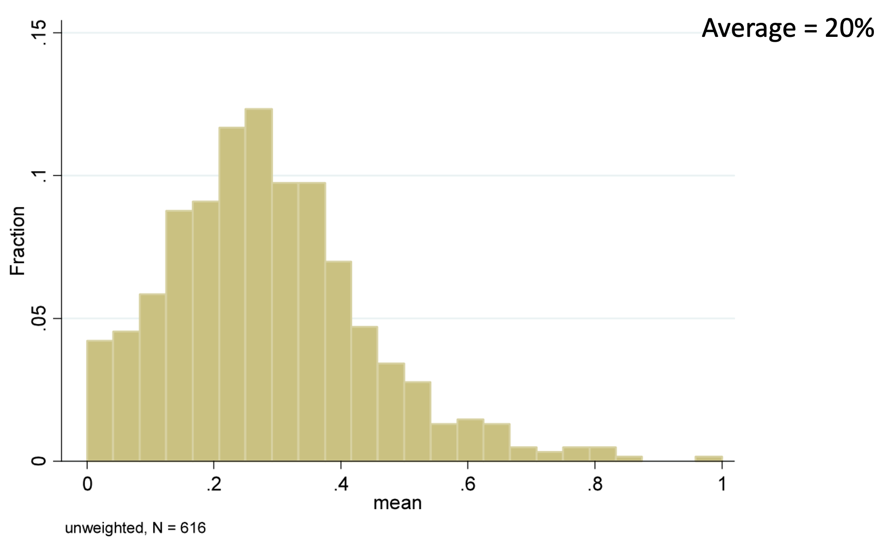

However, the histogram of the _average_ amount shared in each study isn't quite the same saying what individual people share.  For example, you could get an average of 20% by having everyone share 20% or 20% of people share 100% and 80% share nothing.  To look at individual responses, the meta-analysis also created a histogram over _individual_ sharing amounts from 20,813 people ...

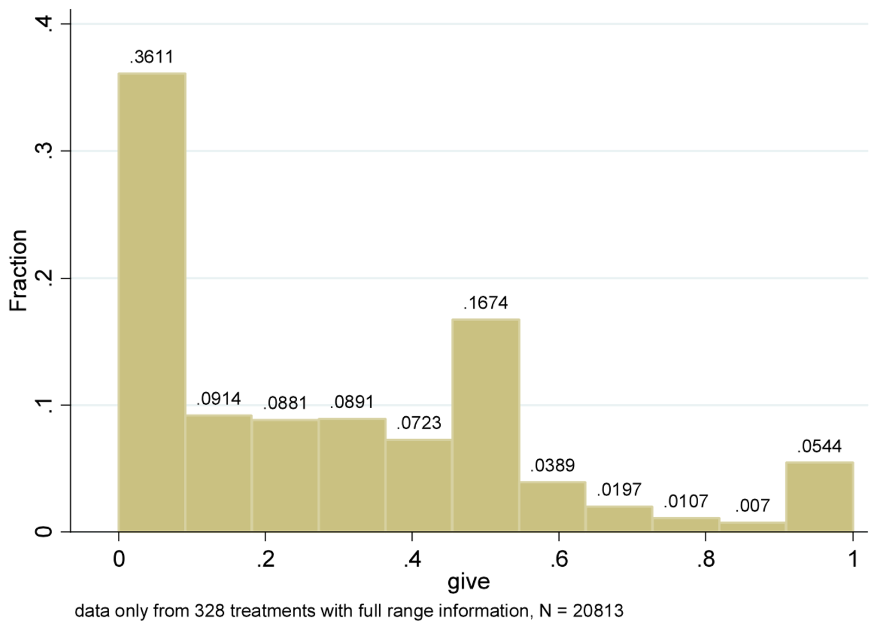

The most likely single amount shared (the mode of the distribution) is actually 0!  The next most likely is 50%.  Most people are somewhere in between 0% and 50%, although just over 5% of people share everything!

### What does human behavior on the Dictator Game tell us?

Taken together these two plots tells us a couple of things

  1. Most people share more than 0
  2. There is considerable heterogeneity in people's behavior on this task

The fact that people share more than zero shows that a purely selfish theory of decision making must be wrong.  Instead, people seem to place some utility on the utility of _other_ people, not just themselves.

The fact that there's variability in the amount people share, suggests that some people value other people's utility more than others!  The meta-analysis digs in to some of the reasons behind this variability. For our purposes it is enough to know that, on average in the Dictator Game, people share about 20%.  The key findings are how this number changes when we tweak the rules of the game ...

## The Ultimatum Game

The Ultimatum Game tweaks the rules of the Dictator Game to give Player B something to do.  In the candy version of this game, Player A starts with ten pieces of candy as before.  Also as before, Player A then decides how much they want to share with Player B.

The twist now though is that Player B gets a say. They now get to decide whether they want to accept the offer, in which case B gets what A shared, or reject it, in which case _both_ players get nothing!  (I like the latter option because I get to keep the candy for myself)

Schematically we have ...

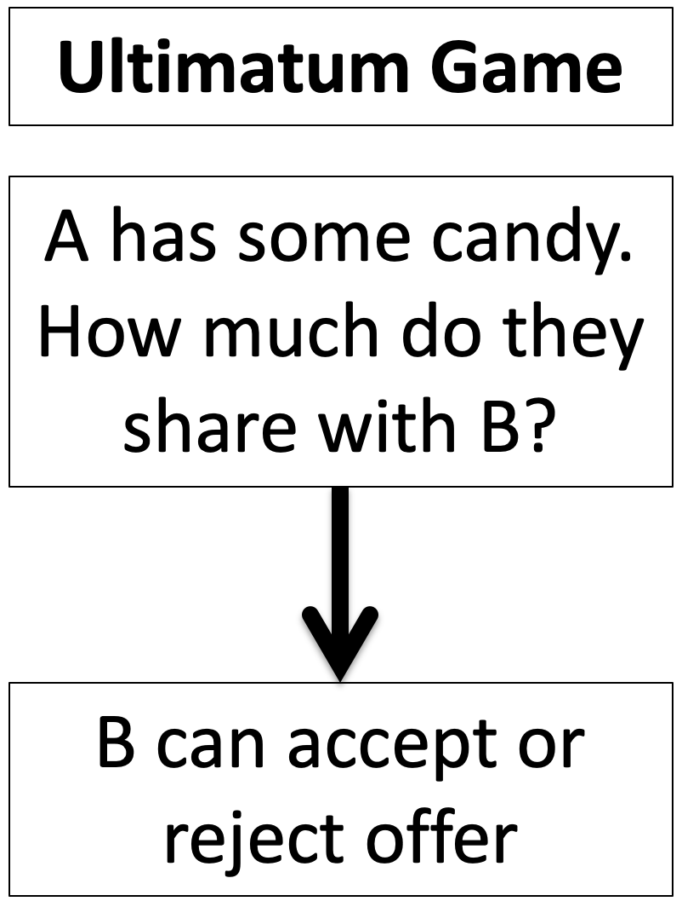

Note the similarity between the Dictator Game and the Ultimatum Game.  In both cases A has candy and can share it with B.  The difference comes later, when B gets a choice in the Ultimatum Game.

### Expected Value Theory decisions in the Ultimatum Game

What's the Expected Value Theory solution to the Ultimatum Game?  To find out we need to consider the decision making of Player B as well as Player A.  Let's start with B ...

By the time the offer, let's call it $X$ candies, comes to B, they have a choice between two options.  They can take the offer and get $X$ candies or they can reject the offer and get zero candies.  This means that so long as

$$X > 0$$

B should take whatever is offered.  If $X = 0$ they should be indifferent, so maybe they toss a coin to decide.

Now, if A knows that B is using Expected Value Theory to make their decision, what should A do?  Well, A knows that B might reject a zero offer, so offering nothing is a gamble.  But B is guaranteed to take anything more than zero.  So A should offer the minimum number of candies greater than zero.  If you can't split a single candy, then this is one candy.

So if A and B are Expected Value decision makers, A should offer 1 candy and B should be happy to take it.

### Human behavior on the Ultimatum Game

First let's consider the behavior of B.  Do they take the offer or not? In [this paper](https://science.sciencemag.org/content/300/5626/1755.abstract?casa_token=qVWIIWZby74AAAAA:4ZGTTZp2Pi78dW-Su8rS1EHqhnhBlW1DHA_IaDzXEce4aCQQQ0kpSFxyO-vdVMlV_zWcdz-5ziahMhs), the researchers had people play the Ultimatum game against either a human or a computer.

Player A was splitting $10 and could either off an equal split ($5:$5 on the x-axis), or an unequal split that was increasingly unfavorable for B: 70-30 ($7 to A, $3 to B), 80-20 or 90-10.

When Player A is a Human, Player B only rejects more than half of the $9:$1 offers.  But against the Computer (which presumably isn't being "unfair") they accept unfair offers about 70% of the time.

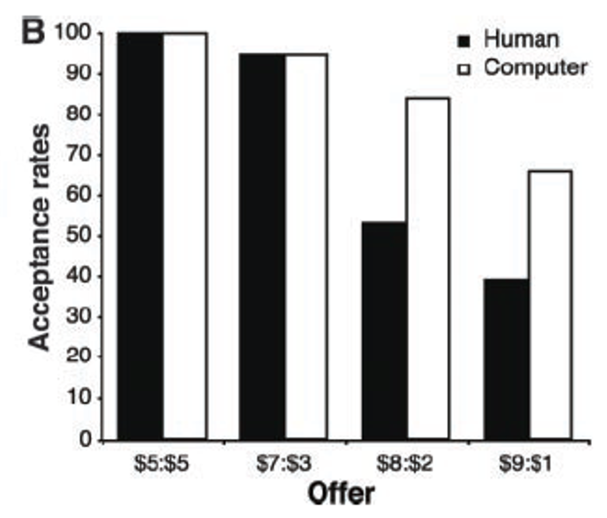

Like the Dictator Game, there's also a great [meta-analysis paper for the Ultimatum Game](https://link.springer.com/article/10.1023/B:EXEC.0000026978.14316.74). Unfortunately, this paper doesn't have nearly as many nice figures as the Dictator Game paper.  However, I was able to cobble toget a histagram for the Fraction Shared by Player A across a bunch of studies ...

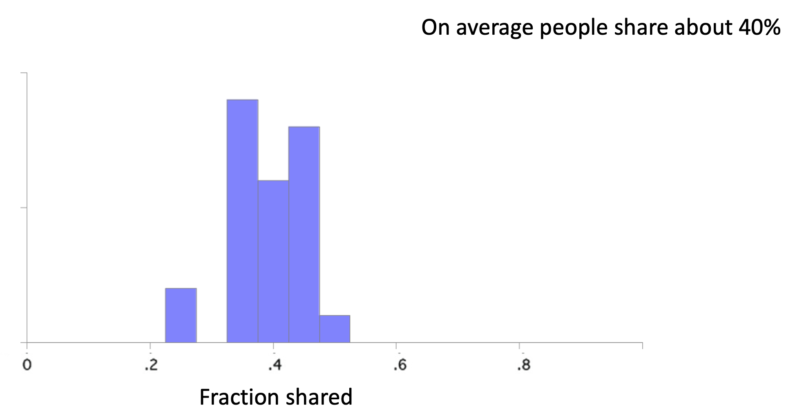

The key result here is that in the Ultimatum Game Player A shares about 40%, which is more than they share in the Dictator Game.  In the follwing I illustrate this by overlapping the two sharing histograms from the two games ...

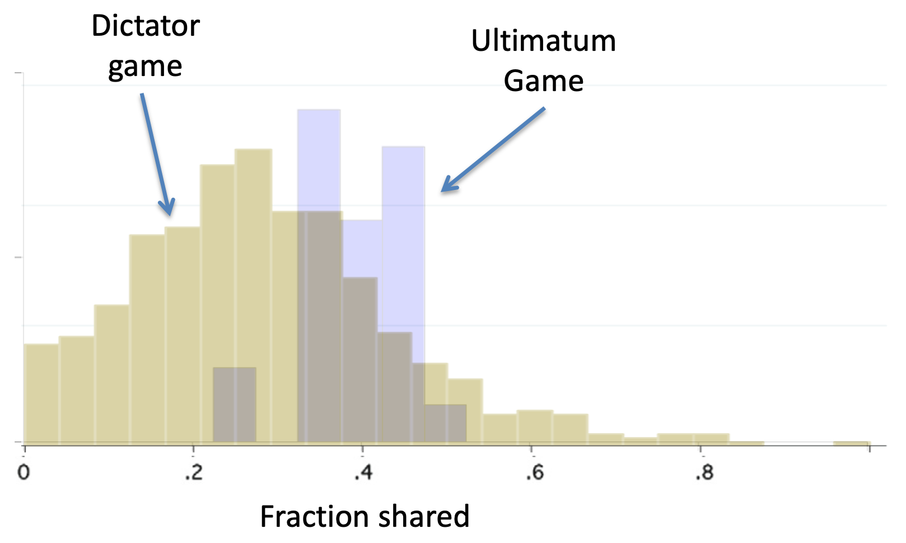

### Why do people share more in the Ultimatum Game?

The simple answer is Fear!  Fear that Player B will punish them.

The formal name for rejecting a bad offer in order to punish the sender (and at cost to oneself) is called _negative reciprocity_.

## The Trust Game

The final twist on the Dictator Game is the Trust Game.  In this game we start with Player B who is given three pieces of candy.  B decides how much of this to share with Player A.

The trick is that the amount that B shares (but not the amount that B does not share) gets tripled and then A gets to decide how much to share back with B.

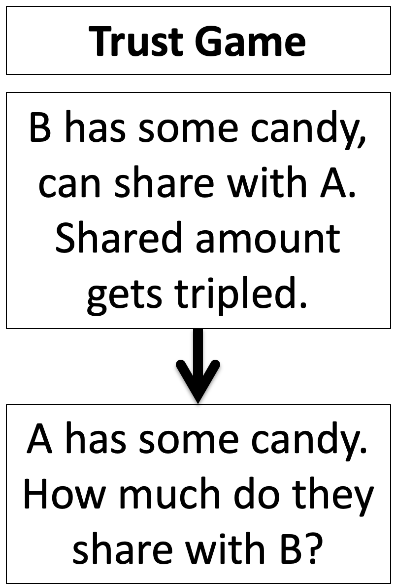

The idea of the game is to mimic an investment scenario.  B is investing some money with Player A, who then decides how much of the profit to share back with Player B.

Note also, that the last stage of the Trust Game is _identical_ to the Dictator Game.  A has some candy, how much are they willing to share with B?

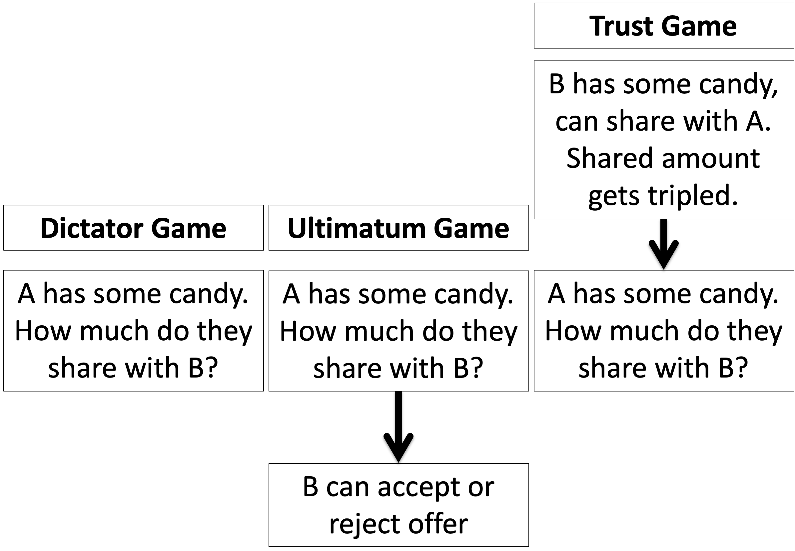

### Expected Value Theory behavior in the Trust Game

Again we first consider what Expected Value Theory decision makers would do in the Trust Game.  And again we start with the last decision, which this time is made by Player A.

Player A's decision is identical to the Dictator Game decision. Let's call the amount of money A has $3X$, which comes from  B sharing $X$ (remember whatever B shares gets tripled).  How much should they share?

Well just like the Dictator Game, A should share nothing.  B doesn't get to retaliate like the Ultimatum Game, so A can share as little as they want.  And if they are an Expected Value decision maker they want to share as little as possible to keep as much as possible for themselves.

However, if B knows that A is an Expected Value decision maker, how much do you think B should share with A in the first place?  Nothing.  Because anything B shares is gone for good!

So Expected Value theory predicts that B will never share.

### Human behavior in the Trust Game

Again there's a great [meta-analysis paper on the Trust Game](https://www.sciencedirect.com/science/article/pii/S0167487011000869?casa_token=8bFAx6aRB-MAAAAA:gdfM3BiqVKtvBam92yZErgJfkTsHA7fSO122Xjz0ScgHQDIbpXDH-NX30N_nWJ2hDF-Tj7pbucU).  First, let's look at the behavior of Player B, how much do they share, it's way more than nothing!  On average Player B shares about 50% ...

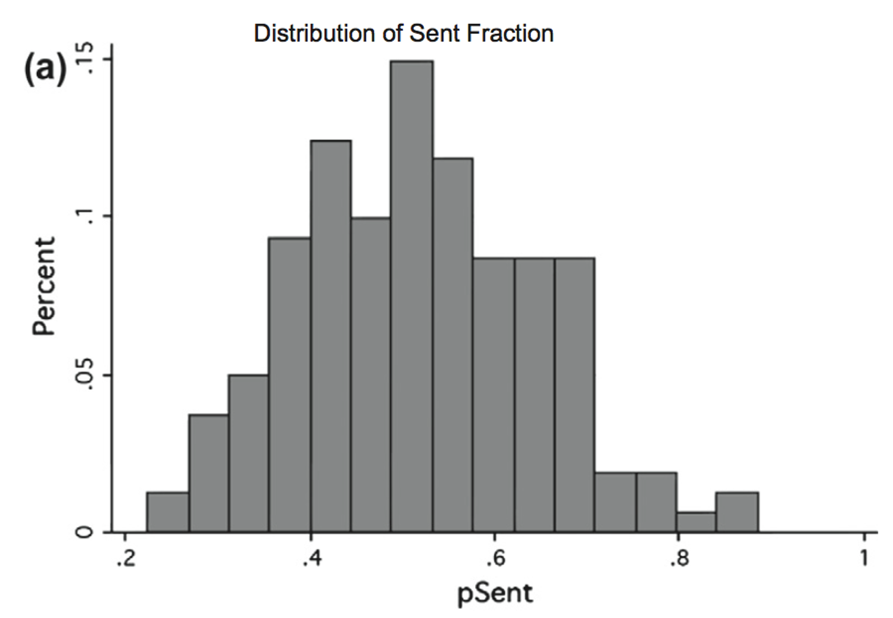

How much does Player A return?  A slightly lower fraction, about 35% overall.  Putting the fraction sent and the fraction returned on the same y-axis ...

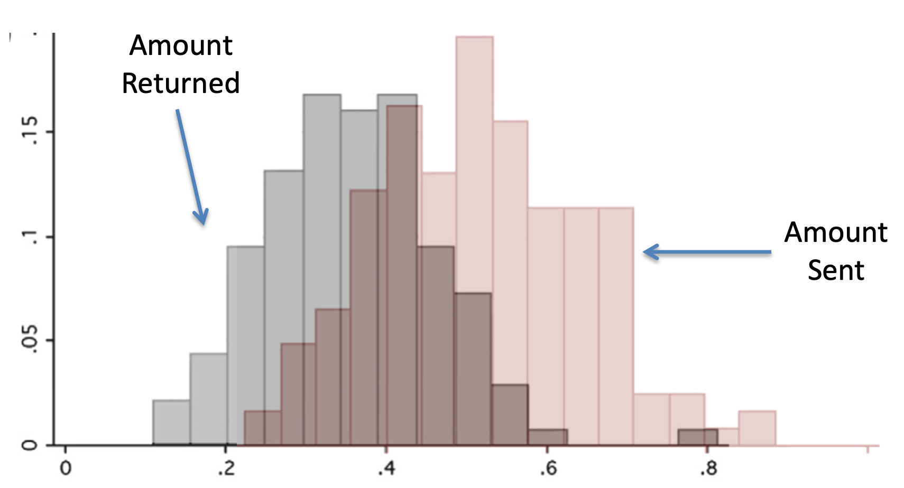

But Player A still shares more in the Trust Game (33%) than the Dictator Game (20%).

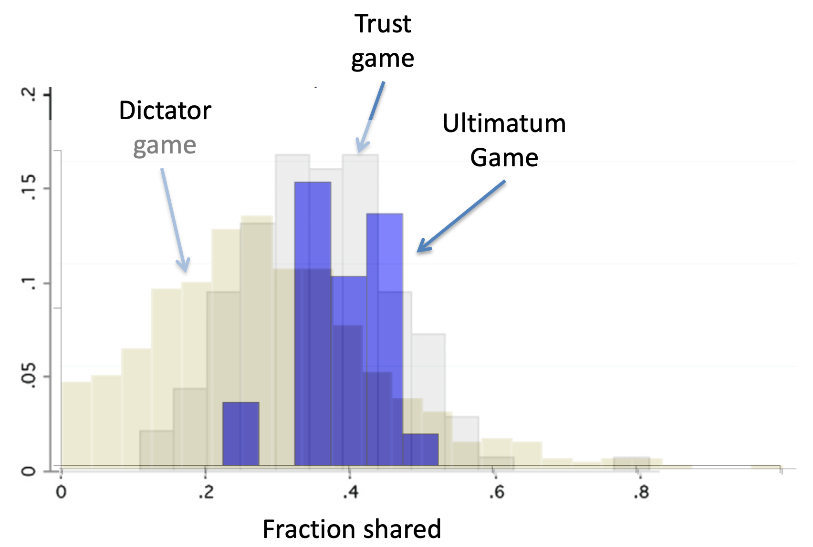

### Why does A share more in the Trust Game?

A simple answer is they reward B for sharing in the first place.  This is known as _positive reciprocity_ --- rewarding people for doing good things.

## Summary

So overall we have three games that all put a slightly different twist on the same decision for Player A --- they have some candy, how much are they willing to share.

In the pure Dictator Game, A shares about 20% because people value the utility of others (although not to a huge extent).

In the Ultimatum Game, A shares about 40%, i.e. more than the Dictator Game.  This is more because they fear _negative reciprocity_ from B rejecting the deal.

In the Trust Game, A shares about 33%, i.e. also more than the Dictator Game.  This is more than the Dictator Game because they are demonstrating _positive reciprocity_, i.e. rewarding the good behavior of B.

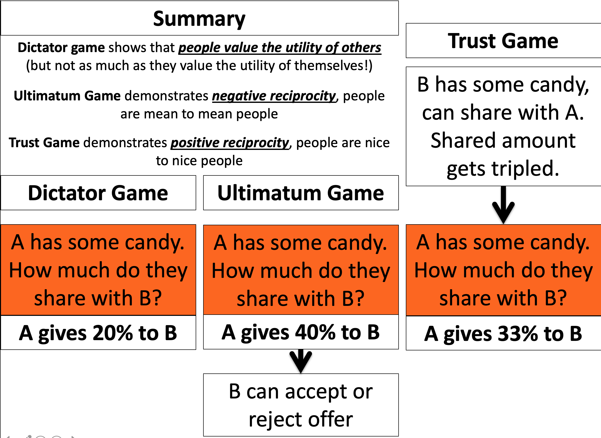

Finally, note that people share more in the Ultimatum Game than the Trust Game.  Why?  What do you remember about the relative strengths of gains vs losses in Prospect Theory?  And how do you think this might relate to positive and negative reciprocity ...
