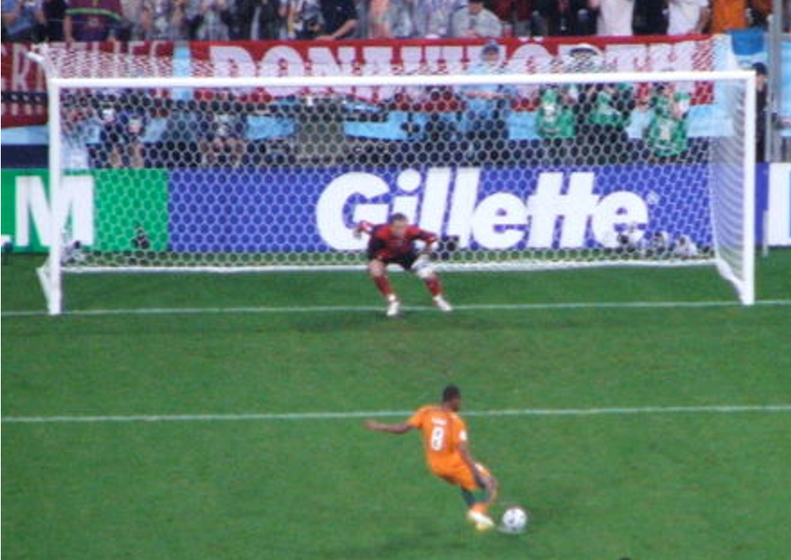
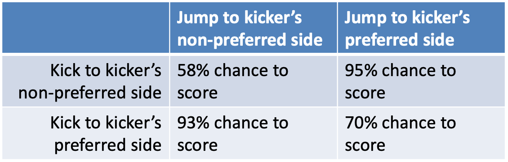
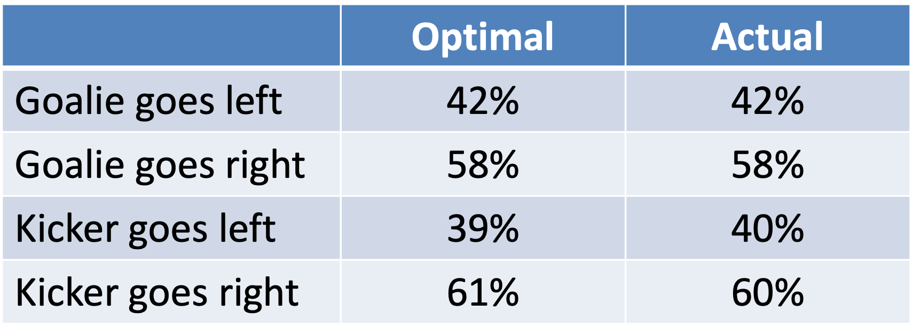

---
title: PSY 333 --- Week 15, Class 2
...

<iframe src="https://arizona.hosted.panopto.com/Panopto/Pages/Embed.aspx?id=af5d555e-2be0-4778-acbb-ac3a011f9b62&autoplay=false&offerviewer=true&showtitle=true&showbrand=false&start=0&interactivity=all" height="405" width="720" style="border: 1px solid #464646;" allowfullscreen allow="autoplay"></iframe>

# Randomess in Games

In the games we've considered so far, the best strategy is deterministic. That is, depending on the conditions, you should do the same thing every time.  For example, in the tit-for-tat strategy in the Prisoner's Dilemma, you _always_ defect if the other person defected on the last trial and you _always_ cooperate if they cooperated.

But there are some games, where you will always lose if your behavior is totally predictable like this.  Instead, the best you can do in these games (at least against a smart competitor) is to be random.

## Rock-Paper-Scissors

At least in the US, most people have played Rock-Paper-Scissors.

In this game you pick one of three options (Rock, Paper or Scissors) that you indicate with different hand shapes (e.g. balled fist for Rock).  At the same time your opponent also picks one fo the options.  If you both choose the same thing it's a tie.  If you choose differently the winner is determined as follows: Rock beats Scissors, Scissors beats Paper, and Paper beats Rock.

Have a go at playing this [online version of Rock Paper Scissors](https://www.afiniti.com/corporate/rock-paper-scissors) in which a sophisticated AI system will learn your moves and (usually) beat you ...

So how does this AI beat you?  Well, it learns and then takes advantages of your biases ...

### Human behavior in Rock-Paper-Scissors

People have all kinds of [biases when they play Rock-Paper-Scissors](https://www.psychologytoday.com/us/blog/the-blame-game/201504/the-surprising-psychology-rock-paper-scissors).  Here are a few of them ...

#### Bias against Paper

People have a slight preference for Rock and Scissors over paper.  While chance would say 33.3% for each, Rock and Scissors get chosen slightly more than by chance (35% of the time) and Paper only gets chosen 30% of the time.

There also appears to be a slight gender difference with men preferring Rock and women prefering Scissors, with these preferences greatest for novice players.

#### Win-stay

Winners tend to repeat their actions.  In life, repeating a winning move might be advantageous, but in Rock-Paper-Scissors it just makes you predictable.  If you lost to someone who played Rock, then Paper might be best for your next move.

#### Lose-shift

Losers tend to switch their actions.  Again this makes sense in life, if you're doing something that doesn't work then you should probably change what you are doing.  However, that makes you more predictable in Rock-Paper-Scissors.

In fact, the lose-shift bias is even more predictable than switching randomly.  People actually appear to be biased towards [a cycle](https://www.nature.com/articles/srep05830?origin=ppub) of Rock $\rightarrow$ Paper $\rightarrow$ Scissors $\rightarrow$ Rock!  So if they just lost playing Rock they switch to Paper, and if they just lost playing Paper they switch to Scissors etc ...

#### The Gambler's fallacy

People don’t like to repeat actions more than a few times.  So if they’ve played Rock repeatedly, they are likely to switch. And (as we saw above) they are likely to switch to the next in sequence – Paper!

#### Copying the other person

Finally, we also tend to copy what the other is doing.  In [one paper](https://royalsocietypublishing.org/doi/full/10.1098/rspb.2011.1024) the authors had people play Rock-Paper-Scissors against a blindfolded competitor.  People tended to copy what the other person did, leading to more draws (36% of the time) than would be expected by chance.

Here's the data plot. It's a little complicated so let's break it down.  Each colored bar corresponds to a choice by the _sighted_ player.  Darkest Grey for Rock, Mid-Grey for Paper, and White for Scissors.

On the x-axis is what the blind player player.  You can see the evidence of copying here (especially for Rock and Scissors) ... for example, when the blind player plays Rock the dark bar is highest corresponding to the sighted player being more likely to play Rock.

Of course, this is one bias that the computer can't learn about!

<!--
## The Matching Pennies Game

The Matching Pennies game is a kind of simpler version of Rock-Paper-Scissors.  Instead of three choices you only have two.  In this game, each player gets a coin and they can decide to put it Heads up or Tails up (note they are not flipping the coin, they are _choosing_ which side to place up).

If the pennies match (e.g. Heads and Heads), Player 1 wins.  If they don't (e.g. Heads and Tails), Player 2 wins.

What's particularly interesting about this game is that it captures a number of real-world decisions that happen in sports ...

### Penalties in soccer

In soccer, a penalty kick involves a single attacking player getting one free kick from 12 yards to try to score a goal against a goal keeper.  In professional soccer games, the ball is kicked so hard, and moves so quickly, that goalkeepers don't have enough time to look where the ball is hit and move in that direction --- if they did the ball would already be in the back of the net.  Instead they have to guess.

This makes penalties in soccer an almost perfect version of the matching pennies task.  The goalkeeper has to guess whether to dive left or right, and the shooter has to decide where to shoot, left or right.

If they both go the same way, the goalkeeper has a better chance of stopping the penalty. If they choose differently, the shooter has a better chance to score.

These chances can be measured empirically based on whether the goalkeeper is diving to the kickers prefered side and the shooter is shooting to their preferred side.

-->
