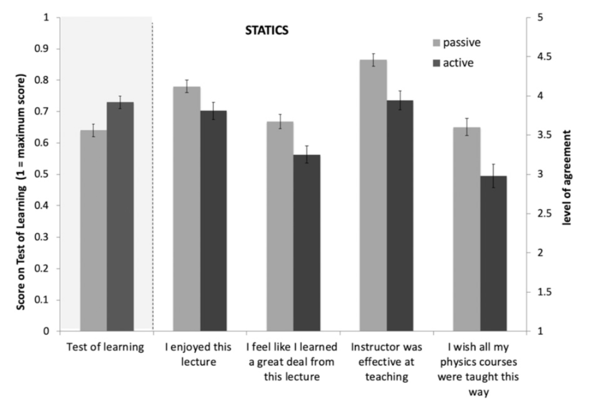

---
title: PSY 333 --- Class mechanics
...

<iframe src="https://arizona.hosted.panopto.com/Panopto/Pages/Embed.aspx?id=62d5262b-8711-4b6c-bf16-ac1e017b06b1&autoplay=false&offerviewer=true&showtitle=true&showbrand=false&start=0&interactivity=all" height="405" width="720" style="border: 1px solid #464646;" allowfullscreen allow="autoplay"></iframe>

## How will this class work?

In Fall 2020, PSY 333 is being offered online for the first time.  How will it work?  In teaching jargon, the class will be a **flipped**, **online** and **active-learning** class with **frequent low-stakes assignments**.

### Flipped

Flipped means that instead of Lectures in class time and Assignments at home, instead **you'll be viewing Lectures (and reading other online material) at home and doing Assignments in class**.

### Online
Online means the whole class is online.  D2L is the center point for everything.  Here you can find material for each week, the Zoom link for class, and a calendar of due dates for Assignments.  You will also hand in Assignments on D2L and find your grade there when it is posted.

### Active learning

Active learning means you will be actively doing things in class time. For this class this means either discussing and answering the Discussion Questions on Tuesday or the Assignment Questions on Thursday.  The research on active learning suggests that you will learn more from this active learning than if I taught the class in a passive way.

For example, in [this study from Louis Deslauriers and colleagues in 2019](classMechanics_activeLearningPaper.pdf) the authors taught the same Physics class in either a traditional passive form or an new fangled active form.  Students judged the passive class as being better on a bunch of measures including: enjoyment, how much they felt they had learned, how effective the instructor was. They also wished that all course were taught this way.  However, their feelings did not match reality (at least for learning), because when they were tested on their knowledge they learned _more_ in the active version of the class.

### Frequent low stakes Assignments

There will be two types of written work every week: **Discussion Questions** and **Assignment Questions**.

Discussion Questions are short (but sometimes open-ended) questions based on the current week's material that you will discuss in groups during Tuesday's class and then hand a short answers at the end of class.  Grading for these Discussion Questions will be binary --- 10 points if you hand in something that even vaguely answers the question, 0 points if you hand in nothing or if it's completely unrelated to the questions.

Assignment Questions require a longer answer and you will work on these on Thurday.  Assignments will be graded on a continuous scale from 0 to 10 depending on how good they are.

----------------------------------

## What will an average week in this class look like?

Every week I will post new course material on D2L.  This will comprise

1. Two webpages, one for Tuesday's class and one for Thursday's class
2. A set of _Discussion Questions_ to discuss in the Tuesday class
3. An _Assignment_ to discuss in the Thursday class and to complete and hand in on D2L before the following Tuesday class

**It will be your job to review course material before class.**

### Tuesday, Discussion Questions

Tuesday's class (on Zoom) will involve splitting into groups and discussing the questions.  I and the two TAs will jump in and out of these discussions to help with any questions and see how you are progressing.  At the end of class you'll write short answers to the Discussion Questions and hand them in on D2L.  Grading for these Discussion Questions will be binary --- 10 points if you hand in something that even vaguely answers the question, 0 points if you hand in nothing or if it's completely unrelated to the questions.

### Thursday, Assignment Questions

Thursday's class (also on Zoom) will involve splitting into groups to work on the longer Assignment Questions.  Again I and the TAs will jump in and out of these groups to help with any difficulties.  You'll have until the following Tuesday to hand in your Assignment on D2L.  Assignments will be graded on a sliding scale from 0 to 10.
